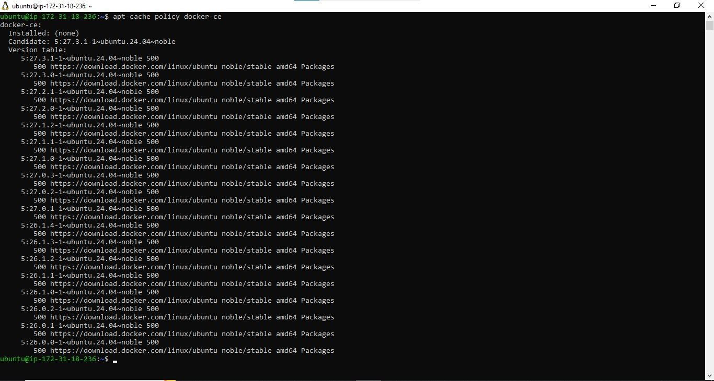

# Migration to the Сloud with containerization (Docker & Docker Compose)1

In this project, we will use a CI tool that is already well-known to us `Jenkins` - for Continous Integration (CI). So, when it is time to write `Jenkinsfile`, we will update our Terraform code to spin up an EC2 instance for Jenkins and run Ansible to install & configure it.

To begin our migration project from VM based workload, we need to implement a `Proof of Concept (POC)`. In many cases, it is good to start with a small-scale project with minimal functionality to prove that technology can fulfill specific requirements. So, this project will be a precursor before you can move on to deploy enterprise-grade microservice solutions with Docker. And so, Project 21 through to 30 will gradually introduce concepts and technologies as we move from POC onto enterprise level deployments.

We can start with our own workstation or spin up an EC2 instance to install Docker engine that will host our Docker containers.

Remember our Tooling website? It is a PHP-based web solution backed by a MySQL database - all technologies we are already familiar with and which we shall be comfortable using by now.

So, let us migrate the Tooling Web Application from a VM-based solution into a containerized one.

## Install Docker and prepare for migration to the Cloud

First, we need to install Docker Engine, which is a client-server application that contains:

- A server with a long-running daemon process dockerd.
- APIs that specify interfaces that programs can use to talk to and instruct the Docker daemon.
- A command-line interface (CLI) client docker.

You can learn how to install Docker Engine on your PC [here](https://docs.docker.com/engine/install/)

First, update your existing list of packages:

```bash
sudo apt-get update
sudo apt-get install docker-ce docker-ce-cli containerd.io
```

Next, install a few prerequisite packages which let apt use packages over HTTPS:

```bash
sudo apt install apt-transport-https ca-certificates curl software-properties-common
curl -fsSL https://download.docker.com/linux/ubuntu/gpg | sudo apt-key add -
```

Add the Docker repository to APT sources:

```bash
sudo add-apt-repository "deb [arch=amd64] https://download.docker.com/linux/ubuntu focal stable"
```

Make sure you are about to install from the Docker repo instead of the default Ubuntu repo

```bash
apt-cache policy docker-ce
```

You’ll see output like this, although the version number for Docker may be different:



Finally, install Docker:

```bash
sudo apt install docker-ce
sudo systemctl start docker
sudo systemctl enable docker
```


Verify the installation:

```bash
docker --version
```


### Executing the Docker Command Without Sudo

If you want to avoid typing sudo whenever you run the docker command, add your username to the docker group:

```bash
sudo usermod -aG docker ${USER}
```

To apply the new group membership, log out of the server and back in, or type the following:

```bash
su - ${USER}
```

**_Before we proceed further, let us understand why we even need to move from VM to Docker._**

As you have already learned – unlike a VM, Docker allocated not the whole guest OS for your application, but only isolated minimal part of it – this isolated container has all that your application needs and at the same time is lighter, faster, and can be shipped as a Docker image to multiple physical or virtual environments, as long as this environment can run Docker engine. This approach also solves the environment incompatibility issue. It is a well-known problem when a developer sends his application to you, you try to deploy it, deployment fails, and the developer replies, _"- It works on my machine!"_. With Docker – if the application is shipped as a container, it has its own environment isolated from the rest of the world, and it will always work the same way on any server that has Docker engine. **IT WORKS ON MY MACHINE**

Now, when we understand the benefits we can get by using Docker containerization, let us learn what needs to be done to migrate to Docker. [Read this excellent article for some insight](https://www.accenture.com/us-en/services/technology/application-services).

As a part of this project, you will use already well-known by you Jenkins for Continous Integration (CI). So, when it is time to write Jenkinsfile, update your Terraform code to spin up an EC2 instance for Jenkins and run Ansible to install & configure it.

# MySQL in container

Let us start assembling our application from the Database layer - we will use a pre-built MySQL database container, configure it, and make sure it is ready to receive requests from our PHP application.

## Step 1: Pull MySQL Docker Image from Docker Hub Registry

Start by pulling the appropriate Docker image for MySQL. We can download a specific version or opt for the latest release, as seen in the following command:

```bash
docker pull mysql/mysql-server:latest
```


If you are interested in a particular version of MySQL, replace latest with the version number. Visit Docker Hub to check other tags [here](https://hub.docker.com/r/mysql/mysql-cluster/tags)

List the images to check that you have downloaded them successfully:

```bash
docker images ls
```


## Step 2: Deploy the MySQL Container to your Docker Engine

1. Once you have the image, move on to deploying a new MySQL container with:

```bash
docker run --name <container_name> -e MYSQL_ROOT_PASSWORD=<my-secret-pw> -d mysql/mysql-server:latest
```


- Replace <container_name> with the name of your choice. If you do not provide a name, Docker will generate a random one
- The -d option instructs Docker to run the container as a service in the background
- Replace <my-secret-pw> with your chosen password
- In the command above, we used the latest version tag. This tag may differ according to the image you downloaded

2. Then, check to see if the MySQL container is running: Assuming the container name specified is mysql-server

```bash
docker ps -a
```


You should see the newly created container listed in the output. It includes container details, one being the status of this virtual environment. The status changes from `health: starting` to `healthy`, once the setup is complete.

## Step 3: Connecting to the MySQL Docker Container

We can either connect directly to the container running the MySQL server or use a second container as a MySQL client. Let us see what the first option looks like.

### Approach 1

Connecting directly to the container running the MySQL server:

```bash
docker exec -it <container_name> mysql -uroot -p
```

Provide the root password when prompted. With that, you have connected the MySQL client to the server.


**Finally**, change the server root password to protect your database.


Stop the running container


### Approach 2

First, create a network:

```bash
docker network create --subnet=172.18.0.0/24 tooling_app_network
```


Creating a custom network is not necessary because even if we do not create a network, Docker will use the default network for all the containers you run. By default, the network we created above is of `DRIVER Bridge`. So, also, it is the default network. You can verify this by running the `docker network ls` command.


But there are use cases where this is necessary. For example, if there is a requirement to control the `cidr range` of the containers running the entire application stack. This will be an ideal situation to create a network and specify the `--subnet`.

For clarity's sake, we will create a network with a subnet dedicated for our project and use it for both MySQL and the application so that they can connect.

### Run the MySQL Server container using the created network.

First, let us create an environment variable to store the root password:


Remove existing container


Then, pull the image and run the container, all in one command like below:

```bash
docker run --network tooling_app_network -h mysqlserverhost --name=mysql-server -e MYSQL_ROOT_PASSWORD=$MYSQL_PW  -d mysql/mysql-server:latest
```


Flags used

- -d runs the container in detached mode
- --network connects a container to a network
- -h specifies a hostname

If the image is not found locally, it will be downloaded from the registry.

Verify the container is running:

```bash
docker ps -a
```


As we already know, it is best practice not to connect to the MySQL server remotely using the root user. Therefore, we will create an `SQL` script that will create a user we can use to connect remotely.

Create a file and name it `create_user.sql` and add the below code in the file:

```sql
CREATE USER '<user>'@'%' IDENTIFIED BY '<client-secret-password>';
GRANT ALL PRIVILEGES ON * . * TO '<user>'@'%';
```


Run the script:

```bash
docker exec -i mysql-server mysql -uroot -p$MYSQL_PW < ./create_user.sql
```

If you see a warning like below, it is acceptable to ignore:

```css
mysql: [Warning] Using a password on the command line interface can be insecure.;
```


## Connecting to the MySQL server from a second container running the MySQL client utility

The good thing about this approach is that you do not have to install any client tool on your laptop, and you do not need to connect directly to the container running the `MySQL server`.

Run the MySQL Client Container:

```bash
docker run --network tooling_app_network --name mysql-client -it --rm mysql mysql -h mysqlserverhost -u <user-created-from-the-SQL-script> -p
```


Flags used:

- --name gives the container a name
- -it runs in interactive mode and Allocate a pseudo-TTY
- --rm automatically removes the container when it exits
- --network connects a container to a network
- -h a MySQL flag specifying the MySQL server Container hostname
- -u user created from the SQL script
- -p password specified for the user created from the SQL script
