# Prepare database schema

Now you need to prepare a database schema so that the Tooling application can connect to it.

## 1. Clone the Tooling-app repository from [here](https://github.com/StegTechHub/tooling-02)

```bash
git clone https://github.com/StegTechHub/tooling-02.git
```

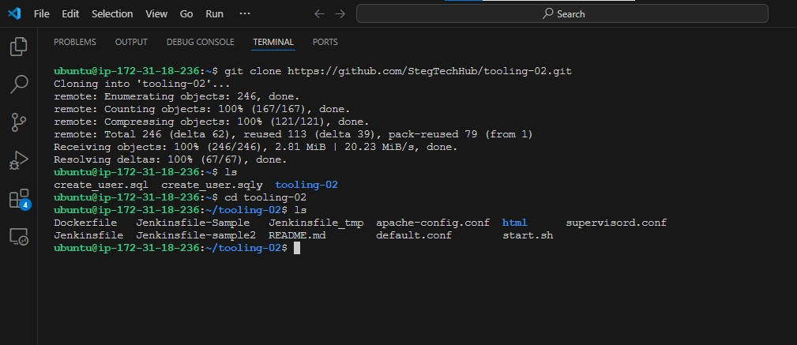

## 2. On the terminal, export the location of the SQL file

You can find the tooling_db_schema.sql in the html folder of cloned repo.

```bash
 export tooling_db_schema=tooling-02/html/tooling_db_schema.sql
```


## 3. Use the SQL script to create the database and prepare the schema. With the `docker exec` command, we can execute a command in a running container.

```bash
docker exec -i mysql-server mysql -uroot -p$MYSQL_PW < $tooling_db_schema
```


## 4. Update the db_conn.php file with connection details to the database

```bash
sudo vi tooling-02/html/db_conn.php
```

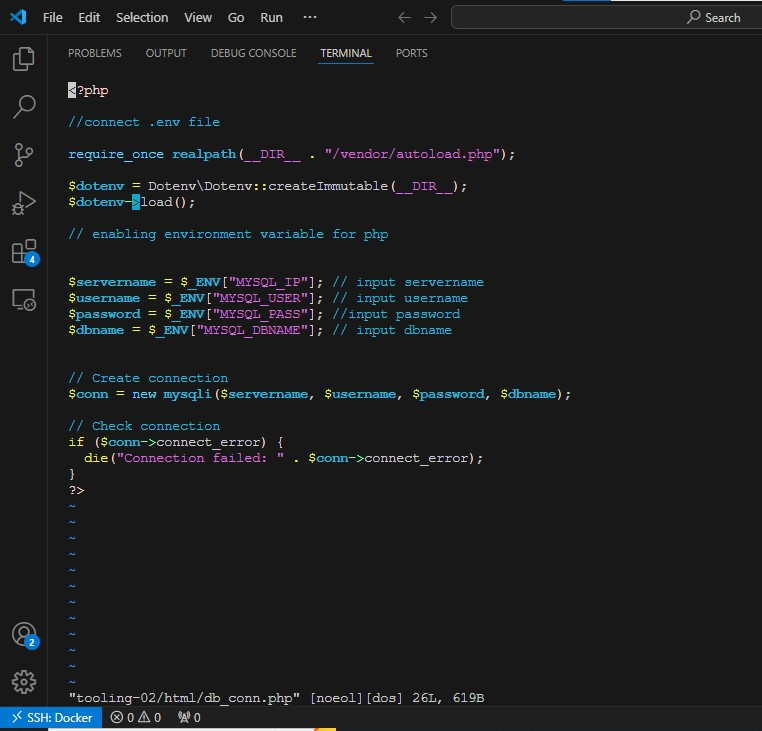

- Create a .env file in tooling/html/.env with connection details to the database.

```bash
sudo vim .env

MYSQL_IP=mysqlserverhost
MYSQL_USER=username
MYSQL_PASS=client-secrete-password
MYSQL_DBNAME=toolingdb
```


Flags used:

- **MYSQL_IP:** mysql ip address "leave as mysqlserverhost"
- **MYSQL_USER:** mysql username for user exported as environment variable
- **MYSQL_PASS:** mysql password for the user exported as environment varaible
- **MYSQL_DBNAME:** mysql databse name "toolingdb"

## 5. Run the Tooling App

`Containerization` of an application starts with creation of a file with a special name - `Dockerfile` (without any extensions). This can be considered as a 'recipe' or 'instruction' that tells Docker how to pack your application into a container.
In this project, we will build our container from a pre-created `Dockerfile`, but as a `DevOps`, we must also be able to write `Dockerfiles`.

You can watch [this video](https://www.youtube.com/watch?v=hnxI-K10auY) to get an idea how to create your Dockerfile and build a container from it.

And on [this page](https://docs.docker.com/build/building/best-practices/), you can find official Docker best practices for writing Dockerfiles.

So, let us `containerize` our `Tooling application`; here is the plan:

- Make sure you have checked out your Tooling repo to your machine with Docker engine
- First, we need to build the Docker image the tooling app will use. The Tooling repo you cloned above has a `Dockerfile` for this purpose. Explore it and make sure you understand the code inside it.
- Run `docker build` command
- Launch the container with `docker run`
- Try to access your application via port exposed from a container

**Let us begin:**

Ensure you are inside the folder that has the Dockerfile and build your container:

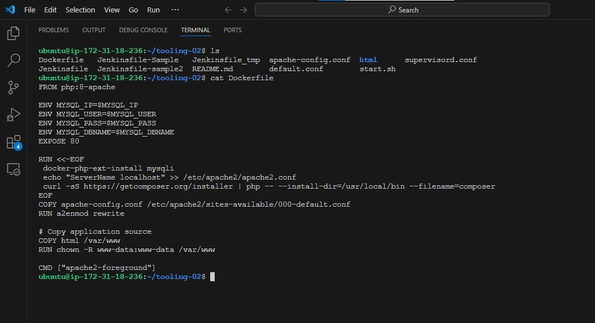

```bash
docker build -t tooling:0.0.1 .
```

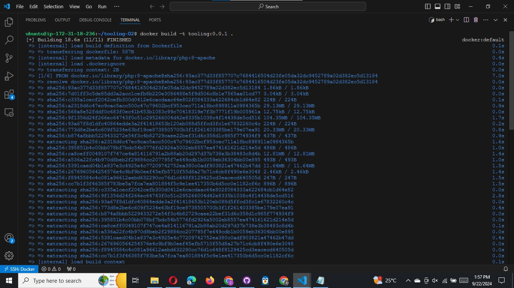


In the above command, we specify a parameter `-t`, so that the image can be tagged `tooling:0.0.1` - Also, you have to notice the `.` at the end. This is important as that tells Docker to locate the `Dockerfile` in the current directory you are running the command. Otherwise, you would need to specify the absolute path to the `Dockerfile`.

## 6. Run the container:

we should open port 8085

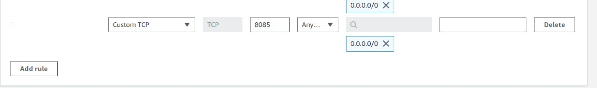

```bash
docker run --network tooling_app_network -p 8085:80 -it tooling:0.0.1
```


Let us observe those flags in the command.

- We need to specify the `--network` flag so that both the Tooling app and the database can easily connect on the same virtual network we created earlier.

- The `-p` flag is used to map the container port with the host port. Within the container, `apache` is the webserver running and, by default, it listens on port 80. You can confirm this with the CMD [`start-apache`] section of the Dockerfile. But we cannot directly use `port 80` on our host machine because it is already in use. The workaround is to use another port that is not used by the host machine. In our case, `port 8085` is free, so we can map that to port 80 running in the container.

**Note:** You will get an `error`. But you must troubleshoot this error and fix it. Below is your error message.

```css
AH00558: apache2: Could not reliably determine the server's fully qualified domain name, using 172.18.0.3. Set the 'ServerName' directive globally to suppress this message
```

**Hint:** You must have faced this error in some of the past projects. It is time to begin to put your skills to good use. Simply do a google search of the error message, and figure out where to update the configuration file to get the error out of your way.

If everything works, you can open the browser and type `http://localhost:8085`

You will see the login page.

The default email is `test@gmail.com`, the password is `12345` or you can check users' credentials stored in the `toolingdb.user table`.

```bash
docker exec -it mysql-server mysql -uroot -p
```

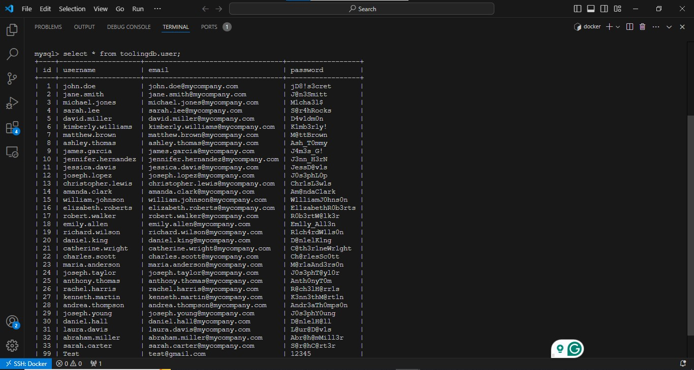

**Here's my first error**

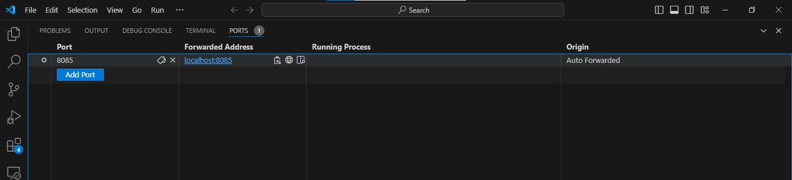
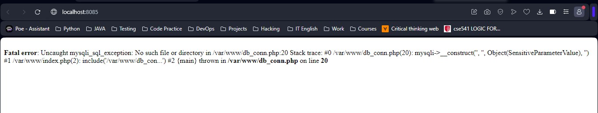

## Troubleshooting

Using the `ENV` instruction in the Dockerfile like this:

```Dockerfile
ENV MYSQL_IP=$MYSQL_IP
ENV MYSQL_USER=$MYSQL_USER
ENV MYSQL_PASS=$MYSQL_PASS
ENV MYSQL_DBNAME=$MYSQL_DBNAME
```

did not work as intended for dynamically injecting values from `.env` file at build time. Here’s why:

1. **Build-Time Context:** When Docker builds an image, it does not have access to `environment variables` from the _`host system`_ or any _`.env`_ file unless you explicitly pass them in. The variables `$MYSQL_IP`, `$MYSQL_USER`, `$MYSQL_PASS`, and `$MYSQL_DBNAME` will not be replaced with values from a .env file or the host environment because Docker does not interpret these at build time.

2. **Result of Current ENV Usage:** As a result, when we use ENV like `ENV MYSQL_IP=$MYSQL_IP`, Docker interprets this as setting the environment variable MYSQL*IP to an empty string unless those variables are explicitly passed to Docker at build time using the *`--build-arg option`\_.

To _`dynamically`_ pass environment variables from a _`.env`_ file or shell environment, consider this approache:

### Using `--env-file` for Runtime Variables

For runtime environment variables, you should pass them when running the container, not at build time. This allows for more flexibility and keeps Docker images more environment-agnostic and is generally the preferred approach for configuration.

Dockerfile Without Hardcoded ENV Variables:

```Dockerfile
FROM php:8-apache

# Install necessary PHP extensions and tools
RUN apt-get update && apt-get install -y git zip unzip

RUN <<-EOF
 docker-php-ext-install mysqli
 echo "ServerName localhost" >> /etc/apache2/apache2.conf
 # Install Composer
 curl -sS https://getcomposer.org/installer | php -- --install-dir=/usr/local/bin --filename=composer
EOF

# Copy Apache configuration
COPY apache-config.conf /etc/apache2/sites-available/000-default.conf
RUN a2enmod rewrite

# Copy application source and set permissions
COPY html /var/www
RUN chown -R www-data:www-data /var/www

# Install Composer dependencies
WORKDIR /var/www
RUN composer install

# Expose port and start Apache
EXPOSE 80
CMD ["apache2-foreground"]
```


**`php:<version>-apache`** base image contains Debian's Apache httpd in conjunction with PHP. See [official PHP image on Docker Hub](https://hub.docker.com/_/php). As such, we can use `apt-get` command for installations.

### Let's Run the container again adding `--env-file .env`

```Docker
docker run --network tooling_app_network --env-file html/.env -p 8085:80 -it tooling:0.0.1
```

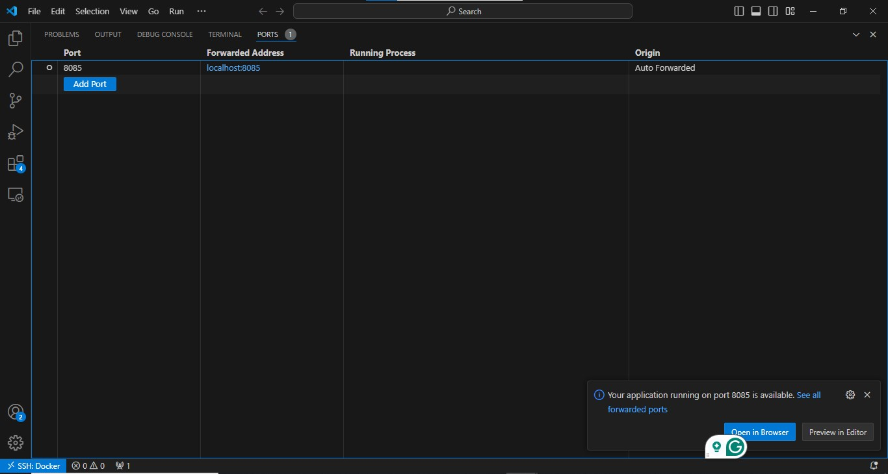

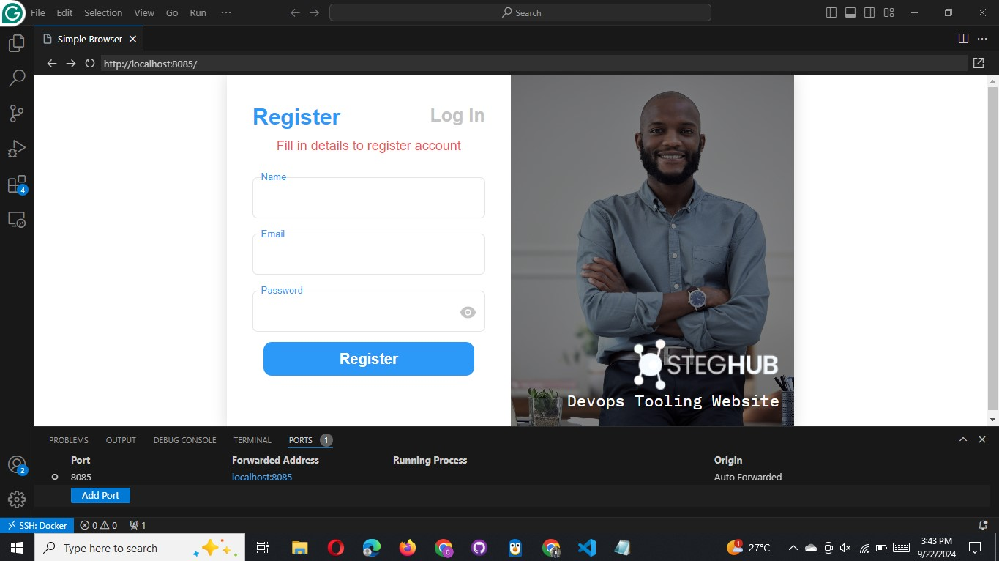


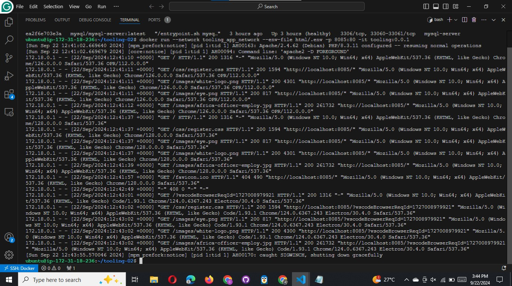

# Practice Task №1 - Implement a POC to migrate the PHP-Todo app into a containerized application.

Download php-todo repository [from here](https://github.com/StegTechHub/php-todo)


The project below will challenge you a little bit, but the experience there is very valuable for future projects.

## Part 1

Here is the [todo-app repository](https://github.com/francdomain/docker-php-todo) for part 1 - 3

### 1. Write a Dockerfile for the TODO app

**Dokerfile**


### 2. Run both database and app on your laptop Docker Engine

**Run database container**

```docker
docker run --network tooling_app_network -h mysqlserverhost --name=mysql-server -e MYSQL_ROOT_PASSWORD=$MYSQL_PW  -d mysql/mysql-server:latest
```

Create a script `create_user.sql` to create database and user


Create database and user using the script

```docker
docker exec -i mysql-server mysql -uroot -p$MYSQL_PW < ./create_user.sql
```


**Run todo app**

Build the todo app

```docker
docker build -t php-todo:0.0.1 .
```


```docker
docker run --network tooling_app_network --rm --name php-todo --env-file .env -p 8090:8000 -it php-todo:0.0.1
```

Migration has taken place in the prvious run


### 3. Access the application from the browser


## Part 2

### 1. Create an account in [Docker Hub](https://hub.docker.com/)


### 2. Create a new Docker Hub repository


### 3. Push the docker images from your PC to the repository

Sign in to docker and tag the docker image

```docker
docker login

docker tag php-todo:0.0.1 francdocmain/php-todo-app:0.0.1
```


Push the docker image to the repository created

```docker
docker push francdocmain/php-todo-app:0.0.1
```


## Part 3

### 1. Write a Jenkinsfile that will simulate a Docker Build and a Docker Push to the registry

```groovy
pipeline {
    agent any

    environment {
        DOCKER_REGISTRY = "docker.io"
        DOCKER_IMAGE = "francdocmain/php-todo-app"
    }

    stages {
        stage("Initial cleanup") {
            steps {
                dir("${WORKSPACE}") {
                    deleteDir()
                }
            }
        }

        stage('Checkout') {
            steps {
                checkout scm
            }
        }

        stage('Build Docker Image') {
            steps {
                script {
                    def branchName = env.BRANCH_NAME
                    // Define tagName outside the script block for reuse
                    env.TAG_NAME = branchName == 'main' ? 'latest' : "${branchName}-0.0.${env.BUILD_NUMBER}"

                    // Build Docker image
                    sh """
                    docker build -t ${DOCKER_REGISTRY}/${DOCKER_IMAGE}:${env.TAG_NAME} .
                    """
                }
            }
        }

        stage('Push Docker Image') {
            steps {
                script {
                    // Use Jenkins credentials to login to Docker and push the image
                    withCredentials([usernamePassword(credentialsId: 'docker-credentials', usernameVariable: 'USERNAME', passwordVariable: 'PASSWORD')]) {
                        sh """
                        echo ${PASSWORD} | docker login -u ${USERNAME} --password-stdin ${DOCKER_REGISTRY}
                        docker push ${DOCKER_REGISTRY}/${DOCKER_IMAGE}:${env.TAG_NAME}
                        """
                    }
                }
            }
        }

        stage('Cleanup Docker Images') {
            steps {
                script {
                    // Clean up Docker images to save space
                    sh """
                    docker rmi ${DOCKER_REGISTRY}/${DOCKER_IMAGE}:${env.TAG_NAME} || true
                    """
                }
            }
        }
    }
}
```


Launch ec2 instance for jenkins


#### Install docker on jenkins server

- Set up Docker's `apt` repository.

```bash
# Add Docker's official GPG key:
sudo apt-get update

sudo apt-get install ca-certificates curl

sudo install -m 0755 -d /etc/apt/keyrings

sudo curl -fsSL https://download.docker.com/linux/ubuntu/gpg -o /etc/apt/keyrings/docker.asc

sudo chmod a+r /etc/apt/keyrings/docker.asc

# Add the repository to Apt sources:
echo \
  "deb [arch=$(dpkg --print-architecture) signed-by=/etc/apt/keyrings/docker.asc] https://download.docker.com/linux/ubuntu \
  $(. /etc/os-release && echo "$VERSION_CODENAME") stable" | \
  sudo tee /etc/apt/sources.list.d/docker.list > /dev/null

sudo apt-get update

sudo systemctl start docker
sudo systemctl enable docker
```

- Install the Docker packages.
  To install the latest version, run:

```bash
sudo apt-get install docker-ce docker-ce-cli containerd.io docker-buildx-plugin docker-compose-plugin
```

#### Ensure Jenkins Has Permission to Run Docker

- Add Jenkins User to Docker Group

```bash
sudo usermod -aG docker jenkins

sudo systemctl restart jenkins
```


#### Install docker plugins

- Go to Manage Jenkins > Manage Plugins > Available.
- Search for Docker Pipeline and install it.


#### Docker Tool Configuration:

- Check the path to Docker executable (Installed docker) by running

```bash
which docker
```


- Go to Manage Jenkins > Tools, Scrol to Docker installations


#### Add Docker credentials to Jenkins.

- Go to Jenkins Dashboard > Manage Jenkins > Credentials.
  Add your Docker `username` and `password` and the credential ID (from jenkinsfile) there.


### 2. Connect your repo to Jenkins

Add a webhook to the github repo


- Install Blue Ocean plugin and Open it from dashboard
- Select create New pipeline
- Select Github and your Github account
- Select the repo for the pipeline
- Select create pipeline


### 3. Create a multi-branch pipeline


### 4. Simulate a CI pipeline from a feature and master branch using previously created Jenkinsfile

**For Feature branch**


**For Main branch**


#### 5. Ensure that the tagged images from your Jenkinsfile have a prefix that suggests which branch the image was pushed from. For example, feature-0.0.1.

#### 6. Verify that the images pushed from the CI can be found at the registry.


