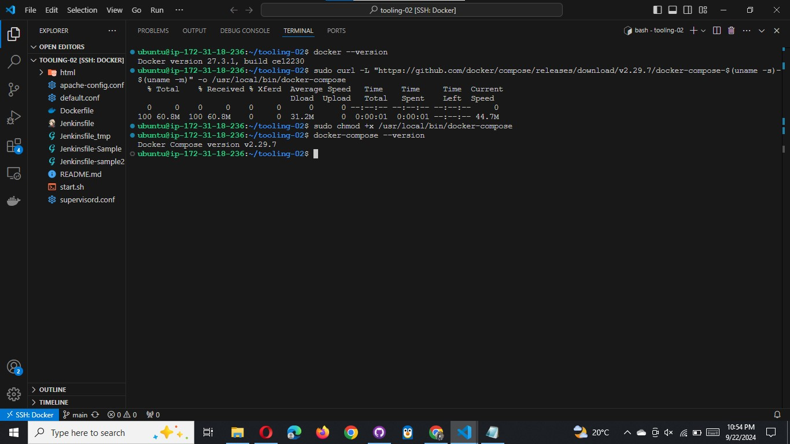
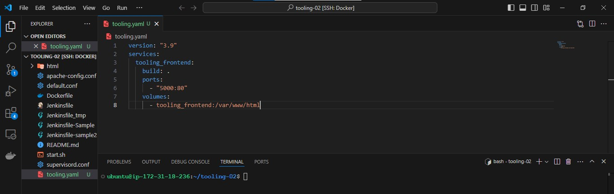
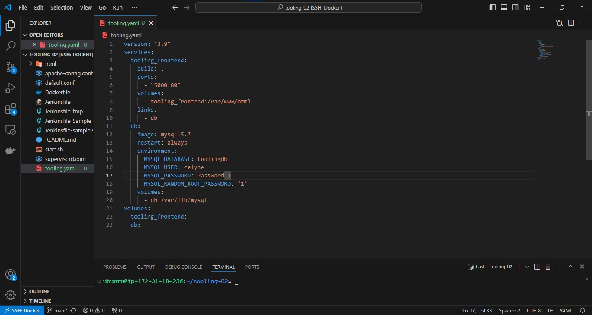
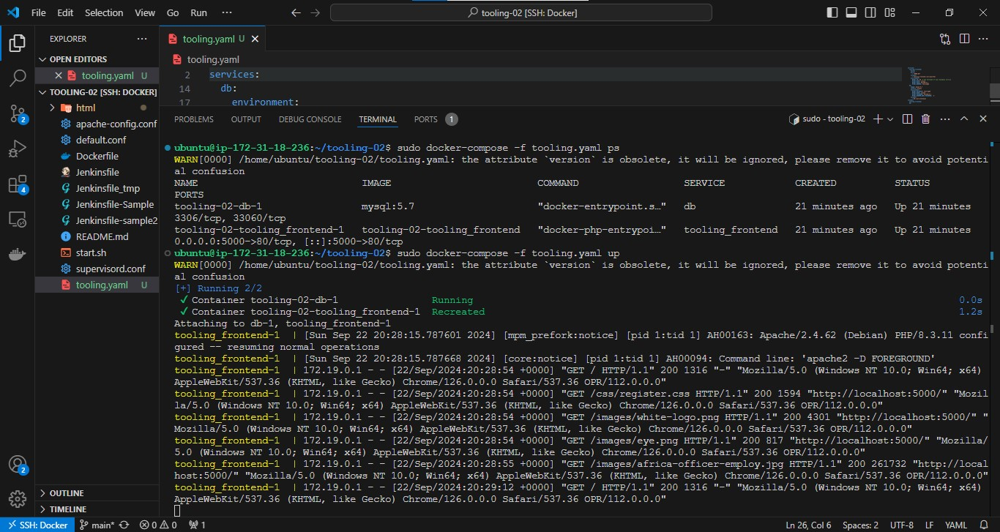
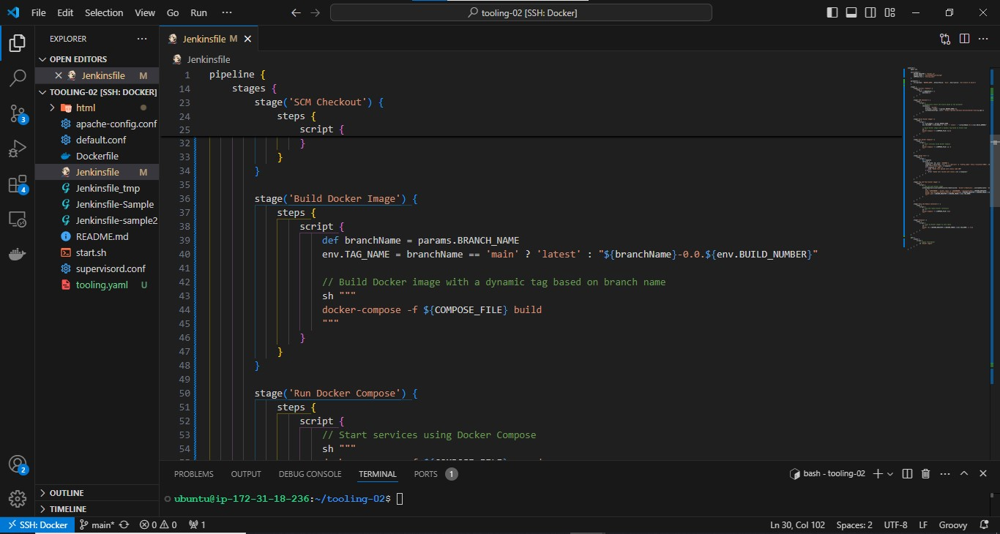
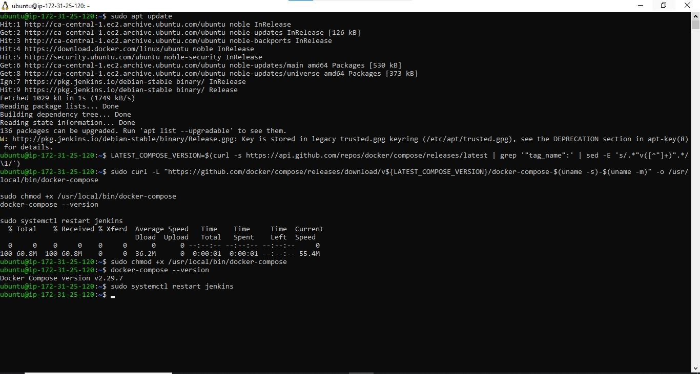
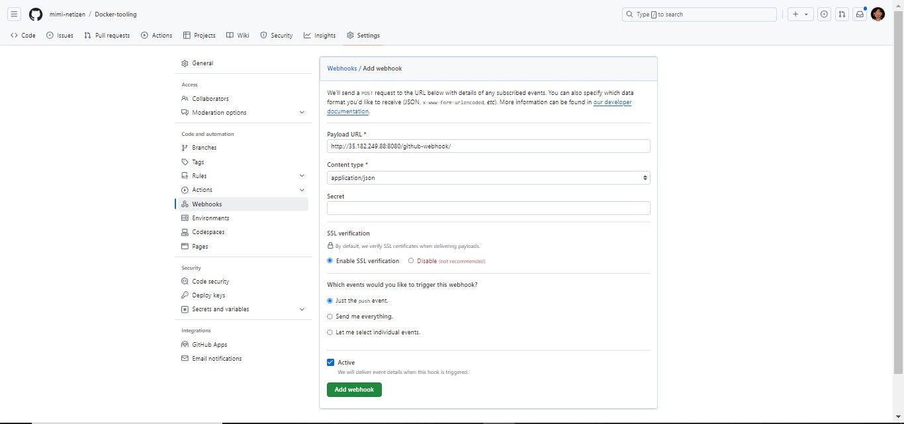

# Deployment with Docker Compose

All we have done until now required quite a lot of effort to create an image and launch an application inside it. We should not have to always run Docker commands on the terminal to get our applications up and running. There are solutions that make it easy to write [declarative code](https://en.wikipedia.org/wiki/Declarative_programming) in [YAML](https://en.wikipedia.org/wiki/YAML), and get all the applications and dependencies up and running with minimal effort by launching a single command.

In this section, we will refactor the `Tooling app` POC so that we can leverage the power of `Docker Compose`.

### 1. First, install Docker Compose on your workstation from [here](https://docs.docker.com/compose/install/)

With `Docker Desktop`, Docker Compose is now integrated as a `Docker CLI plugin`, and you use it by typing `docker compose` instead of `docker-compose` (for stand alone docker compose tool).



#### 2. Create a file, name it tooling.yaml

#### 3. Begin to write the Docker Compose definitions with YAML syntax. The YAML file is used for defining services, networks, and volumes:

```yaml
version: "3.9"
services:
  tooling_frontend:
    build: .
    ports:
      - "5000:80"
    volumes:
      - tooling_frontend:/var/www/html
```



The YAML file has declarative fields, and it is vital to understand what they are used for.

- **version:** Is used to specify the version of Docker Compose API that the Docker Compose engine will connect to. This field is optional from docker compose version v1.27.0.

- **service:** A service definition contains a configuration that is applied to each container started for that service. In the snippet above, the only service listed there is `tooling_frontend`. So, every other field under the tooling_frontend service will execute some commands that relate only to that service. Therefore, all the below-listed fields relate to the tooling_frontend service.
- **build**
- **port**
- **volumes**
- **links**

You can visit the site [here](https://www.balena.io/docs/reference/supervisor/docker-compose/) to find all the fields and read about each one that currently matters to you.

You may also go directly to the official documentation site to read about each field [here](https://docs.docker.com/compose/compose-file/compose-file-v3/).

Let us fill up the entire file and test our application:

```yaml
version: "3.9"
services:
  tooling_frontend:
    build: .
    ports:
      - "5001:80"
    volumes:
      - tooling_frontend:/var/www/html
    links:
      - db
  db:
    image: mysql:5.7
    restart: always
    environment:
      MYSQL_DATABASE: <The database name required by Tooling app >
      MYSQL_USER: <The user required by Tooling app >
      MYSQL_PASSWORD: <The password required by Tooling app >
      MYSQL_RANDOM_ROOT_PASSWORD: "1"
    volumes:
      - db:/var/lib/mysql
volumes:
  tooling_frontend:
  db:
```



Run the command to start the containers

```docker
docker-compose -f tooling.yaml  up -d
```


Verify that the compose is in the running status:

```docker
docker compose ls
```





To stop containers

```bash
docker-compose -f tooling.yml down
```


# Practice Task №2 - Complete Continous Integration With A Test Stage

### 1. Document your understanding of all the fields specified in the Docker Compose file `tooling.yaml`

**Version:**
This specifies the version of the Docker Compose file format being used, which in this case is version 3.9.

**Services:**
The services section defines the containers that will be run as part of this Docker Compose setup.

- **frontend Service:**

  - **build .**: This tells Docker to build an image from a Dockerfile in the current directory (.).
  - **ports:** "5001:80": Maps port 5001 on the host machine to port 80 on the container, allowing access to the frontend service from outside.
  - **volumes:**:
    - **tooling_frontend:/var/www/html:** This mounts a named volume tooling_frontend to the path /var/www/html inside the container. This is useful for persisting data or sharing data between containers.
  - **links:** - db
    - Enables the frontend service to connect to the db service using the hostname `db`.

- **db Service:**

  - **image: mysql:5.7:** Specifies the MySQL version 5.7 Docker image to be used for this service.
  - **restart: always:** Configures the container to always restart if it stops, ensuring high availability.
  - **environment:**: Sets environment variables for the MySQL container:

    - MYSQL_DATABASE: The name of the database to create.

    - MYSQL_USER: The username for the MySQL user.

    - MYSQL_PASSWORD: The password for the MySQL user.
    - MYSQL_RANDOM_ROOT_PASSWORD: A flag to generate a random root password.

  - **volumes:**:
    - **db:/var/lib/mysql:** Uses a named volume db to persist MySQL data, storing it in /var/lib/mysql inside the container.

**Volumes:**
This section declares two named volumes, `tooling_frontend` and `db`, which are used by the frontend and db services respectively for persistent storage.

### 2. Update your `Jenkinsfile` with a `test stage` before pushing the image to the registry.

See repository [here](https://github.com/mimi-netizen/Docker-tooling.git)



**Install `docker compose` on jenkins server**

```bash
sudo apt update

LATEST_COMPOSE_VERSION=$(curl -s https://api.github.com/repos/docker/compose/releases/latest | grep '"tag_name":' | sed -E 's/.*"v([^"]+)".*/\1/')

sudo curl -L "https://github.com/docker/compose/releases/download/v${LATEST_COMPOSE_VERSION}/docker-compose-$(uname -s)-$(uname -m)" -o /usr/local/bin/docker-compose

sudo chmod +x /usr/local/bin/docker-compose
docker-compose --version

sudo systemctl restart jenkins
```



Install docker compose plugin


Add a webhook



### 3. What you will be testing here is to ensure that the `tooling site` http endpoint is able to return status `code 200`. Any other code will be determined a stage failure.


#### 4. Implement a similar pipeline for the PHP-todo app.

See repository [here](https://github.com/mimi-netizen/Docker-php-todo-app.git)


### 5. Ensure that both pipelines have a clean-up stage where all the images are deleted on the Jenkins server.

Confirm the tooling site image in the registry


### Conclusion

We have migrated our application running on virtual machines into the Cloud with containerization.

In the next project, we will expand our skills further into more advanced use cases and technologies.
