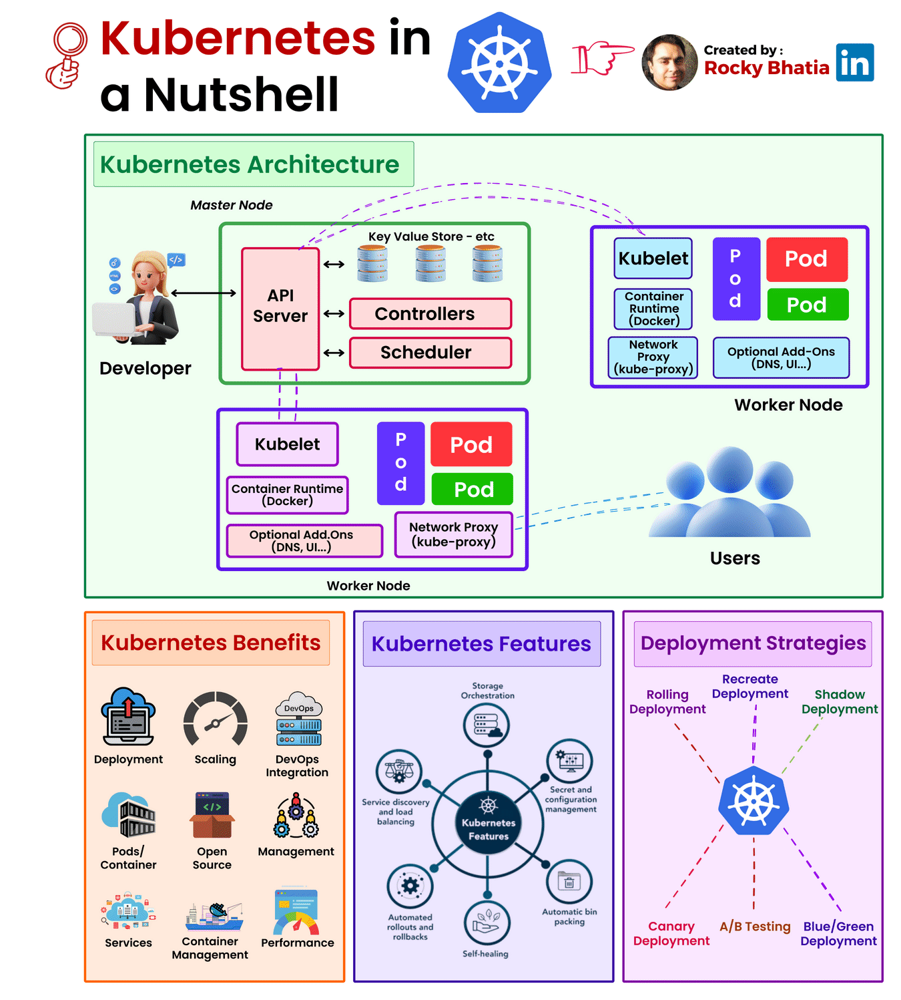

# What is Kubernetes?



Kubernetes, also known as K8s, is an open-source container orchestration system for automating the deployment, scaling, and management of containerized applications. It was originally designed by Google, and is now maintained by the Cloud Native Computing Foundation (CNCF).

Kubernetes provides a platform-agnostic way to deploy, manage, and scale applications that are packaged in containers, such as Docker containers. It abstracts the underlying infrastructure and provides a common layer for deploying applications in a variety of environments, including on-premises, in the cloud, or in a hybrid environment.

## History and Evolution

Kubernetes was first released in 2014 by Google as an open-source project. It was based on the experience of running production workloads at Google, and was designed to provide a scalable and flexible way to deploy and manage applications.

In 2015, the Cloud Native Computing Foundation (CNCF) was founded, and Kubernetes was donated to the foundation. Since then, Kubernetes has become one of the fastest-growing and most popular open-source projects in the world.

Over time, Kubernetes has evolved to support a wide range of use cases, including:

- Cloud-native applications
- Microservices architecture
- DevOps and continuous integration/continuous deployment (CI/CD)
- Big data and analytics
- Machine learning and artificial intelligence
- Edge computing and IoT

## Benefits and Use Cases

- **Scalability**: Kubernetes allows you to scale your applications horizontally (add more pods) or vertically (increase resources per pod) to handle increased traffic or demand.

- **High Availability**: Kubernetes provides self-healing capabilities, which means that if a pod fails, Kubernetes can automatically restart or replace it to maintain application availability.

- **Flexibility**: Kubernetes supports a wide range of container runtimes, frameworks, and languages, making it a flexible platform for deploying a variety of applications.

- **Portability**: Kubernetes provides a common layer for deploying applications, making it easy to move applications between environments (e.g., from dev to prod).

### Some common use cases for Kubernetes include:

- **Cloud-native applications**: Kubernetes is well-suited for cloud-native applications that require scalability, high availability, and flexibility.

- **Microservices architecture**: Kubernetes provides a natural fit for microservices architecture, allowing you to deploy and manage multiple services independently.

- **DevOps and CI/CD**: Kubernetes provides a platform for automating the deployment and management of applications, making it a key component of DevOps and CI/CD pipelines.

## Architecture Overview

The Kubernetes architecture consists of several components, including:

- **Cluster**: A cluster is a set of machines that run Kubernetes components, including the control plane and worker nodes.

- **Control Plane**: The control plane is responsible for managing the cluster, including scheduling, monitoring, and maintaining the desired state of the cluster.

- **Worker Nodes**: Worker nodes are machines that run applications (pods) and provide compute resources to the cluster.

- **Pods**: Pods are the basic execution unit in Kubernetes, consisting of one or more containers.

- **Deployments**: Deployments are a way to manage the rollout of new versions of an application, including rolling updates and rollbacks.

- **Services**: Services provide a network identity and load balancing for accessing applications.

**_Here is a high-level diagram of the Kubernetes architecture:_**

```
                                  +---------------+
                                  |  Control Plane  |
                                  +---------------+
                                            |
                                            |
                                            v
                                  +---------------+
                                  |  API Server    |
                                  +---------------+
                                            |
                                            |
                                            v
                                  +---------------+
                                  |  etcd          |
                                  +---------------+
                                            |
                                            |
                                            v
                                  +---------------+
                                  |  Worker Nodes  |
                                  +---------------+
                                            |
                                            |
                                            v
                                  +---------------+
                                  |  Pods          |
                                  +---------------+
                                            |
                                            |
                                            v
                                  +---------------+
                                  |  Containers    |
                                  +---------------+
```

This diagram shows the control plane components, including the API server and etcd, which manage the cluster state and provide a unified view of the cluster. The worker nodes run the pods, which contain the containers that make up the application.

That's a brief introduction to Kubernetes! In the next chapter, we'll dive deeper into the Kubernetes components and architecture.
