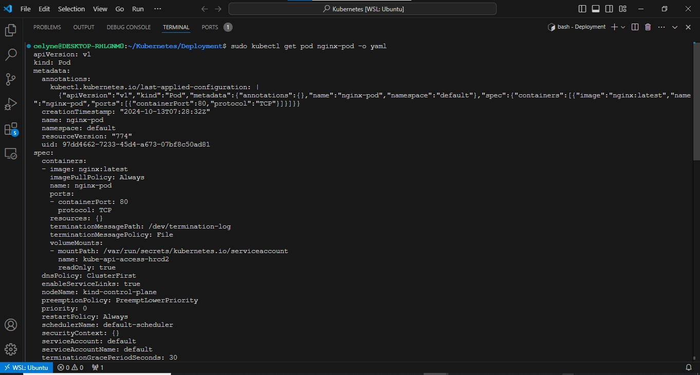
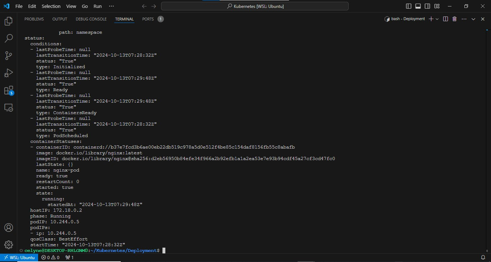
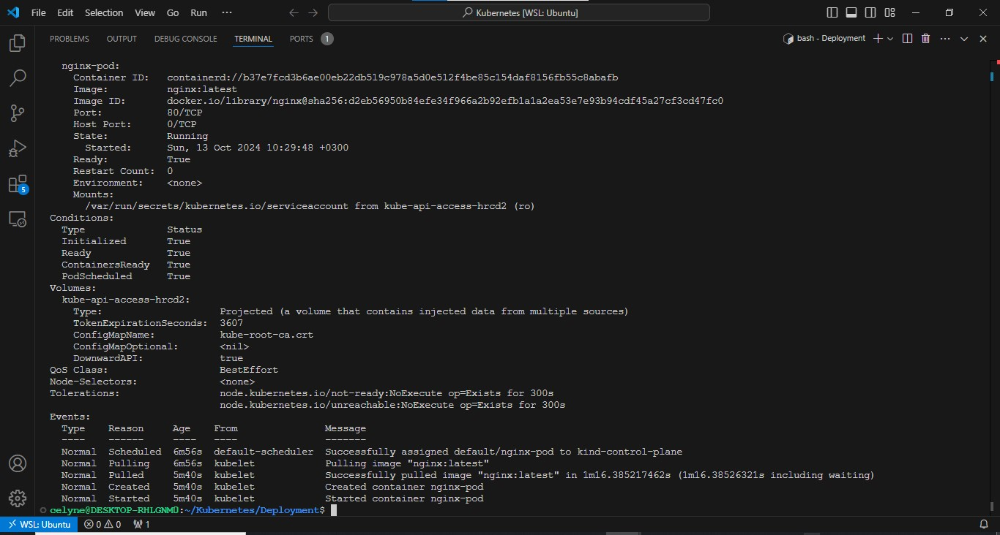

# Deploying Applications Into Kubernetes Cluster

## Deploying a random Pod

Lets see what it looks like to have a Pod running in a **k8s cluster**. This section is just to illustrate and get you to familiarise with how the object's fields work. Lets deploy a basic `Nginx` container to run inside a `Pod`.

- **apiVersion** is **v1**
- **kind** is **Pod**
- **metadata** has a **name** which is set to **nginx-pod**
- The **spec** section has further information about the Pod. Where to find the image to run the container - (This defaults to **Docker Hub**), the port and protocol.

The structure is similar for any Kubernetes objects, and you will get to see them all as we progress.

1. Create a [Pod](https://kubernetes.io/docs/concepts/workloads/pods/) yaml manifest on your master node

```bash
sudo cat <<EOF | sudo tee ./nginx-pod.yaml
apiVersion: v1
kind: Pod
metadata:
  name: nginx-pod
spec:
  containers:
  - image: nginx:latest
    name: nginx-pod
    ports:
    - containerPort: 80
      protocol: TCP
EOF
```


2. Apply the manifest with the help of kubectl

```bash
kubectl apply -f nginx-pod.yaml
```

Output:

```
pod/nginx-pod created
```


### HINT: SINCE AWS EKS REFUSE WORKING BASED ON VPC REQUEST LIMIT, I HAD TO MAKE USE OF KIND (KUBERNTES IN DOCKER )

STEPS

```bash
#Download the Kind binary

curl -Lo ./kind https://kind.sigs.k8s.io/dl/v0.20.0/kind-linux-amd64

#Make the Kind binary executable:

chmod +x ./kind

#Move the binary to your system's PATH:

sudo mv ./kind /usr/local/bin/kind

#After installing Kind, verify that it's properly installed by checking the version:

kind --version

#Once Kind is installed, you can create your cluster with:

sudo kind create cluster

#Verify that the cluster is created:

sudo kubectl get nodes
```


Apply the manifest with the help of kubectl

```bash
kubectl apply -f nginx-pod.yaml

Output:

pod/nginx-pod created
```


3. Get an output of the pods running in the cluster

```bash
kubectl get pods
```

Output:

```
NAME        READY   STATUS    RESTARTS   AGE
nginx-pod   1/1     Running   0          19m
```


4. If the Pods were not ready for any reason, for example if there are no worker nodes, you will see something like the below output.

```
NAME        READY   STATUS    RESTARTS   AGE
nginx-pod   0/1     Pending   0          111s
```

5. To see other fields introduced by kubernetes after you have deployed the resource, simply run below command, and examine the output. You will see other fields that kubernetes updates from time to time to represent the state of the resource within the cluster. -o simply means the output format.

```bash
kubectl get pod nginx-pod -o yaml
```





OR

```bash
kubectl describe pod nginx-pod
```




## Accessing the app from the browser

Now you have a running Pod. What's next?

The ultimate goal of any solution is to access it either through a web portal or some application (e.g., mobile app). We have a Pod with Nginx container, so we need to access it from the browser. But all you have is a running Pod that has its own IP address which cannot be accessed through the browser. To achieve this, we need another Kubernetes object called [Service](https://kubernetes.io/docs/concepts/services-networking/service/) to accept our request and pass it on to the `Pod`.

A **service** is an object that accepts requests on behalf of the **Pods** and forwards it to the Pod's IP address. If you run the command below, you will be able to see the Pod's IP address. But there is no way to reach it directly from the outside world.

```bash
kubectl get pod nginx-pod  -o wide
```

Output:

```
NAME        READY   STATUS    RESTARTS   AGE    IP               NODE                                              NOMINATED NODE   READINESS GATES
nginx-pod   1/1     Running   0          138m   172.50.202.214   ip-172-50-202-161.eu-central-1.compute.internal   <none>           <none>
```


### Let us try to access the Pod through its IP address from within the K8s cluster. To do this,

1. We need an image that already has curl software installed. You can check it out [here](https://hub.docker.com/r/dareyregistry/curl)

```
dareyregistry/curl
```

2. Run kubectl to connect inside the container

```bash
kubectl run curl --image=dareyregistry/curl -i --tty
```

or Run Temporary Pod

```bash
kubectl run curl-pod --image=curlimages/curl:latest --restart=Never -i --tty -- /bin/sh
```

3. Run curl and point to the IP address of the Nginx Pod (Use the IP address of your own Pod)

```bash
curl -v 172.31.43.239:80
```

Output:

```
> GET / HTTP/1.1
> User-Agent: curl/7.35.0
> Host: 172.50.202.214
> Accept: */*
>
< HTTP/1.1 200 OK
< Server: nginx/1.21.0
< Date: Sat, 12 Jun 2021 21:12:56 GMT
< Content-Type: text/html
< Content-Length: 612
< Last-Modified: Tue, 25 May 2021 12:28:56 GMT
< Connection: keep-alive
< ETag: "60aced88-264"
< Accept-Ranges: bytes
<
<!DOCTYPE html>
<html>
<head>
<title>Welcome to nginx!</title>
<style>
    body {
        width: 35em;
        margin: 0 auto;
        font-family: Tahoma, Verdana, Arial, sans-serif;
    }
</style>
</head>
<body>
<h1>Welcome to nginx!</h1>
<p>If you see this page, the nginx web server is successfully installed and
working. Further configuration is required.</p>

<p>For online documentation and support please refer to
<a href="http://nginx.org/">nginx.org</a>.<br/>
Commercial support is available at
<a href="http://nginx.com/">nginx.com</a>.</p>

<p><em>Thank you for using nginx.</em></p>
</body>
</html>
```


If the use case for your solution is required for internal use ONLY, without public Internet requirement. Then, this should be OK. But in most cases, it is NOT!

Assuming that your requirement is to access the Nginx Pod internally, using the Pod's IP address directly as above is not a reliable choice because Pods are ephemeral. They are not designed to run forever. When they die and another Pod is brought back up, the IP address will change and any application that is using the previous IP address directly will break.

To solve this problem, kubernetes uses **Service** - An object that abstracts the underlining IP addresses of Pods. A service can serve as a load balancer, and a reverse proxy which basically takes the request using a human readable DNS name, resolves to a Pod IP that is running and forwards the request to it. This way, you do not need to use an IP address. Rather, you can simply refer to the service name directly.

### Let us create a service to access the **Nginx Pod**

1. Create a Service `yaml` manifest file:

```bash
sudo cat <<EOF | sudo tee ./nginx-service.yaml
apiVersion: v1
kind: Service
metadata:
  name: nginx-service
spec:
  selector:
    app: nginx-pod
  ports:
    - protocol: TCP
      port: 80
      targetPort: 80
EOF
```


2. Create a nginx-service resource by applying your manifest

```bash
kubectl apply -f nginx-service.yaml
```

output:

```
service/nginx-service created
```


3. Check the created service

```bash
kubectl get service
```

output:

```
NAME            TYPE        CLUSTER-IP      EXTERNAL-IP   PORT(S)   AGE
kubernetes      ClusterIP   10.100.0.1      <none>        443/TCP   68d
nginx-service   ClusterIP   10.100.71.130   <none>        80/TCP    85s
```


**Observation:**

The **TYPE** column in the output shows that there are different [service types](https://kubernetes.io/docs/concepts/services-networking/service/#publishing-services-service-types).

- ClusterIP
- NodePort
- LoadBalancer &
- Headless Service

Since we did not specify any type, it is obvious that the default type is **ClusterIP**

Now that we have a service created, how can we access the app? Since there is no public IP address, we can leverage `kubectl's` **port-forward** functionality.

```bash
kubectl  port-forward svc/nginx-service 8089:80
```

**8089** is an arbitrary port number on your laptop or client PC, and we want to tunnel traffic through it to the port number of the `nginx-service` **80**.


Unfortunately, this will not work quite yet. Because there is no way the service will be able to select the actual Pod it is meant to route traffic to. If there are hundreds of Pods running, there must be a way to ensure that the service only forwards requests to the specific Pod it is intended for.


To make this work, you must reconfigure the Pod manifest and introduce `labels` to match the `selectors` key in the field section of the service manifest.

1. Update the Pod manifest with the below and apply the manifest:

```yaml
apiVersion: v1
kind: Pod
metadata:
  name: nginx-pod
  labels:
    app: nginx-pod
spec:
  containers:
    - image: nginx:latest
      name: nginx-pod
      ports:
        - containerPort: 80
          protocol: TCP
```


**Notice** that under the metadata section, we have now introduced `labels` with a key field called `app` and its value `nginx-pod`. This matches exactly the `selector` key in the **service** manifest.
The key/value pairs can be anything you specify. These are not Kubernetes specific keywords. As long as it matches the selector, the service object will be able to route traffic to the `Pod`.

Apply the manifest with:

```bash
kubectl apply -f nginx-pod.yaml
```


2. Run kubectl port-forward command again

```bash
kubectl  port-forward svc/nginx-service 8089:80
```

output:

```
kubectl  port-forward svc/nginx-service 8089:80
Forwarding from 127.0.0.1:8089 -> 80
Forwarding from [::1]:8089 -> 80
```


Then go to your web browser and enter **localhost:8089** - You should now be able to see the nginx page in the browser.


Let us try to understand a bit more about how the service object is able to route traffic to the Pod.

If you run the below command:

```bash
kubectl get service nginx-service -o wide
```

You will get the output similar to this:

```
NAME            TYPE        CLUSTER-IP      EXTERNAL-IP   PORT(S)   AGE   SELECTOR
nginx-service   ClusterIP   10.100.71.130   <none>        80/TCP    4d    app=nginx-pod
```


As you already know, the service's type is `ClusterIP`, and in the above output, it has the IP address of **10.96.54.119** - This IP works just like an internal loadbalancer. It accepts requests and forwards it to an IP address of any Pod that has the respective `selector` label. In this case, it is `app=nginx-pod`. If there is more than one Pod with that label, service will distribute the traffic to all theese pods in a [Round Robin](https://en.wikipedia.org/wiki/Round-robin_scheduling) fashion.

Now, let us have a look at what the Pod looks like:

```bash
kubectl get pod nginx-pod --show-labels
```

Output:

```
NAME        READY   STATUS    RESTARTS   AGE   LABELS
nginx-pod   1/1     Running   0          31m   app=nginx-pod
```


**\_Notice** that the IP address of the Pod, is NOT the IP address of the server it is running on. Kubernetes, through the implementation of network plugins assigns virtual IP adrresses to each Pod.\_

```bash
kubectl get pod nginx-pod -o wide
```

Output:

```
NAME        READY   STATUS    RESTARTS   AGE   IP               NODE                                              NOMINATED NODE   READINESS GATES
nginx-pod   1/1     Running   0          57m   172.50.197.236   ip-172-50-197-215.eu-central-1.compute.internal   <none>           <none>
```


Therefore, Service with IP `10.100.131.163` takes request and forwards to Pod with IP `172.31.43.239`

# Expose a Service on a server's public IP address & static port

Sometimes, it may be needed to directly access the application using the public IP of the server (when we speak of a K8s cluster we can replace 'server' with 'node') the Pod is running on. This is when the [NodePort](https://kubernetes.io/docs/concepts/services-networking/service/#nodeport) service type comes in handy.

A **Node port** service type exposes the service on a static port on the node's IP address. NodePorts are in the `30000-32767` range by default, which means a NodePort is unlikely to match a service’s intended port (for example, **80** may be exposed as **30080**).

Update the nginx-service `yaml` to use a NodePort Service.

```yaml
sudo cat <<EOF | sudo tee ./nginx-service.yaml
apiVersion: v1
kind: Service
metadata:
  name: nginx-service
spec:
  type: NodePort
  selector:
    app: nginx-pod
  ports:
    - protocol: TCP
      port: 80
      nodePort: 30080
EOF
```


What has changed is:

- Specified the type of service (Nodeport)
- Specified the NodePort number to use.


To access the service, you must:

- Allow the inbound traffic in your EC2's **Security Group** to the `NodePort` range **30000-32767**
- Get the public IP address of the node the Pod is running on, append the nodeport and access the app through the browser.

Apply the service update

```bash
kubectl apply -f nginx-service.yaml
```

Confirm the node the pod is running on (Check the internal IP address)

```bash
kubectl get pod nginx-pod -o wide
```

You must understand that the port number `30080` is a port on the node in which the Pod is scheduled to run. If the Pod ever gets rescheduled elsewhere, that the same port number will be used on the new node it is running on. So, if you have multiple Pods running on several nodes at the same time - they all will be exposed on respective nodes' IP addresses with a static port number.


### However, since we are using docker container to run our kubernetes cluster, heres how we can achieve same result.

STEPS

Get the service NodePort by running

```bash
sudo kubectl get svc nginx-service
```


Get the docker container ID of the node running in Kind

```bash
sudo docker ps
```


Find the container ip address

```bash
sudo docker inspect -f '{{range.NetworkSettings.Networks}}{{.IPAddress}}{{end}}' <container_id>
```


Access the service via the container IP address with the NodePort 30080


Read some more information regarding Services in Kubernetes in this [article](https://medium.com/avmconsulting-blog/service-types-in-kubernetes-24a1587677d6).

## How Kubernetes ensures desired number of Pods is always running?

When we define a Pod manifest and appy it - we create a Pod that is running until it's terminated for some reason (e.g., error, Node reboot or some other reason), but what if we want to declare that we always need at least 3 replicas of the same Pod running at all times? Then we must use a [ResplicaSet (RS)](https://kubernetes.io/docs/concepts/workloads/controllers/replicaset/) object - it's purpose is to maintain a stable set of Pod replicas running at any given time. As such, it is often used to guarantee the availability of a specified number of identical Pods.

**Note:** In some older books or documents you might find the old version of a similar object - [ReplicationController (RC)](https://kubernetes.io/docs/concepts/workloads/controllers/replicationcontroller/), it had similar purpose, but did not support [set-base label selectors](https://kubernetes.io/docs/concepts/overview/working-with-objects/labels/#set-based-requirement) and it is now recommended to use ReplicaSets instead, since it is the next-generation RC.

Let us **delete** our **nginx-pod Pod**:

```bash
kubectl delete -f nginx-pod.yaml
```

Output:

```
pod "nginx-pod" deleted
```


## Create a ReplicaSet

Let us create a `rs.yaml` manifest for a ReplicaSet object:

```bash
cat <<EOF > rs.yaml
apiVersion: apps/v1
kind: ReplicaSet
metadata:
  name: nginx-rs
spec:
  replicas: 3
  selector:
    matchLabels:
      app: nginx-pod
  template:
    metadata:
      name: nginx-pod
      labels:
        app: nginx-pod
    spec:
      containers:
      - image: nginx:latest
        name: nginx-pod
        ports:
        - containerPort: 80
          protocol: TCP
EOF
```


```bash
kubectl apply -f rs.yaml
```


The manifest file of ReplicaSet consist of the following fields:

- **apiVersion:** This field specifies the version of kubernetes Api to which the object belongs. ReplicaSet belongs to **apps/v1** apiVersion.
- **kind:** This field specify the type of object for which the manifest belongs to. Here, it is **ReplicaSet**.
- **metadata:** This field includes the metadata for the object. It mainly includes two fields: name and labels of the ReplicaSet.
- **spec:** This field specifies the `label selector` to be used to select the Pods, number of replicas of the Pod to be run and the container or list of containers which the Pod will run. In the above example, we are running `3 replicas` of nginx container.

Let us check what Pods have been created:

```bash
kubectl get pods
```

OUTPUT:

```
NAME              READY   STATUS    RESTARTS   AGE     IP               NODE                                              NOMINATED NODE   READINESS GATES
nginx-pod-j784r   1/1     Running   0          7m41s   172.50.197.5     ip-172-50-197-52.eu-central-1.compute.internal    <none>           <none>
nginx-pod-kg7v6   1/1     Running   0          7m41s   172.50.192.152   ip-172-50-192-173.eu-central-1.compute.internal   <none>           <none>
nginx-pod-ntbn4   1/1     Running   0          7m41s   172.50.202.162   ip-172-50-202-18.eu-central-1.compute.internal    <none>           <none>
```


Here we see three `ngix-pods` with some random suffixes (e.g., `-j784r`) - it means, that these Pods were created and named automatically by some other object (higher level of abstraction) such as ReplicaSet.

Try to delete one of the Pods:

```bash
kubectl delete pod nginx-rs-52597
```


You can see, that we still have all 3 Pods, but one has been recreated (can you differentiate the new one?)

Explore the ReplicaSet created:

```bash
kubectl get rs -o wide
```


**Notice**, that ReplicaSet understands which Pods to create by using **SELECTOR** key-value pair.

## Get detailed information of a ReplicaSet

To display detailed information about any Kubernetes object, you can use 2 differen commands:

kubectl **describe** %object_type% %object_name% (e.g. kubectl describe rs nginx-rs)
kubectl **get** %object_type% %object_name% -o yaml (e.g. kubectl get rs nginx-rs -o yaml)

Try both commands in action and see the difference. Also try `get` with `-o json` instead of `-o yaml` and decide for yourself which output option is more readable for you.

```bash
kubectl describe rs nginx-rs
```


```bash
kubectl get rs nginx-rs -o yaml
```


```bash
kubectl get rs nginx-rs -o json
```


## Scale ReplicaSet up and down

In general, there are 2 approaches of [Kubernetes Object Management](https://kubernetes.io/docs/concepts/overview/working-with-objects/object-management/): **imperative** and **declarative**.

Let us see how we can use both to scale our Replicaset up and down:

### Imperative:

We can easily scale our ReplicaSet up by specifying the desired number of replicas in an imperative command, like this:

```bash
kubectl scale rs nginx-rs --replicas=5
```

Output:

```
replicationcontroller/nginx-rc scaled
```

```bash
kubectl get pods
```

Output:

```
NAME             READY   STATUS    RESTARTS   AGE
nginx-rc-4kgpj   1/1     Running   0          4m30s
nginx-rc-4z2pn   1/1     Running   0          4m30s
nginx-rc-g4tvg   1/1     Running   0          6s
nginx-rc-kmh8m   1/1     Running   0          6s
nginx-rc-zlgvp   1/1     Running   0          4m30s
```


Scaling down will work the same way, so scale it down to 3 replicas.


### Declarative:

Declarative way would be to open our `rs.yaml` manifest, change desired number of replicas in respective section.

```yaml
spec:
  replicas: 3
```

and applying the updated manifest:

```bash
kubectl apply -f rs.yaml
```

There is another method - `ad-hoc`, it is definitely not the best practice and we do not recommend using it, but you can edit an existing ReplicaSet with following command:

```bash
kubectl edit -f rs.yaml
```

## Advanced label matching

As Kubernetes mature as a technology, so does its features and improvements to k8s objects. `ReplicationControllers` do not meet certain complex business requirements when it comes to using selectors. Imagine if you need to select Pods with multiple lables that represents things like:

- **Application tier:** such as Frontend, or Backend
- **Environment:** such as Dev, SIT, QA, Preprod, or Prod

So far, we used a simple selector that just matches a key-value pair and check only 'equality':

```yaml
selector:
  app: nginx-pod
```

But in some cases, we want ReplicaSet to manage our existing containers that match certain criteria, we can use the same simple label matching or we can use some more complex conditions, such as:

```
- in
- not in
- not equal
- etc...
```

Let us look at the following manifest file:

```bash
cat <<EOF > rs.yaml
apiVersion: apps/v1
kind: ReplicaSet
metadata:
  name: nginx-rs
spec:
  replicas: 3
  selector:
    matchLabels:
      env: prod
    matchExpressions:
    - { key: tier, operator: In, values: [frontend] }
  template:
    metadata:
      name: nginx
      labels:
        env: prod
        tier: frontend
    spec:
      containers:
      - name: nginx-container
        image: nginx:latest
        ports:
        - containerPort: 80
          protocol: TCP
EOF
```


In the above spec file, under the selector, **matchLabels** and **matchExpression** are used to specify the key-value pair. The **matchLabel** works exactly the same way as the equality-based selector, and the matchExpression is used to specify the set based selectors. This feature is the main differentiator between **ReplicaSet** and previously mentioned obsolete **ReplicationController**.

Get the replication set:

```bash
# Delete the existing ReplicaSet and recreate it (because the selector field is immutable)
kubectl delete rs nginx-rs
kubectl apply -f rs.yaml

kubectl get rs nginx-rs -o wide
```

Output:

```
NAME       DESIRED   CURRENT   READY   AGE     CONTAINERS        IMAGES         SELECTOR
nginx-rs   3         3         3       5m34s   nginx-container   nginx:latest   env=prod,tier in (frontend)
```


## Using AWS Load Balancer to access your service in Kubernetes.

**\_Note:** You will only be able to test this using AWS EKS. You don not have to set this up in current project yet. In the next project, you will update your Terraform code to build an EKS cluster.\_

You have previously accessed the Nginx service through **ClusterIP**, and **NodeIP**, but there is another service type - [Loadbalancer](https://kubernetes.io/docs/concepts/services-networking/service/#loadbalancer). This type of service does not only create a **Service** object in K8s, but also provisions a real external Load Balancer (e.g. [Elastic Load Balancer](https://aws.amazon.com/elasticloadbalancing/) - ELB in AWS)

To get the experience of this service type, update your service manifest and use the **LoadBalancer** type. Also, ensure that the selector references the Pods in the replica set.

```bash
sudo cat <<EOF | sudo tee ./nginx-service.yaml
apiVersion: v1
kind: Service
metadata:
  name: nginx-service
spec:
  type: LoadBalancer
  selector:
    tier: frontend
  ports:
    - protocol: TCP
      port: 80 # This is the port the Loadbalancer is listening at
      targetPort: 80 # This is the port the container is listening at
EOF
```


Apply the configuration:

```bash
kubectl apply -f nginx-service.yaml
```

Get the newly created service :

```bash
kubectl get service nginx-service
```

Output:

```
NAME            TYPE           CLUSTER-IP      EXTERNAL-IP                                                                  PORT(S)        AGE
nginx-service   LoadBalancer   10.100.71.130   aab159950f39e43d39195e23c77417f8-1167953448.eu-central-1.elb.amazonaws.com   80:31388/TCP   5d18h
```

```bash
export AWS_SDK_LOAD_CONFIG=1
```

This environment variable ensures that the AWS SDK checks both **~/.aws/credentials** and **~/.aws/config** files.


An ELB resource will be created in your AWS console.


A Kubernetes component in the control plane called [Cloud-controller-manager](https://kubernetes.io/docs/concepts/architecture/cloud-controller/) is responsible for triggeriong this action. It connects to your specific cloud provider's (AWS) APIs and create resources such as Load balancers. It will ensure that the resource is appropriately tagged:


Get the output of the entire `yaml` for the service. You will see additional information about this service in which you did not define them in the `yaml` manifest. Kubernetes did this for you.

```bash
kubectl get service nginx-service -o yaml
```

Output:

```yaml
apiVersion: v1
kind: Service
metadata:
  annotations:
    kubectl.kubernetes.io/last-applied-configuration: |
      {"apiVersion":"v1","kind":"Service","metadata":{"annotations":{},"name":"nginx-service","namespace":"default"},"spec":{"ports":[{"port":80,"protocol":"TCP","targetPort":80}],"selector":{"app":"nginx-pod"},"type":"LoadBalancer"}}
  creationTimestamp: "2021-06-18T16:24:21Z"
  finalizers:
    - service.kubernetes.io/load-balancer-cleanup
  name: nginx-service
  namespace: default
  resourceVersion: "21824260"
  selfLink: /api/v1/namespaces/default/services/nginx-service
  uid: c12145d6-a8b5-491d-95ff-8e2c6296b46c
spec:
  clusterIP: 10.100.153.44
  externalTrafficPolicy: Cluster
  ports:
    - nodePort: 31388
      port: 80
      protocol: TCP
      targetPort: 80
  selector:
    tier: frontend
  sessionAffinity: None
  type: LoadBalancer
status:
  loadBalancer:
    ingress:
      - hostname: ac12145d6a8b5491d95ff8e2c6296b46-588706163.eu-central-1.elb.amazonaws.com
```


1. A **clusterIP** key is updated in the manifest and assigned an IP address. Even though you have specified a Loadbalancer service type, internally it still requires a clusterIP to route the external traffic through.

2. In the ports section, nodePort is still used. This is because Kubernetes still needs to use a dedicated port on the worker node to route the traffic through. Ensure that port range **30000-32767** is opened in your inbound Security Group configuration.

3. More information about the provisioned balancer is also published in the .status.loadBalancer field.
   `yaml
status:
  loadBalancer:
    ingress:
    - hostname: ac12145d6a8b5491d95ff8e2c6296b46-588706163.eu-central-1.elb.amazonaws.com
`
   Copy and paste the load balancer's address to the browser, and you will access the Nginx service


## Do not Use Replication Controllers - Use Deployment Controllers Instead

Kubernetes is loaded with a lot of features, and with its vibrant open source community, these features are constantly evolving and adding up.

Previously, you have seen the improvements from **ReplicationControllers (RC)**, to **ReplicaSets (RS)**. In this section you will see another K8s object which is highly recommended over Replication objects (RC and RS).

## Deployment

A [Deployment](https://kubernetes.io/docs/concepts/workloads/controllers/deployment/) is another layer above ReplicaSets and Pods, newer and more advanced level concept than ReplicaSets. It manages the deployment of ReplicaSets and allows for easy updating of a ReplicaSet as well as the ability to roll back to a previous version of deployment. It is declarative and can be used for rolling updates of micro-services, ensuring there is no downtime.

Officially, it is highly recommended to use **Deplyments** to manage replica sets rather than using replica sets directly.

Let us see Deployment in action.

1. Delete the ReplicaSet

```bash
kubectl delete rs nginx-rs
```


2. Understand the layout of the deployment.yaml manifest below. Lets go through the 3 separated sections:

```yaml
# Section 1 - This is the part that defines the deployment
apiVersion: apps/v1
kind: Deployment
metadata:
  name: nginx-deployment
  labels:
    tier: frontend

# Section 2 - This is the Replica set layer controlled by the deployment
spec:
  replicas: 3
  selector:
    matchLabels:
      tier: frontend

  # Section 3 - This is the Pod section controlled by the deployment and selected by the replica set in section 2.
  template:
    metadata:
      labels:
        tier: frontend
    spec:
      containers:
        - name: nginx
          image: nginx:latest
          ports:
            - containerPort: 80
```

3. Putting them altogether

```bash
cat <<EOF > ./deployment.yaml
apiVersion: apps/v1
kind: Deployment
metadata:
  name: nginx-deployment
  labels:
    tier: frontend
spec:
  replicas: 3
  selector:
    matchLabels:
      tier: frontend
  template:
    metadata:
      labels:
        tier: frontend
    spec:
      containers:
      - name: nginx
        image: nginx:latest
        ports:
        - containerPort: 80
EOF
```


```bash
kubectl apply -f deployment.yaml
```


Run commands to get the following

1. Get the Deployment

```bash
kubectl get deployment
```

```
NAME               READY   UP-TO-DATE   AVAILABLE   AGE
nginx-deployment   3/3     3            3           39s
```


2. Get the ReplicaSet

```bash
kubectl get rs
```

```
NAME                          DESIRED   CURRENT   READY   AGE
nginx-deployment-56466d4948   3         3         3       24s
```


3. Get the Pods

```bash
kubectl get pods
```

```
NAME                                READY   STATUS    RESTARTS   AGE
nginx-deployment-56466d4948-5zdbx   1/1     Running   0          12s
nginx-deployment-56466d4948-tg9j8   1/1     Running   0          12s
nginx-deployment-56466d4948-ttn5t   1/1     Running   0          12s
```


4. Scale the replicas in the Deployment to 15 Pods

```bash
kubectl scale deployment nginx-deployment --replicas=15
```


5. Exec into one of the Pod's container to run Linux commands

```bash
kubectl exec -it nginx-deployment-56466d4948-78j9c bash
```

List the files and folders in the Nginx directory

```bash
ls -ltr /etc/nginx/
```


Check the content of the default Nginx configuration file

```bash
cat  /etc/nginx/conf.d/default.conf
```


Now, as we have got acquainted with most common Kubernetes workloads to deploy applications:


it is time to explore how Kubernetes is able to manage persistent data.

## Persisting Data for Pods

Deployments are stateless by design. Hence, any data stored inside the Pod's container does not persist when the Pod dies.

If you were to update the content of the `index.html` file inside the container, and the Pod dies, that content will be lost since a new Pod will replace the dead one.

Let us try that:

1. Scale the Pods down to 1 replica.

```bash
kubectl scale deployment nginx-deployment --replicas=1
```


2. Exec into the running container (figure out the command yourself)

```bash
kubectl exec -it nginx-deployment-56466d4948-78j9c -- /bin/bash
```


3. Install vim so that you can edit the file

```bash
apt-get update
apt-get install vim
```


4. Update the content of the file and add the code below **/usr/share/nginx/html/index.html**

```bash
vim /usr/share/nginx/html/index.html
```


```html
<!DOCTYPE html>
<html>
  <head>
    <title>Welcome to STEGHUB.COM!</title>
    <style>
      body {
        width: 35em;
        margin: 0 auto;
        font-family: Tahoma, Verdana, Arial, sans-serif;
      }
    </style>
  </head>
  <body>
    <h1>Welcome to STEGHUB.COM!</h1>
    <p>I love experiencing Kubernetes</p>

    <p>
      Learning by doing is absolutely the best strategy at
      <a href="https://steghub.com/">www.steghub.com</a>.<br />
      for skills acquisition
      <a href="https://steghub.com/">www.steghub.com</a>.
    </p>

    <p><em>Thank you for learning from STEGHUB.COM</em></p>
  </body>
</html>
```


5. Check the browser - You should see this


6. Now, delete the only running Pod so that a new one is automatically recreated.

```bash
kubectl delete pod nginx-deployment-56466d4948-tg9j8
```


7. **Refresh the web page** - You will see that the content you saved in the container is no longer there. That is because Pods do not store data when they are being recreated - that is why they are called `ephemeral` or `stateless`. (_But not to worry, we will address this with persistent volumes in the next project_)


**Storage** is a critical part of running containers, and Kubernetes offers some powerful primitives for managing it. **Dynamic volume provisioning**, a feature unique to Kubernetes, which allows storage volumes to be created on-demand. Without dynamic provisioning, DevOps engineers must manually make calls to the cloud or storage provider to create new storage volumes, and then create **PersistentVolume** objects to represent them in Kubernetes. The dynamic provisioning feature eliminates the need for DevOps to pre-provision storage. Instead, it automatically provisions storage when it is requested by users.

To make the data persist in case of a Pod's failure, you will need to configure the Pod to use **Volumes**:

**Clean up the deployment**

```bash
kubectl delete deployment nginx-deployment
```


In the next project,

- We will understand how persistence work in Kubernetes using **Volumes**.
- We will use `eksctl` to create a Kubernetes EKS cluster in AWS, and begin to use some powerful features such as `PV`, `PVCs`, `ConfigMaps`.
- Experience Dynamic provisioning of volumes to make our Pods stateful, using Kubernetes Statefulset.
