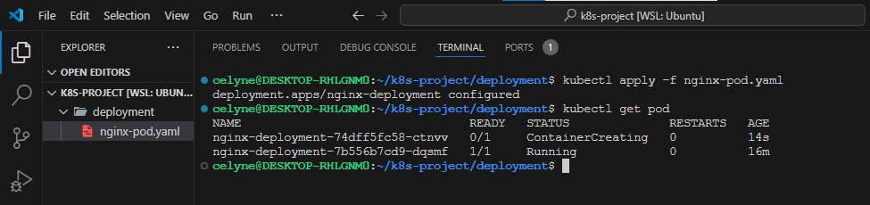
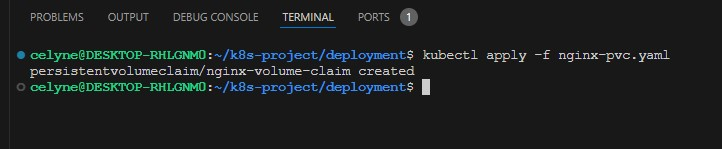
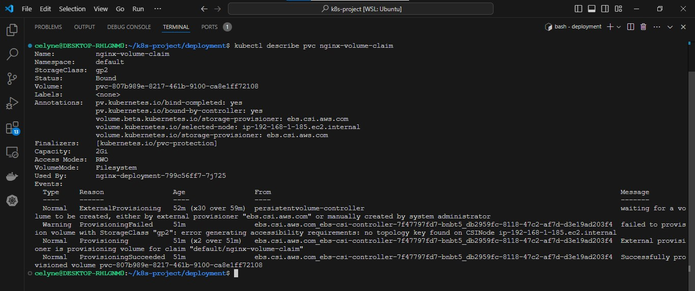

# Persisting Data in Kubernetes

**NOTE:** Create EKS cluster first before the below section

### 1. Set up an Amazon Elastic Kubernetes Service (EKS) cluster.

- Ensure AWS CLI is already installed and access key credentials have been configured.


- Install **eksctl**

```bash
curl --silent --location "https://github.com/weaveworks/eksctl/releases/download/v0.125.0/eksctl_$(uname -s)_amd64.tar.gz" | sudo tar -xz -C /usr/local/bin
```

```bash
eksctl version
```


- Create EKS cluster using `eksctl`

```bash
eksctl create cluster --name cdk-eks-cluster --region us-east-1 --nodegroup-name cdk-node-group --node-type t3.medium --nodes 2
```


- Enable **OIDC** to allow the cluster to use **IAM roles** for service accounts and automatically configure **IAM permissions** for addons.

```bash
eksctl utils associate-iam-oidc-provider --cluster cdk-eks-cluster --approve
```


- Check the cluster status and verify API connection

```bash
aws eks update-kubeconfig --name cdk-eks-cluster --region us-east-1

kubectl config current-context

kubectl get svc

kubectl get nodes

kubectl get ns

eksctl get cluster --region us-east-1
```


- Check the cluster in the AWS console


- ConfigMap

```bash
kubectl get configmap aws-auth -n kube-system -o yaml

kubectl auth can-i list pods --all-namespaces

kubectl get pods --all-namespaces
```


Now we know that containers are stateless by design, which means that data does not persist in the containers. Even when you run the containers in kubernetes pods, they still remain stateless unless you ensure that your configuration supports statefulness.

To achieve statefuleness in kubernetes, you must understand how `volumes`, `persistent volumes`, and `persistent volume claims` work.

# Volumes

On-disk files in a container are ephemeral, which presents some problems for non-trivial applications when running in containers. One problem is the loss of files when a container crashes. The kubelet restarts the container but with a clean state. A second problem occurs when sharing files between containers running together in a Pod. The Kubernetes volume abstraction solves both of these problems

Docker has a concept of volumes, though it is somewhat looser and less managed. A Docker volume is a directory on disk or in another container. Docker provides volume drivers, but the functionality is somewhat limited.

Kubernetes supports many types of volumes. A Pod can use any number of volume types simultaneously. Ephemeral volume types have a lifetime of a pod, but persistent volumes exist beyond the lifetime of a pod. When a pod ceases to exist, Kubernetes destroys ephemeral volumes; however, Kubernetes does not destroy persistent volumes. For any kind of volume in a given pod, data is preserved across container restarts.

At its core, a volume is a directory, possibly with some data in it, which is accessible to the containers in a pod. How that directory comes to be, the medium that backs it, and the contents of it are all determined by the particular **volume type** used. This means, you must know some of the different types of volumes available in kubernetes before choosing what is ideal for your particular use case.

Lets have a look at a few of them.

## awsElasticBlockStore

An awsElasticBlockStore volume mounts an **Amazon Web Services (AWS) EBS** volume into your pod. The contents of an EBS volume are persisted and the volume is only unmmounted when the pod crashes, or terminates. This means that an EBS volume can be pre-populated with data, and that data can be shared between pods.

Lets see what it looks like for our Nginx pod to persist data using `awsElasticBlockStore` volume

```bash
sudo cat <<EOF | sudo tee ./nginx-pod.yaml
apiVersion: apps/v1
kind: Deployment
metadata:
  name: nginx-deployment
  labels:
    tier: frontend
spec:
  replicas: 1
  selector:
    matchLabels:
      tier: frontend
  template:
    metadata:
      labels:
        tier: frontend
    spec:
      containers:
      - name: nginx
        image: nginx:latest
        ports:
        - containerPort: 80
      volumes:
      - name: nginx-volume
        # This AWS EBS volume must already exist.
        awsElasticBlockStore:
          volumeID: "<volume id>"
          fsType: ext4
EOF
```

The **volume** section indicates the type of volume to be used to ensure persistence.

If you notice the config above carefully, you will realise that there is need to provide a **_volumeID_** before the deployment will work. Therefore, You must create an **EBS** volume by using aws `ec2 create-volume` command or the AWS console.

Before you create a volume, lets run the nginx deployment into kubernetes without a volume.

```bash
sudo cat <<EOF | sudo tee ./nginx-pod.yaml
apiVersion: apps/v1
kind: Deployment
metadata:
  name: nginx-deployment
  labels:
    tier: frontend
spec:
  replicas: 3
  selector:
    matchLabels:
      tier: frontend
  template:
    metadata:
      labels:
        tier: frontend
    spec:
      containers:
      - name: nginx
        image: nginx:latest
        ports:
        - containerPort: 80
EOF
```

```bash
kubectl apply -f nginx-pod.yaml
```


**Tasks**

- Verify that the pod is running

```bash
kubectl get pods
```


- Check the logs of the pod

```bash
POD_NAME=$(kubectl get pod -l tier=frontend -o jsonpath="{.items[0].metadata.name}")

if [ -z "$POD_NAME" ]; then
    echo "No pods found with label 'tier=frontend'"
else
    echo "Found pod: $POD_NAME"
    echo "Fetching logs for pod: $POD_NAME"
    kubectl logs "$POD_NAME"
fi
```


- Exec into the pod and navigate to the nginx configuration file **/etc/nginx/conf.d**

```bash
kubectl exec -it $POD_NAME -- /bin/bash

cd /etc/nginx/conf.d
```

- Open the config files to see the default configuration.


**NOTE:** There are some restrictions when using an awsElasticBlockStore volume:

- The nodes on which pods are running must be AWS EC2 instances
- Those instances need to be in the same region and availability zone as the EBS volume
- EBS only supports a single EC2 instance mounting a volume

Now that we have the pod running without a volume, Lets now create a volume from the **AWS console**.

1. In your AWS console, head over to the EC2 section and scroll down to the **Elastic Block Storage** menu.
2. Click on Volumes
3. At the top right, click on **Create Volume**

Part of the requirements is to ensure that the volume exists in the same region and availability zone as the EC2 instance running the pod. Hence, we need to find out

- Which node is running the pod (replace the pod name with yours)

```bash
kubectl get po nginx-deployment-75b7745567-9gxvz -o wide
```

**Output:**

```
NAME                                READY   STATUS    RESTARTS   AGE   IP           NODE                                       NOMINATED NODE   READINESS GATES
nginx-deployment-6fdcffd8fc-thcfp   1/1     Running   0          64m   10.0.3.159   ip-10-0-3-233.eu-west-2.compute.internal   <none>           <none>
```


The NODE column shows the node the pode is running on

- In which Availability Zone the node is running.

```bash
kubectl describe node ip-192-168-11-24.ec2.internal
```


The information is written in the labels section of the describe command.

4. So, in the case above, we know the AZ for the node is in `us-east-1f` hence, the volume must be created in the same AZ. Choose the size of the required volume.

The **create volume** selection should be like:


5. Copy the **VolumeID**


6. Update the deployment configuration with the volume spec.

```bash
sudo cat <<EOF | sudo tee ./nginx-pod.yaml
apiVersion: apps/v1
kind: Deployment
metadata:
  name: nginx-deployment
  labels:
    tier: frontend
spec:
  replicas: 1
  selector:
    matchLabels:
      tier: frontend
  template:
    metadata:
      labels:
        tier: frontend
    spec:
      containers:
      - name: nginx
        image: nginx:latest
        ports:
        - containerPort: 80
      volumes:
      - name: nginx-volume
        # This AWS EBS volume must already exist.
        awsElasticBlockStore:
          volumeID: "vol-01d59773bbb64f8c5"
          fsType: ext4
EOF
```


Apply the new configuration and check the pod. As you can see, the old pod is being terminated while the updated one is up and running.

```bash
kubectl apply -f nginx-pod.yaml
```


Now, the new pod has a volume attached to it, and can be used to run a container for statefuleness. Go ahead and explore the running pod. Run `describe` on both the **pod** and **deployment**

```bash
kubectl describe pod nginx-deployment-6fbdb6d65f-jslb9
```


```bash
kubectl describe deployment nginx-deployment
```


At this point, even though the pod can be used for a stateful application, the configuration is not yet complete. This is because, the **volume is not yet mounted onto any specific filesystem inside the container**. The directory **/usr/share/nginx/html** which holds the software/website code is still **ephemeral**, and if there is any kind of update to the `index.html` file, the new changes will only be there for as long as the pod is still running. If the pod dies after, all previously written data will be erased.

To complete the configuration, we will need to add another section to the deployment yaml manifest. The **`volumeMounts`** which basically answers the question "Where should this _Volume_ be mounted inside the container?" Mounting a volume to a directory means that all data written to the directory will be stored on that volume.

Lets do that now.

```bash
cat <<EOF | tee ./nginx-pod.yaml
apiVersion: apps/v1
kind: Deployment
metadata:
  name: nginx-deployment
  labels:
    tier: frontend
spec:
  replicas: 1
  selector:
    matchLabels:
      tier: frontend
  template:
    metadata:
      labels:
        tier: frontend
    spec:
      containers:
      - name: nginx
        image: nginx:latest
        ports:
        - containerPort: 80
        volumeMounts:
        - name: nginx-volume
          mountPath: /usr/share/nginx/
      volumes:
      - name: nginx-volume
        # This AWS EBS volume must already exist.
        awsElasticBlockStore:
          volumeID: "vol-01d59773bbb64f8c5"
          fsType: ext4
EOF
```




Notice the newly added section:

```yaml
volumeMounts:
  - name: nginx-volume
    mountPath: /usr/share/nginx/
```

- The value provided to `name` in `volumeMounts` must be the same value used in the `volumes` section. It basically means mount the volume with the name provided, to the provided `mountpath`

In as much as we now have a way to persist data, we also have new problems.

1. If you **port forward** the service and try to reach the endpoint, you will get a 403 error. This is because mounting a volume on a filesystem that already contains data will automatically erase all the existing data. This strategy for statefulness is preferred if the mounted volume already contains the data which you want to be made available to the container.

2. It is still a manual process to create a volume, manually ensure that the volume created is in the same Avaioability zone in which the pod is running, and then update the manifest file to use the volume ID. All of these is against DevOps principles because it will mean having a lot of road blocks to getting a simple thing done.


The more elegant way to achieve this is through **Persistent Volume** and **Persistent Volume claims**.

In kubernetes, there are many elegant ways of persisting data. Each of which is used to satisfy different use cases. Lets take a look at the different options available.

- **Persistent Volume (PV)** and **Persistent Volume Claim (PVC)**
- **configMap**

# Managing Volumes Dynamically with PVs and PVCs

Kubernetes provides API objects for storage management such that, the lower level details of volume provisioning, storage allocation, access management etc are all abstracted away from the user, and all you have to do is present manifest files that describes what you want to get done.

**PVs** are volume plugins that have a lifecycle completely independent of any individual Pod that uses the PV. This means that even when a pod dies, the PV remains. A **PV** is a piece of storage in the cluster that is either provisioned by an administrator through a manifest file, or it can be dynamically created if a storage class has been pre-configured.

Creating a PV manually is like what we have done previously where with creating the volume from the console. As much as possible, we should allow PVs to be created automatically just be adding it to the container spec iin deployments. But without a storageclass present in the cluster, PVs cannot be automatically created.

If your infrastructure relies on a storage system such as NFS, iSCSI or a cloud provider-specific storage system such as EBS on AWS, then you can dynamically create a PV which will create a volume that a Pod can then use. This means that there must be a `storageClass` resource in the cluster before a PV can be provisioned.

By default, in EKS, there is a default `storageClass` configured as part of EKS installation. This storageclass is based on **gp2** which is Amazon's default type of volume for Elastic block storage.**gp2** is backled by solid-state drives (SSDs) which means they are suitable for a broad range of transactional workloads.

Run the command below to check if you already have a storageclass in your cluster `kubectl get storageclass`

```bash
kubectl get storageclass
```

```
NAME               PROVISIONER        RECLAIMPOLICY      VOLUMEBINDINGMODE    ALLOWVOLUMEEXPANSION    AGE
gp2 (default)   kubernetes.io/aws-ebs   Delete          WaitForFirstConsumer        false             18d
```


Of course, if the cluster is not EKS, then the storage class will be different. For example if the cluster is based on Google's `GKE` or Azure's `AKS`, then the storage class will be different.

If there is no storage class in your cluster, below manifest is an example of how one would be created

```yaml
kind: StorageClass
  apiVersion: storage.k8s.io/v1
  metadata:
    name: gp2
    annotations:
      storageclass.kubernetes.io/is-default-class: "true"
  provisioner: kubernetes.io/aws-ebs
  parameters:
    type: gp2
    fsType: ext4
```

A **PersistentVolumeClaim** (PVC) on the other hand is a request for storage. Just as Pods consume node resources, PVCs consume PV resources. Pods can request specific levels of resources (CPU and Memory). Claims can request specific size and access modes (e.g., they can be mounted `ReadWriteOnce`, `ReadOnlyMany` or `ReadWriteMany`, see [AccessModes](https://kubernetes.io/docs/concepts/storage/persistent-volumes/#access-modes)).

## Lifecycle of a PV and PVC

**PVs** are resources in the cluster. **PVCs** are requests for those resources and also act as **claim checks** to the resource. The interaction between PVs and PVCs follows this lifecycle:

### 1. Provisioning

There are two ways PVs may be provisioned: **statically** or **dynamically**.

- **Static/Manual Provisioning:** A cluster administrator creates a number of PVs using a manifest file which will contain all the details of the real storage. **PVs are not scoped to namespaces, they are clusterwide wide resource**, therefore the PV will be available for use when requested. **PVCs on the other hand are namespace scoped**.

- **Dynamic:** When there is no PV matching a PVC's request, then based on the available StorageClass, a dynamic PV will be created for use by the PVC. If there is no StorageClass, then the request for a PV by the PVC will fail.

### 2. Binding

PVCs are bound to specific PVs. This binding is exclusive. A PVC to PV binding is a one-to-one mapping. Claims will remain unbound indefinitely if a matching volume does not exist. Claims will be bound as matching volumes become available. For example, a cluster provisioned with many 50Gi PVs would not match a PVC requesting 100Gi. The PVC can be bound when a 100Gi PV is added to the cluster.

### 3. Using

Pods use claims as volumes. The cluster inspects the claim to find the bound volume and mounts that volume for a Pod. For volumes that support multiple access modes, the user specifies which mode is desired when using their claim as a volume in a Pod. Once a user has a claim and that claim is bound, the bound PV belongs to the user for as long as they need it. Users schedule Pods and access their claimed PVs by including a persistentVolumeClaim section in a Pod's volumes block

### 4. Storage Object in Use Protection

The purpose of the Storage Object in Use Protection feature is to ensure that PersistentVolumeClaims (PVCs) in active use by a Pod and PersistentVolume (PVs) that are bound to PVCs are not removed from the system, as this may result in data loss.
**Note:** PVC is in active use by a Pod when a Pod object exists that is using the PVC. If a user deletes a PVC in active use by a Pod, the PVC is not removed immediately. PVC removal is postponed until the PVC is no longer actively used by any Pods. Also, if an admin deletes a PV that is bound to a PVC, the PV is not removed immediately. PV removal is postponed until the PV is no longer bound to a PVC.

### 5. Reclaiming

When a user is done with their volume, they can delete the PVC objects from the API that allows reclamation of the resource. The reclaim policy for a PersistentVolume tells the cluster what to do with the volume after it has been released of its claim. Currently, volumes can either be Retained, Recycled, or Deleted.

- **Retain:** The Retain reclaim policy allows for manual reclamation of the resource. When the PersistentVolumeClaim is deleted, the PersistentVolume still exists and the volume is considered `released`. But it is not yet available for another claim because the previous claimant's data remains on the volume.

- **Delete:** For volume plugins that support the Delete reclaim policy, deletion removes both the PersistentVolume object from Kubernetes, as well as the associated storage asset in the external infrastructure, such as an AWS EBS. Volumes that were dynamically provisioned inherit the reclaim policy of their StorageClass, which defaults to Delete.

**NOTES:**

1. When PVCs are created with a specific size, it cannot be expanded except the storageClass is configured to allow expansion with the allowVolumeExpansion field is set to true in the manifest YAML file. This is "unset" by default in EKS.

2. When a PV has been provisioned in a specific availability zone, only pods running in that zone can use the PV. If a pod spec containing a PVC is created in another AZ and attempts to reuse an already bound PV, then the pod will remain in pending state and **report volume node affinity conflict**. Anytime you see this message, this will help you to understand what the problem is.

3. PVs are not scoped to namespaces, they are clusterwide wide resource. PVCs on the other hand are namespace scoped.

Learn more about the different types of [persistent volumes here](https://kubernetes.io/docs/concepts/storage/persistent-volumes/#types-of-persistent-volumes)

Now lets create some persistence for our nginx deployment. We will use 2 different approaches.

### Approach 1

1. Create a manifest file for a PVC, and based on the `gp2` storageClass a PV will be dynamically created

```yaml
apiVersion: v1
kind: PersistentVolumeClaim
metadata:
  name: nginx-volume-claim
spec:
  accessModes:
    - ReadWriteOnce
  resources:
    requests:
      storage: 2Gi
  storageClassName: gp2
```


Apply the manifest file and you will get an output like below

```
persistentvolumeclaim/nginx-volume-claim created
```

```bash
kubectl apply -f nginx-pvc.yaml
```



**Run get on the pvc and you will notice that it is in pending state.**

```bash
kubectl get pvc
```

```
NAME                 STATUS      VOLUME            CAPACITY   ACCESS MODES   STORAGECLASS   AGE
nginx-volume-claim   Pending                                                 gp2            61s
```


**To troubleshoot this**, simply run a describe on the pvc. Then you will see in the Message section that this pvc is waiting for the first consumer to be created before binding the PVC to a PV.

```bash
kubectl describe pvc
```

```
Name:          nginx-volume-claim
Namespace:     default
StorageClass:  gp2
Status:        Pending
Volume:
Labels:        <none>
Annotations:   <none>
Finalizers:    [kubernetes.io/pvc-protection]
Capacity:
Access Modes:
VolumeMode:    Filesystem
Used By:       <none>
Events:
  Type    Reason                Age                  From                         Message
  ----    ------                ----                 ----                         -------
  Normal  WaitForFirstConsumer  7s (x11 over 2m24s)  persistentvolume-controller  waiting for first consumer to be created before binding
```


If you run `kubectl get pv` you will see that no PV is created yet. The _waiting for first consumer to be created before binding_ is a configuration setting from the storageClass. See the `VolumeBindingMode` section below.

```bash
kubectl describe storageclass gp2
```

```
Name:            gp2
IsDefaultClass:  Yes
Annotations:     kubectl.kubernetes.io/last-applied-configuration={"apiVersion":"storage.k8s.io/v1","kind":"StorageClass","metadata":{"annotations":{"storageclass.kubernetes.io/is-default-class":"true"},"name":"gp2"},"parameters":{"fsType":"ext4","type":"gp2"},"provisioner":"kubernetes.io/aws-ebs","volumeBindingMode":"WaitForFirstConsumer"}
,storageclass.kubernetes.io/is-default-class=true
Provisioner:           kubernetes.io/aws-ebs
Parameters:            fsType=ext4,type=gp2
AllowVolumeExpansion:  <unset>
MountOptions:          <none>
ReclaimPolicy:         Delete
VolumeBindingMode:     WaitForFirstConsumer
Events:                <none>
```


To proceed, simply apply the new deployment configuration below.

```yaml
apiVersion: apps/v1
kind: Deployment
metadata:
  name: nginx-deployment
  labels:
    tier: frontend
spec:
  replicas: 1
  selector:
    matchLabels:
      tier: frontend
  template:
    metadata:
      labels:
        tier: frontend
    spec:
      containers:
        - name: nginx
          image: nginx:latest
          ports:
            - containerPort: 80
          volumeMounts:
            - name: nginx-volume-claim
              mountPath: "/tmp/cdk"
      volumes:
        - name: nginx-volume-claim
          persistentVolumeClaim:
            claimName: nginx-volume-claim
```


**Notice** that the volumes section now has a **persistentVolumeClaim**. With the new deployment manifest, the **/tmp/cdk** directory will be persisted, and any data written in there will be stored permanetly on the volume, which can be used by another Pod if the current one gets replaced.

Apply the manifest

```bash
kubectl apply -f nginx-deployment.yaml
```


Now lets check the dynamically created PV

```bash
kubectl get pv
```

Output:

```
kubectl get pv
NAME                                       CAPACITY   ACCESS MODES   RECLAIM POLICY   STATUS   CLAIM                                    STORAGECLASS   REASON   AGE
pvc-89ba00d9-68f4-4039-b19e-a6471aad6a1e   2Gi        RWO            Delete           Bound    default/nginx-volume-claim               gp2                     7s
```

After running the command above, there was this output "No resource found"

Confirm PVC status `kubectl get pvc`


The status remained Pending.

then I described the PVC - `kubectl describe pvc nginx-volume-claim`.

The logs below was present in the Event section

```bash
Normal  WaitForFirstConsumer  5m9s (x26 over 11m)   persistentvolume-controller  waiting for first consumer to be created before binding
Normal  ExternalProvisioning  69s (x10 over 3m11s)  persistentvolume-controller  waiting for a volume to be created, either by external provisioner "ebs.csi.aws.com" or manually created by system administrator
```


This shows that the eks cluster is attempting to provision an EBS volume using the AWS EBS CSI driver, but it is unable to complete the process. Specifically, it is waiting for the volume to be created by the external provisioner (ebs.csi.aws.com).

This suggests that EBS CSI driver may not be installed, or it may not be running correctly in the cluster.

Attempt installation of the driver

```bash
eksctl create addon --name aws-ebs-csi-driver --cluster cdk-eks-cluster

eks utils migrate-to-pod-identity --cluster cdk-eks-cluster --approve
```


The EBS CSI driver requires proper IAM permissions to create and manage EBS volumes. If the necessary permissions are not attached to the EBS CSI service account or the worker node role, it will fail to provision the volume.

1. Create an IAM Role with the Required Policy

- From IAM console, Click Roles > Create Role
- Under Trusted entity type, select **Custom Trust Policy**
- In the trust policy editor, paste the below trust relationship to allow the role to be assumed by your EKS cluster:

```json
{
  "Version": "2012-10-17",
  "Statement": [
    {
      "Effect": "Allow",
      "Principal": {
        "Service": "eks.amazonaws.com"
      },
      "Action": "sts:AssumeRole"
    }
  ]
}
```


- Click Next
- Search for and select the AmazonEBSCSIDriverPolicy.
- Click Next and provide a role name - **EBSCSIControllerRole**
- Review and click Create Role


2. Annotate the Kubernetes Service Account to Use the IAM Role

- Navigate to Roles
- Click on EBSCSIControllerRole
- Go to Trust relationships tab
- Edit the trust relationship to allow the Kubernetes service account to assume this role.
  add the following:

```json
{
  "Effect": "Allow",
  "Principal": {
    "Federated": "arn:aws:iam::<account-id>:oidc-provider/<oidc-provider>"
  },
  "Action": "sts:AssumeRoleWithWebIdentity",
  "Condition": {
    "StringEquals": {
      "<oidc-provider>:sub": "system:serviceaccount:kube-system:ebs-csi-controller-sa"
    }
  }
}
```

- Replace <account-id> with your AWS account ID.
- Replace <oidc-provider> with your OIDC provider URL, which can be retrieved from your EKS cluster.
- Save the changes to the trust relationship.


Now confirm PVC status again

```bash
kubectl get pvc
```


Now lets check the dynamically created PV

```bash
kubectl get pv
```


```bash
kubectl describe pvc nginx-volume-claim
```




### Approach 2 (Attempt this on your own). [See an example here](https://www.elastic.co/guide/en/cloud-on-k8s/current/k8s-volume-claim-templates.html)

1. Create a volumeClaimTemplate within the Pod spec. This approach is simply adding the manifest for PVC right within the Pod spec of the deployment.

2. Then use the PVC name just as Approach 1 above.

So rather than have 2 manifest files, you will define everything within the deployment manifest.

```yaml
apiVersion: apps/v1
kind: StatefulSet
metadata:
  name: nginx-statefulset
  labels:
    tier: frontend
spec:
  serviceName: "nginx-service"
  replicas: 1
  selector:
    matchLabels:
      tier: frontend
  template:
    metadata:
      labels:
        tier: frontend
    spec:
      containers:
        - name: nginx
          image: nginx:latest
          ports:
            - containerPort: 80
          volumeMounts:
            - name: nginx-volume
              mountPath: "/tmp/fnc"
  volumeClaimTemplates:
    - metadata:
        name: nginx-volume
      spec:
        accessModes: ["ReadWriteOnce"]
        resources:
          requests:
            storage: 2Gi
        storageClassName: gp2
```


## ConfigMap

Using **configMaps** for persistence is not something you would consider for data storage. Rather it is a way to manage configuration files and ensure they are not lost as a result of Pod replacement.

to demonstrate this, we will use the HTML file that came with Nginx. This file can be found in **/usr/share/nginx/html/index.html** directory.

Lets go through the below process so that you can see an example of a `configMap` use case.

1. Remove the **volumeMounts** and **PVC** sections of the manifest and use kubectl to apply the configuration
2. port forward the service and ensure that you are able to see the **Welcome to nginx** page


3. exec into the running container and keep a copy of the **index.html** file somewhere. For example

```bash
kubectl exec -it nginx-deployment-79d8c764bc-j6sp9 -- bash

cat /usr/share/nginx/html/index.html
```


4. Copy the output and save the file on your local pc because we will need it to create a configmap.


## Persisting configuration data with configMaps

According to the official documentation of [configMaps](https://kubernetes.io/docs/concepts/configuration/configmap/), A ConfigMap is an API object used to store non-confidential data in key-value pairs. Pods can consume ConfigMaps as environment variables, command-line arguments, or as configuration files in a volume.

In our own use case here, We will use configMap to create a file in a volume.

The manifest file we look like:

```bash
cat <<EOF | tee ./nginx-configmap.yaml
apiVersion: v1
kind: ConfigMap
metadata:
  name: website-index-file
data:
  # file to be mounted inside a volume
  index-file: |
    <!DOCTYPE html>
    <html>
    <head>
    <title>Welcome to nginx!</title>
    <style>
    html { color-scheme: light dark; }
    body { width: 35em; margin: 0 auto;
    font-family: Tahoma, Verdana, Arial, sans-serif; }
    </style>
    </head>
    <body>
    <h1>Welcome to nginx!</h1>
    <p>If you see this page, the nginx web server is successfully installed and
    working. Further configuration is required.</p>

    <p>For online documentation and support please refer to
    <a href="http://nginx.org/">nginx.org</a>.<br/>
    Commercial support is available at
    <a href="http://nginx.com/">nginx.com</a>.</p>

    <p><em>Thank you for using nginx.</em></p>
    </body>
    </html>
EOF
```


- Apply the new manifest file

```bash
kubectl apply -f nginx-configmap.yaml
```


- Update the deployment file to use the configmap in the volumeMounts section

```bash
cat <<EOF | tee ./nginx-pod-with-cm.yaml
apiVersion: apps/v1
kind: Deployment
metadata:
  name: nginx-deployment
  labels:
    tier: frontend
spec:
  replicas: 1
  selector:
    matchLabels:
      tier: frontend
  template:
    metadata:
      labels:
        tier: frontend
    spec:
      containers:
      - name: nginx
        image: nginx:latest
        ports:
        - containerPort: 80
        volumeMounts:
          - name: config
            mountPath: /usr/share/nginx/html
            readOnly: true
      volumes:
      - name: config
        configMap:
          name: website-index-file
          items:
          - key: index-file
            path: index.html
EOF
```

```bash
kubectl apply -f nginx-pod-with-cm.yaml
```


- Now the `index.html` file is no longer ephemeral because it is using a configMap that has been mounted onto the filesystem. This is now evident when you **exec** into the pod and list the **/usr/share/nginx/html** directory

```
root@nginx-deployment-84b799b888-fqzwk:/# ls -ltr  /usr/share/nginx/html

lrwxrwxrwx 1 root root 17 Feb 19 16:16 index.html -> ..data/index.html
```

```bash
kubectl exec -it nginx-deployment-5f5874b487-z9ctz -- /bin/bash
```


You can now see that the `index.html` is now a soft link to `../data`

- Accessing the site will not change anything at this time because the same html file is being loaded through configmap.

- But if you make any change to the content of the html file through the configmap, and restart the pod, all your changes will persist.

Lets try that;

- List the available configmaps. You can either use

```bash
kubectl get configmap

or

kubectl get cm
```

```
NAME                 DATA   AGE
kube-root-ca.crt     1      17d
website-index-file   1      46m
```


We are interested in the **website-index-file** configmap

- Update the configmap. You can either update the manifest file, or the kubernetes object directly. Lets use the latter approach this time.

```bash
kubectl edit cm website-index-file
```

It will open up a `vim` editor, or whatever default editor your system is configured to use. Update the content as you like. "Only the html data section", then save the file.

You should see an output like this

```
configmap/website-index-file edited
```


```yaml
apiVersion: v1
kind: ConfigMap
metadata:
  name: website-index-file
data:
  # file to be mounted inside a volume
  index-file: |
    <!DOCTYPE html>
    <html>
    <head>
    <title>Welcome to STEGHUB.COM!</title>
    <style>
    html { color-scheme: light dark; }
    body { width: 35em; margin: 0 auto;
    font-family: Tahoma, Verdana, Arial, sans-serif; }
    </style>
    </head>
    <body>
    <h1>Welcome to STEGHUB.COM!</h1>
    <p>If you see this page, It means you have successfully updated the configMap data in Kubernetes.</p>

    <p>For online documentation and support please refer to
    <a href="http://STEGHUB.COM/">STEGHUB.COM</a>.<br/>
    Commercial support is available at
    <a href="http://STEGHUB.COM/">STEGHUB.COM</a>.</p>

    <p><em>Thank you and WELCOME TO THE LIFE CHANGING PROGRAM.</em></p>
    </body>
    </html>
```

Without restarting the pod, your site should be loaded automatically.

```bash
kubectl get pods

kubectl port-forward pod/nginx-deployment-74b5dcf9f5-zqgjq  8089:80
```


If you wish to restart the deployment for any reason, simply use the command

```bash
kubectl rollout restart deploy nginx-deployment
```

Output:

```
deployment.apps/nginx-deployment restarted
```

This will terminate the running pod and spin up a new one.

**The End**

In the next project

- We will also be introduced to packaging Kubernetes manifests using Helm
- Deploying applications into Kubernetes using [Helm Charts](https://helm.sh/)
- And many more awesome technologies.
