# Building Elastic Kubernetes Service (EKS) With Terraform

Since project 21 and 22, we have had some fragmented experience around kubernetes bootstraping and deployment of containerised applications. This project seeks to solidify our skills by focusing more on real world set up.

1. We will use Terraform to create a Kubernetes EKS cluster and dynamically add scalable worker nodes
2. We will deploy multiple applications using **HELM**
3. We will experience more kubernetes objects and how to use them with Helm. Such as Dynamic provisioning of volumes to make pods stateful
4. We will improve upon our **CI/CD** skills with **Jenkins**

in this project, we begin by focusing on `EKS`, and how to get it up and running using **Terraform**. Before moving on to other things.

## Building EKS with Terraform

At this point you already have some Terraform experience. So, you have some work to do. But, you can get started with the steps below. _If you have terraform code from Project 16, simply update the code and include EKS starting from number 6 below. Otherwise, follow the steps from number 1_

**Note**: Use Terraform version v1.0.2 and kubectl version v1.23.6

1. Open up a new directory on your laptop, and name it eks

```bash
mkdir EKS_Cluster_With_Terraform
cd EKS_Cluster_With_Terraform
```

2. Use AWS CLI to create an S3 bucket

```bash
aws s3 mb s3://cdk-eks-terraform-state --region us-east-1
```


3. Create a file – backend.tf Task for you, ensure the backend is configured for remote state in S3

```hcl
terraform {
  backend "s3" {
    bucket = "cdk-eks-tf-statefile"
    key    = "eks/terraform.tfstate"
    region = "us-west-2"
    dynamodb_table = "eks-cluster-lock"
    encrypt = true
  }
}
```

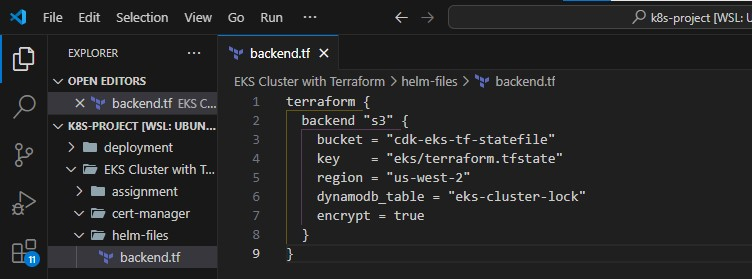

4. Create a file – `network.tf` and provision **Elastic IP** for Nat Gateway, VPC, Private and public subnets.

```hcl
# reserve Elastic IP to be used in our NAT gateway
resource "aws_eip" "nat_gw_elastic_ip" {
  vpc = true

  tags = {
  Name            = "${var.cluster_name}-nat-eip"
  iac_environment = var.iac_environment_tag
  }
}
```

Create `VPC` using the official AWS module

```hcl
module "vpc" {
  source = "terraform-aws-modules/vpc/aws"

  name = "${var.name_prefix}-vpc"
  cidr = var.main_network_block
  azs  = data.aws_availability_zones.available_azs.names

  private_subnets = [
    # this loop will create a one-line list as ["10.0.0.0/20", "10.0.16.0/20", "10.0.32.0/20", ...]
    # with a length depending on how many Zones are available
    for zone_id in data.aws_availability_zones.available_azs.zone_ids :
    cidrsubnet(var.main_network_block, var.subnet_prefix_extension, tonumber(substr(zone_id, length(zone_id) - 1, 1)) - 1)
  ]

  public_subnets = [
    # this loop will create a one-line list as ["10.0.128.0/20", "10.0.144.0/20", "10.0.160.0/20", ...]
    # with a length depending on how many Zones are available
    # there is a zone Offset variable, to make sure no collisions are present with private subnet blocks
    for zone_id in data.aws_availability_zones.available_azs.zone_ids :
    cidrsubnet(var.main_network_block, var.subnet_prefix_extension, tonumber(substr(zone_id, length(zone_id) - 1, 1)) + var.zone_offset - 1)
  ]

  # Enable single NAT Gateway to save some money
  # WARNING: this could create a single point of failure, since we are creating a NAT Gateway in one AZ only
  # feel free to change these options if you need to ensure full Availability without the need of running 'terraform apply'
  # reference: https://registry.terraform.io/modules/terraform-aws-modules/vpc/aws/2.44.0#nat-gateway-scenarios

  enable_nat_gateway     = true
  single_nat_gateway     = true
  one_nat_gateway_per_az = false
  enable_dns_hostnames   = true
  reuse_nat_ips          = true
  external_nat_ip_ids    = [aws_eip.nat_gw_elastic_ip.id]

  # Add VPC/Subnet tags required by EKS
  tags = {
    "kubernetes.io/cluster/${var.cluster_name}" = "shared"
    iac_environment                             = var.iac_environment_tag
  }
  public_subnet_tags = {
    "kubernetes.io/cluster/${var.cluster_name}" = "shared"
    "kubernetes.io/role/elb"                    = "1"
    iac_environment                             = var.iac_environment_tag
  }
  private_subnet_tags = {
    "kubernetes.io/cluster/${var.cluster_name}" = "shared"
    "kubernetes.io/role/internal-elb"           = "1"
    iac_environment                             = var.iac_environment_tag
  }
}
```


**Note:** The **tags** added to the subnets is very important. The Kubernetes Cloud Controller Manager (`cloud-controller-manager`) and AWS Load Balancer Controller (`aws-load-balancer-controller`) needs to identify the cluster’s. To do that, it querries the cluster’s subnets by using the tags as a filter.

- For public and private subnets that use load balancer resources: each subnet must be tagged

```hcl
Key: kubernetes.io/cluster/cluster-name
Value: shared
```

- For private subnets that use internal load balancer resources: each subnet must be tagged

```hcl
Key: kubernetes.io/role/internal-elb
Value: 1
```

- For public subnets that use internal load balancer resources: each subnet must be tagged

```hcl
Key: kubernetes.io/role/elb
Value: 1
```


5. Create a file – `variables.tf`

```hcl
# create some variables
variable "cluster_name" {
  type        = string
  description = "EKS cluster name."
}
variable "iac_environment_tag" {
  type        = string
  description = "AWS tag to indicate environment name of each infrastructure object."
}
variable "name_prefix" {
  type        = string
  description = "Prefix to be used on each infrastructure object Name created in AWS."
}
variable "main_network_block" {
  type        = string
  description = "Base CIDR block to be used in our VPC."
}
variable "subnet_prefix_extension" {
  type        = number
  description = "CIDR block bits extension to calculate CIDR blocks of each subnetwork."
}
variable "zone_offset" {
  type        = number
  description = "CIDR block bits extension offset to calculate Public subnets, avoiding collisions with Private subnets."
}
```

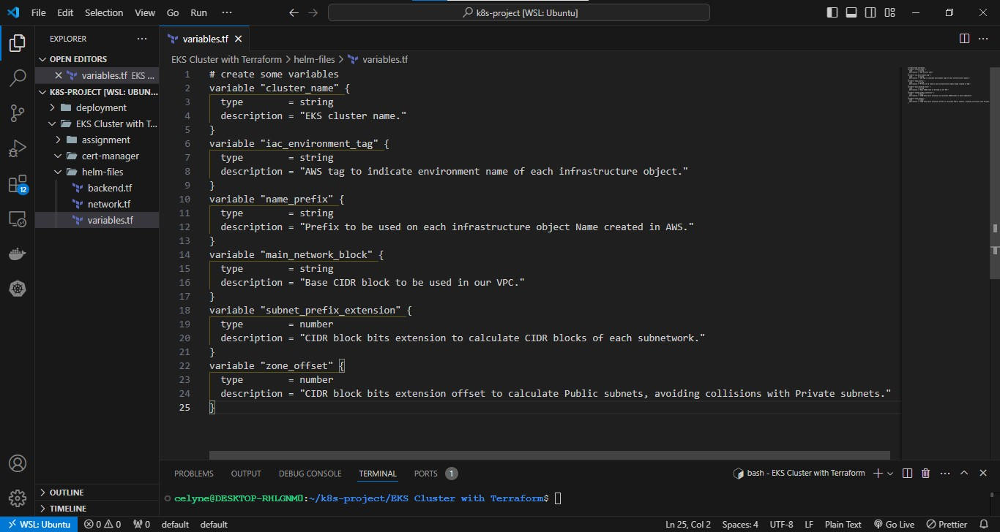

6. Create a file – `data.tf` – This will pull the available AZs for use.

```hcl
# get all available AZs in our region
data "aws_availability_zones" "available_azs" {
  state = "available"
}
data "aws_caller_identity" "current" {} # used for accesing Account ID and ARN
```


7. Create a file – `eks.tf` and provision EKS cluster (Create the file only if you are not using your existing Terraform code. Otherwise you can simply append it to the main.tf from your existing code) [Read more about this module from the official documentation here](https://registry.terraform.io/modules/terraform-aws-modules/eks/aws/18.20.5) – Reading it will help you understand more about the rich features of the module.

```hcl
module "eks_cluster" {
  source                          = "terraform-aws-modules/eks/aws"
  version                         = "~> 18.0"
  cluster_name                    = var.cluster_name
  cluster_version                 = "1.22"
  vpc_id                          = module.vpc.vpc_id
  subnet_ids                      = module.vpc.private_subnets
  cluster_endpoint_private_access = true
  cluster_endpoint_public_access  = true

  # Self Managed Node Group(s)
  self_managed_node_group_defaults = {
    instance_type                          = var.asg_instance_types[0]
    update_launch_template_default_version = true
  }
  self_managed_node_groups = local.self_managed_node_groups

  # aws-auth configmap
  create_aws_auth_configmap = true
  manage_aws_auth_configmap = true
  aws_auth_users            = concat(local.admin_user_map_users, local.developer_user_map_users)
  tags = {
    Environment = "prod"
    Terraform   = "true"
  }
}
```


8. Create a file – `locals.tf` to create local variables. Terraform does not allow assigning variable to variables. There is good reasons for that to avoid repeating your code unecessarily. So a terraform way to achieve this would be to use locals so that your code can be kept [DRY](https://en.wikipedia.org/wiki/Don%27t_repeat_yourself).

```hcl
# render Admin & Developer users list with the structure required by EKS module
locals {
  admin_user_map_users = [
    for admin_user in var.admin_users :
    {
      userarn  = "arn:aws:iam::${data.aws_caller_identity.current.account_id}:user/${admin_user}"
      username = admin_user
      groups   = ["system:masters"]
    }
  ]
  developer_user_map_users = [
    for developer_user in var.developer_users :
    {
      userarn  = "arn:aws:iam::${data.aws_caller_identity.current.account_id}:user/${developer_user}"
      username = developer_user
      groups   = ["${var.name_prefix}-developers"]
    }
  ]

  self_managed_node_groups = {
    worker_group1 = {
      name = "${var.cluster_name}-wg"

      min_size      = var.autoscaling_minimum_size_by_az * length(data.aws_availability_zones.available_azs.zone_ids)
      desired_size  = var.autoscaling_minimum_size_by_az * length(data.aws_availability_zones.available_azs.zone_ids)
      max_size      = var.autoscaling_maximum_size_by_az * length(data.aws_availability_zones.available_azs.zone_ids)
      instance_type = var.asg_instance_types[0].instance_type

      bootstrap_extra_args = "--kubelet-extra-args '--node-labels=node.kubernetes.io/lifecycle=spot'"

      block_device_mappings = {
        xvda = {
          device_name = "/dev/xvda"
          ebs = {
            delete_on_termination = true
            encrypted             = false
            volume_size           = 10
            volume_type           = "gp2"
          }
        }
      }

      use_mixed_instances_policy = true
      mixed_instances_policy = {
        instances_distribution = {
          spot_instance_pools = 4
        }

        override = var.asg_instance_types
      }
    }
  }
}
```

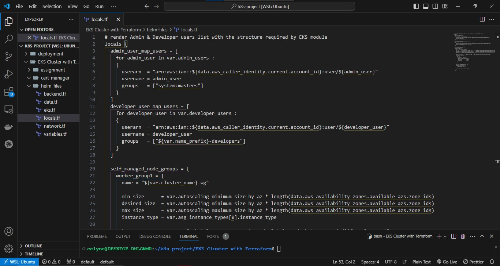

9. Add more variables to the `variables.tf` file

```hcl
# create some variables
variable "admin_users" {
  type        = list(string)
  description = "List of Kubernetes admins."
}
variable "developer_users" {
  type        = list(string)
  description = "List of Kubernetes developers."
}
variable "asg_instance_types" {
  description = "List of EC2 instance machine types to be used in EKS."
}
variable "autoscaling_minimum_size_by_az" {
  type        = number
  description = "Minimum number of EC2 instances to autoscale our EKS cluster on each AZ."
}
variable "autoscaling_maximum_size_by_az" {
  type        = number
  description = "Maximum number of EC2 instances to autoscale our EKS cluster on each AZ."
}
```


9. Create a file – `variables.tfvars` to set values for variables.

```hcl
cluster_name            = "tooling-app-eks"
iac_environment_tag     = "development"
name_prefix             = "cdk-io-eks"
main_network_block      = "10.0.0.0/16"
subnet_prefix_extension = 4
zone_offset             = 8

# Ensure that these users already exist in AWS IAM. Another approach is that you can introduce an iam.tf file to manage users separately, get the data source and interpolate their ARN.
admin_users                    = ["k8s-admin"]
developer_users                = ["Celyne", "Zarya"]
asg_instance_types             = [ { instance_type = "t3.small" }, { instance_type = "t2.small" }, ]
autoscaling_minimum_size_by_az = 1
autoscaling_maximum_size_by_az = 10
```

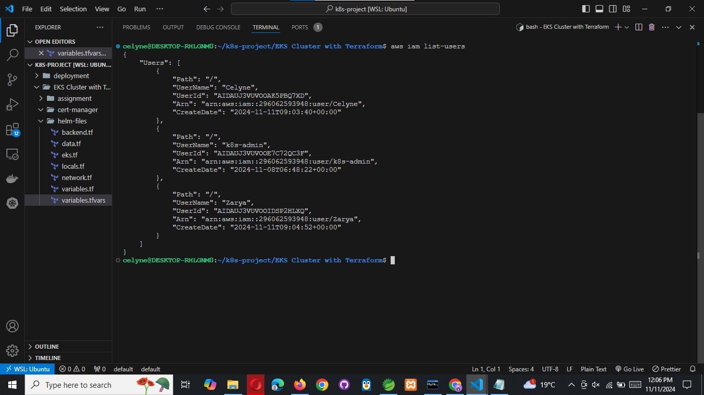

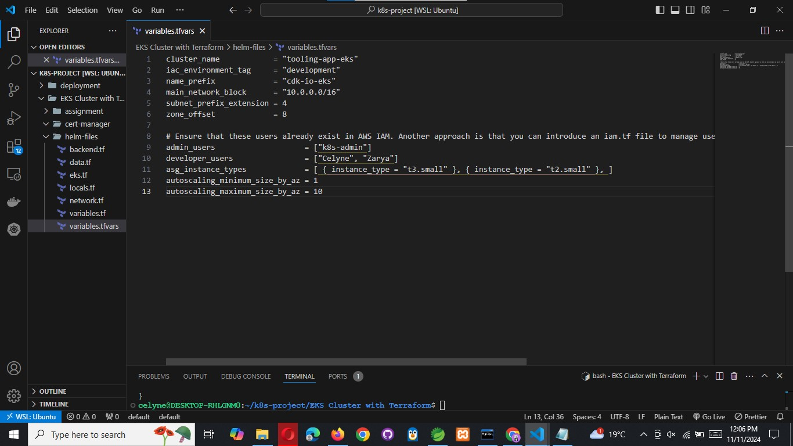

11. Create file – `provider.tf`

```hcl
provider "aws" {
  region = "us-west-1"
}

provider "random" {
}
```


12. Run `terraform init`

```hcl
terraform init
```

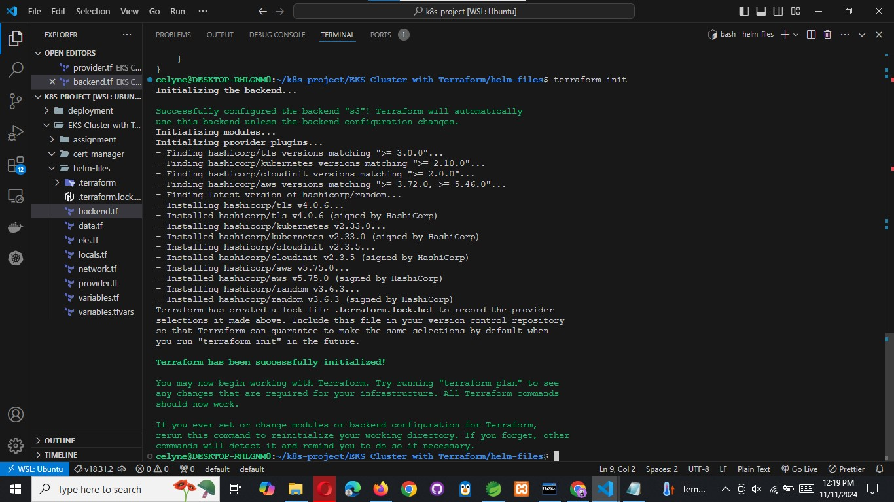

13. Run `Terraform plan` – Your plan should have an output

```
Plan: 41 to add, 0 to change, 0 to destroy.
```

```hcl
terraform plan
```


14. Run `Terraform apply`

```hcl
terraform apply
```

This will begin to create cloud resources, and fail at some point with the error

```
╷
│ Error: Post "http://localhost/api/v1/namespaces/kube-system/configmaps": dial tcp [::1]:80: connect: connection refused
│
│   with module.eks-cluster.kubernetes_config_map.aws_auth[0],
│   on .terraform/modules/eks-cluster/aws_auth.tf line 63, in resource "kubernetes_config_map" "aws_auth":
│   63: resource "kubernetes_config_map" "aws_auth" {
```


That is because for us to connect to the cluster using the **kubeconfig**, Terraform needs to be able to connect and set the credentials correctly.

Let fix the problem in the next section.

## FIXING THE ERROR

To fix this problem

- Append to the file `data.tf`

```hcl
# get EKS cluster info to configure Kubernetes and Helm providers
data "aws_eks_cluster" "cluster" {
  name = module.eks_cluster.cluster_id
}
data "aws_eks_cluster_auth" "cluster" {
  name = module.eks_cluster.cluster_id
}
```

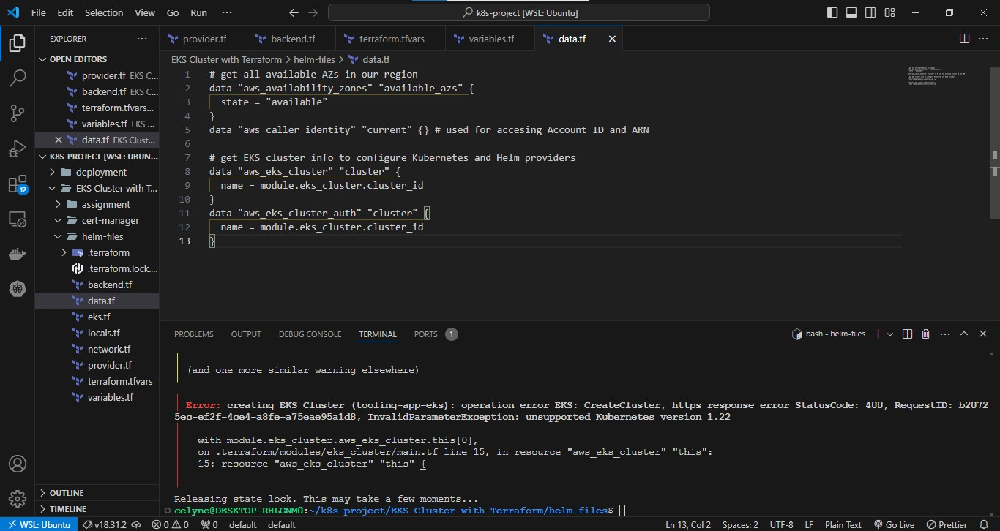

- Append to the file `provider.tf`

```hcl
# get EKS authentication for being able to manage k8s objects from terraform
provider "kubernetes" {
  host                   = data.aws_eks_cluster.cluster.endpoint
  cluster_ca_certificate = base64decode(data.aws_eks_cluster.cluster.certificate_authority.0.data)
  token                  = data.aws_eks_cluster_auth.cluster.token
}
```


- Run the `init` and plan `again` – This time you will see

```hcl
# module.eks-cluster.kubernetes_config_map.aws_auth[0] will be created
  + resource "kubernetes_config_map" "aws_auth" {
      + data = {
          + "mapAccounts" = jsonencode([])
          + "mapRoles"    = <<-EOT
                - "groups":
                  - "system:bootstrappers"
                  - "system:nodes"
                  "rolearn": "arn:aws:iam::696742900004:role/tooling-app-eks20210718113602300300000009"
                  "username": "system:node:{{EC2PrivateDNSName}}"
            EOT
          + "mapUsers"    = <<-EOT
                - "groups":
                  - "system:masters"
                  "userarn": "arn:aws:iam::696742900004:user/dare"
                  "username": "dare"
                - "groups":
                  - "system:masters"
                  "userarn": "arn:aws:iam::696742900004:user/solomon"
                  "username": "solomon"
                - "groups":
                  - "darey-io-eks-developers"
                  "userarn": "arn:aws:iam::696742900004:user/leke"
                  "username": "leke"
                - "groups":
                  - "darey-io-eks-developers"
                  "userarn": "arn:aws:iam::696742900004:user/david"
                  "username": "david"
            EOT
        }
      + id   = (known after apply)

      + metadata {
          + generation       = (known after apply)
          + labels           = {
              + "app.kubernetes.io/managed-by" = "Terraform"
              + "terraform.io/module"          = "terraform-aws-modules.eks.aws"
            }
          + name             = "aws-auth"
          + namespace        = "kube-system"
          + resource_version = (known after apply)
          + uid              = (known after apply)
        }
    }

Plan: 1 to add, 0 to change, 0 to destroy.
```

```bash
terraform init
terraform plan
```

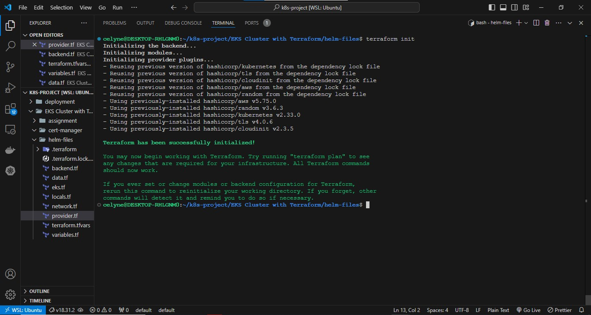

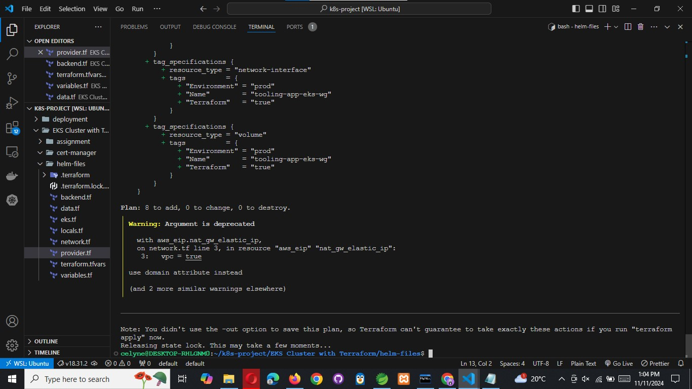

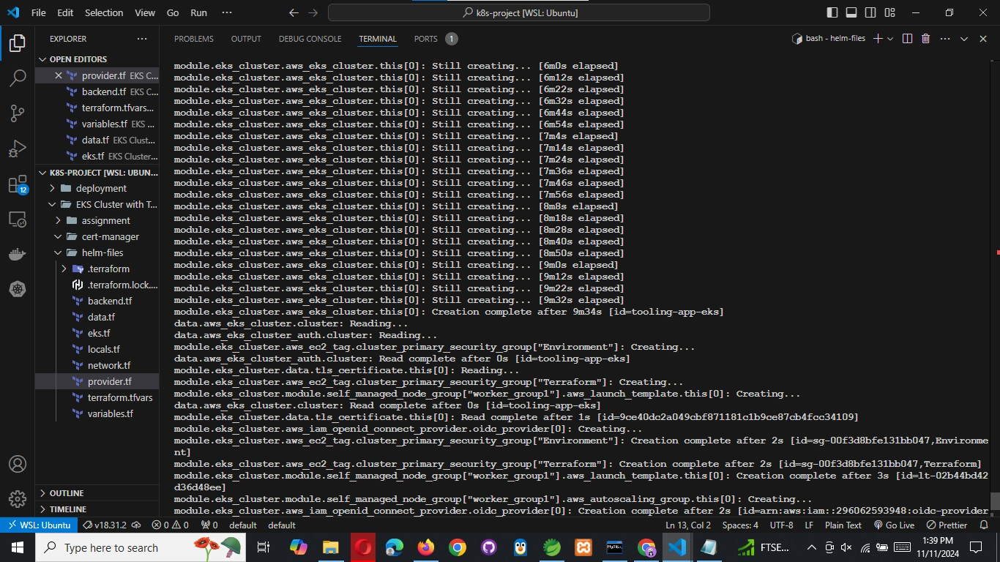

### Console

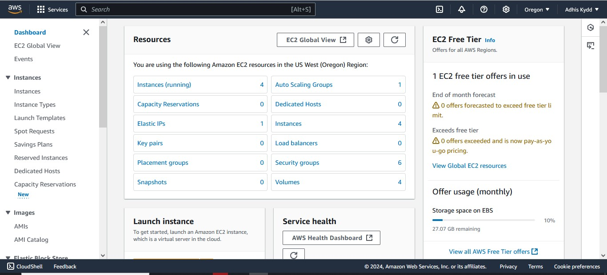

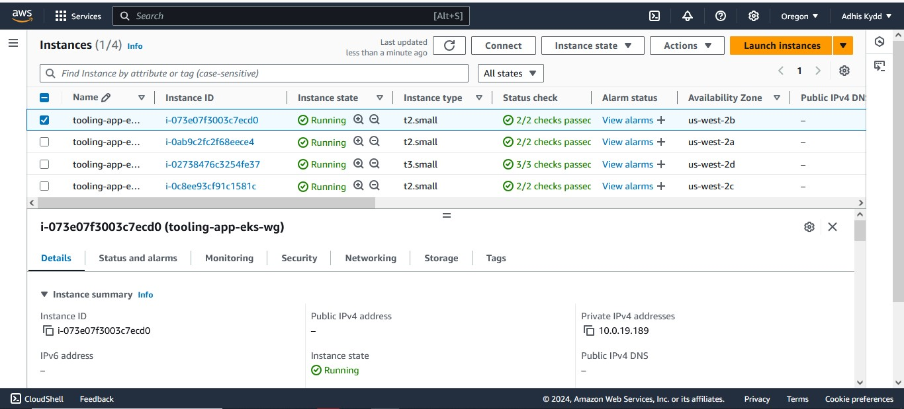

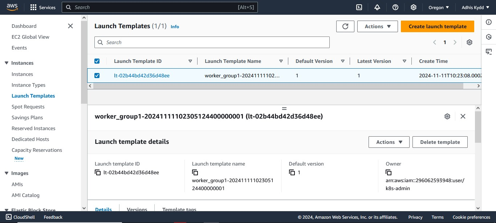

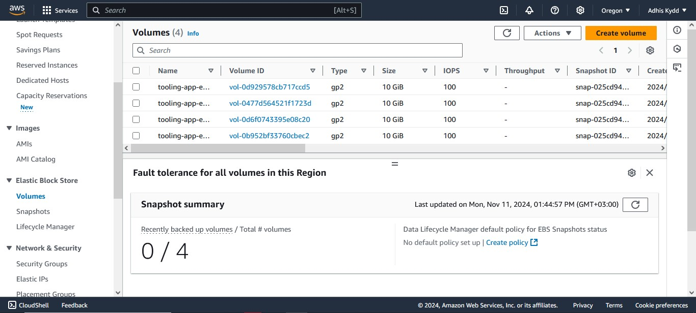

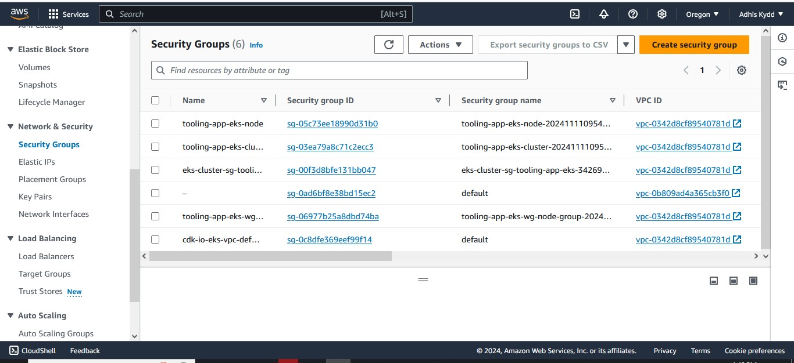

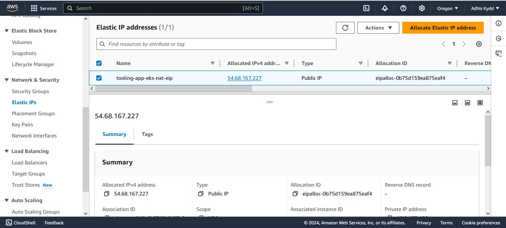

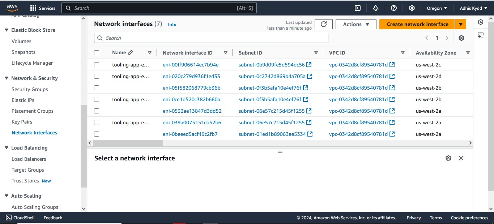

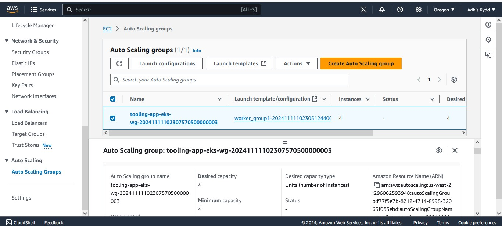

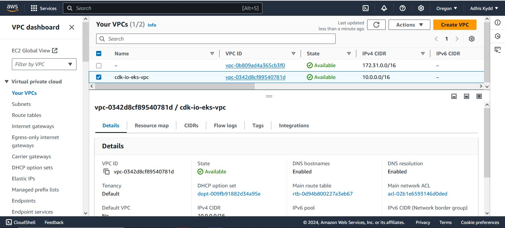

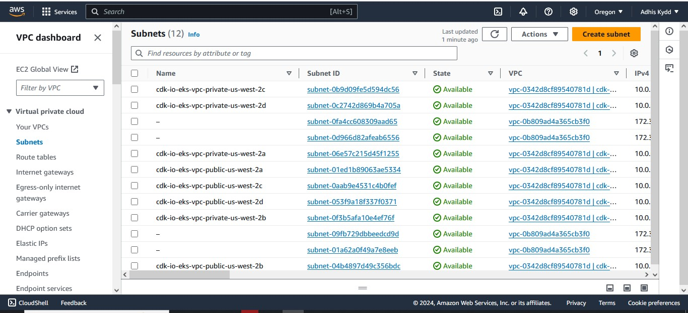

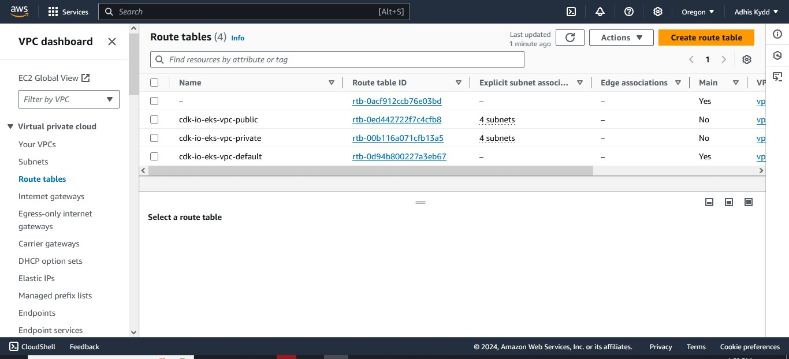

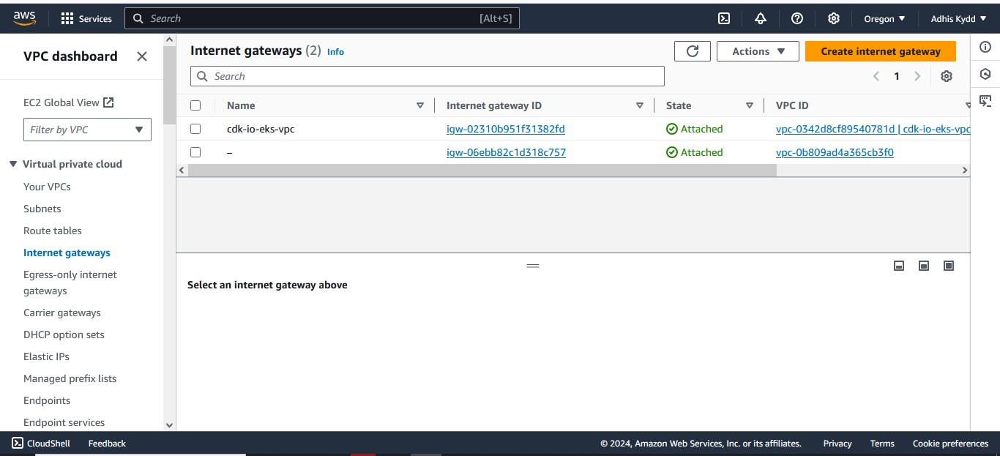


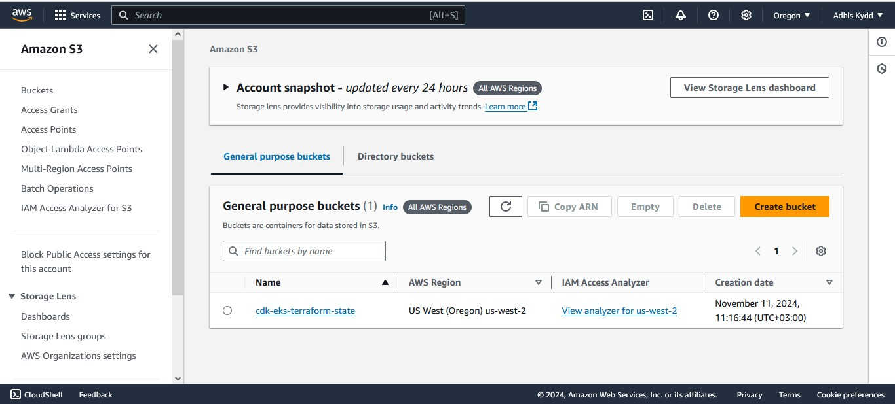

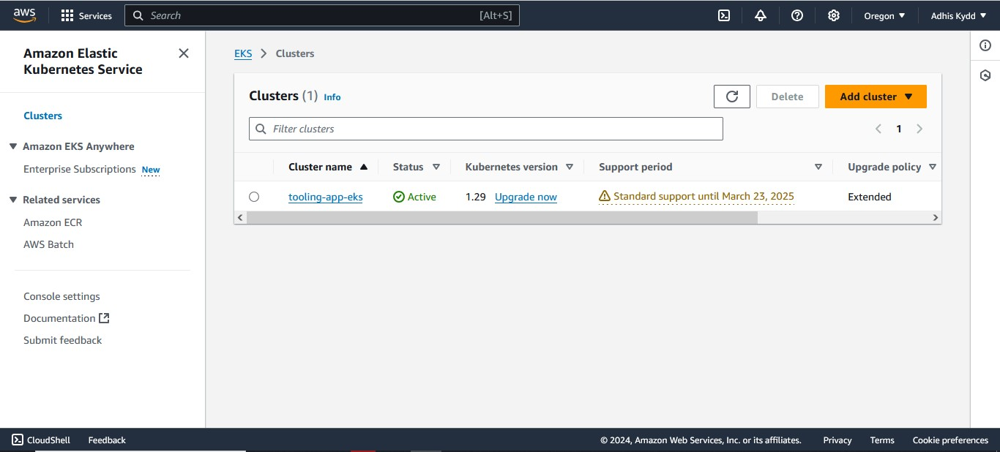

15. Create `kubeconfig` file using **awscli**.

```bash
aws eks update-kubeconfig --name tooling-app-eks --region us-west-1 --kubeconfig kubeconfig
```


[Here's the link to the terraform code](https://github.com/mimi-netizen/EKS-Cluster-with-Terraform)
