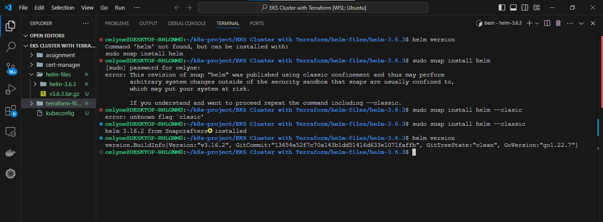

# DEPLOY APPLICATIONS WITH HELM

In Project 22, you experienced the use of manifest files to define and deploy resources like pods, deployments, and services into Kubernetes cluster. Here, you will do the same thing except that it will not be passed through kubectl. In the real world, Helm is the most popular tool used to deploy resources into kubernetes. That is because it has a rich set of features that allows deployments to be packaged as a unit. Rather than have multiple YAML files managed individually – which can quickly become messy.

A **Helm** chart is a definition of the resources that are required to run an application in Kubernetes. Instead of having to think about all of the various **deployments/services/volumes/configmaps/**

```bash
helm install stable/mysql
```

and **Helm** will make sure all the required resources are installed. In addition you will be able to tweak helm configuration by setting a single variable to a particular value and more or less resources will be deployed. For example, enabling slave for MySQL so that it can have read only replicas.

Behind the scenes, a helm chart is essentially a bunch of YAML manifests that define all the resources required by the application. Helm takes care of creating the resources in Kubernetes (where they don’t exist) and removing old resources.

## Lets begin to gradually walk through how to use Helm

(Credit – https://andrewlock.net/series/deploying-asp-net-core-applications-to-kubernetes/)

1. Parameterising YAML manifests using Helm templates

Let’s consider that our Tooling app have been Dockerised into an image called `tooling-app`, and that you wish to deploy with Kubernetes. Without `helm`, you would create the YAML manifests defining the deployment, service, and ingress, and apply them to your Kubernetes cluster using `kubectl apply`. Initially, your application is version 1, and so the Docker image is tagged as `tooling-app:1.0.0`. A simple deployment manifest might look something like the following:

```yaml
apiVersion: apps/v1
kind: Deployment
metadata:
  name: tooling-app-deployment
  labels:
    app: tooling-app
spec:
  replicas: 3
  strategy:
    type: RollingUpdate
    rollingUpdate:
      maxUnavailable: 1
  selector:
    matchLabels:
      app: tooling-app
  template:
    metadata:
      labels:
        app: tooling-app
    spec:
      containers:
        - name: tooling-app
          image: "tooling-app:1.0.0"
          ports:
            - containerPort: 80
```

Now lets imagine you produce another version of your app, version 1.1.0. How do you deploy that? Assuming nothing needs to be changed with the service or ingress, it may be as simple as copying the deployment manifest and replacing the image defined in the spec section. You would then re-apply this manifest to the cluster, and the deployment would be updated, performing a rolling-update as I described in my first post.

The main problem with this is that all of the values specific to your application – the labels and the image names etc – are mixed up with the "**mechanical**" definition of the manifest.

**Helm** tackles this by splitting the configuration of a chart out from its basic definition. For example, instead of baking the name of your app or the specific container image into the manifest, you can provide those when you install the chart into the cluster.

For example, a simple templated version of the previous deployment might look like the following:

```yaml
apiVersion: apps/v1
kind: Deployment
metadata:
  name: {{ .Release.Name }}-deployment
  labels:
    app: "{{ template "name" . }}"
spec:
  replicas: 3
  strategy:
    type: RollingUpdate
    rollingUpdate:
      maxUnavailable: 1
  selector:
    matchLabels:
      app: "{{ template "name" . }}"
  template:
    metadata:
      labels:
        app: "{{ template "name" . }}"
    spec:
      containers:
      - name: "{{ template "name" . }}"
        image: "{{ .Values.image.name }}:{{ .Values.image.tag }}"
        ports:
        - containerPort: 80
```

This example demonstrates a number of features of Helm templates:

The template is based on YAML, with {{ }} mustache syntax defining dynamic sections.
Helm provides various variables that are populated at install time. For example, the {{.Release.Name}} allows you to change the name of the resource at runtime by using the release name. Installing a Helm chart creates a release (this is a Helm concept rather than a Kubernetes concept).
You can define helper methods in external files. The {{template "name"}} call gets a safe name for the app, given the name of the Helm chart (but which can be overridden). By using helper functions, you can reduce the duplication of static values (like tooling-app), and hopefully reduce the risk of typos.

You can manually provide configuration at runtime. The {{.Values.image.name}} value for example is taken from a set of default values, or from values provided when you call helm install. There are many different ways to provide the configuration values needed to install a chart using Helm. Typically, you would use two approaches:

A values.yaml file that is part of the chart itself. This typically provides default values for the configuration, as well as serving as documentation for the various configuration values.

When providing configuration on the command line, you can either supply a file of configuration values using the `-f` flag. We will see a lot more on this later on.

## Now lets setup Helm and begin to use it.

According to the official documentation [here](https://helm.sh/docs/intro/install/), there are different options to installing Helm. But we will build the source code to create the binary.

1. [Download the tar.gz file from the project’s Github release page](https://github.com/helm/helm/releases). Or simply use wget to download version 3.6.3 directly

```bash
wget https://github.com/helm/helm/archive/refs/tags/v3.6.3.tar.gz
```

2. Unpack the `tar.gz` file

```bash
tar -zxvf v3.6.3.tar.gz
```

3. cd into the unpacked directory

```bash
cd helm-3.6.3
```

4. Build the source code using `make` utility

```bash
make build
```

If you do not have `make` installed or for any other reason, you cannot install the tool, simply use the official documentation [here](https://helm.sh/docs/intro/install/) for other options.

5. Helm binary will be in the `bin` folder. Simply move it to the `bin` directory on your system. You can check other tools to know where that is. fOr example, check where pwd the utility is being called from by running `which pwd`. Assuming the output is **/usr/local/bin**. You can move the `helm` binary there.

```bash
sudo mv bin/helm /usr/local/bin/
```

6. Check that Helm is installed

```bash
helm version
```

```
version.BuildInfo{Version:"v3.6+unreleased", GitCommit:"13f07e8adbc57b0e3f96b42340d6f44bdc8d5016", GitTreeState:"dirty", GoVersion:"go1.15.5"}
```


