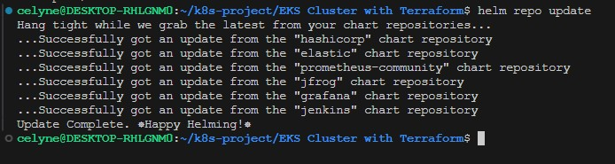
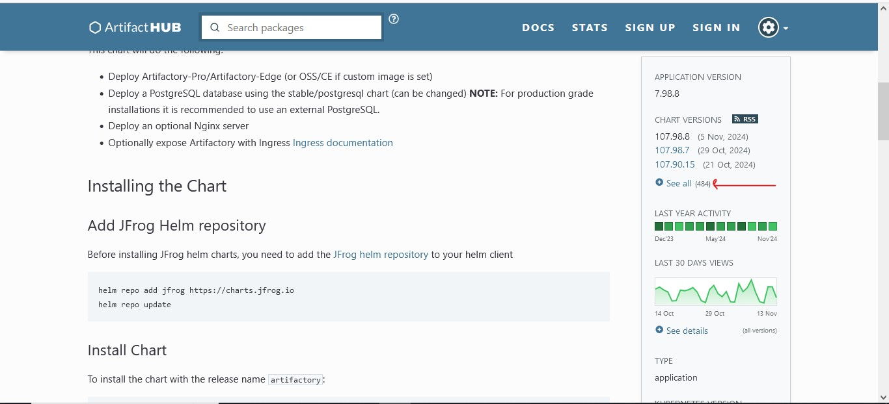

# Deploying and Packaging applications into Kubernetes

### DEPLOYING AND PACKAGING APPLICATIONS INTO KUBERNETES WITH HELM

In the previous project, you started experiencing helm as a tool used to deploy an application into Kubernetes. We probably also tried installing more tools apart from Jenkins.

In this project, we will experience deploying more DevOps tools, get familiar with some of the real world issues faced during such deployments and how to fix them. We will learn how to tweak helm values files to automate the configuration of the applications we deploy. Finally, once we have most of the DevOps tools deployed, we will experience using them and relate with the DevOps cycle and how they fit into the entire ecosystem.

Our focus will be on the following tools.

1. Artifactory
2. Hashicorp Vault
3. Prometheus
4. Grafana
5. Elasticsearch ELK using [ECK](https://www.elastic.co/guide/en/cloud-on-k8s/current/k8s-install-helm.html)

For the tools that require paid license, don’t worry, you will also learn how to get the license for free and have true experience exactly how they are used in the real world.

Lets start first with **Artifactory**. What is it exactly?

Artifactory is part of a suit of products from a company called [Jfrog](https://jfrog.com/). Jfrog started out as an artifact repository where software binaries in different formats are stored. Today, Jfrog has transitioned from an artifact repository to a DevOps Platform that includes CI and CD capabilities. This has been achieved by offering more products in which **Jfrog Artifactory** is part of. Other offerings include

- JFrog Pipelines – a CI-CD product that works well with its Artifactory repository. Think of this product as an alternative to Jenkins.
- JFrog Xray – a security product that can be built-into various steps within a JFrog pipeline. Its job is to scan for security vulnerabilities in the stored artifacts. It is able to scan all dependent code.

In this project, the requirement is to use Jfrog Artifactory as a private registry for the organisation’s Docker images and Helm charts. This requirement will satisfy part of the company’s corporate security policies to never download artifacts directly from the public into production systems. We will eventually have a CI pipeline that initially pulls public docker images and helm charts from the internet, store in artifactory and scan the artifacts for security vulnerabilities before deploying into the corporate infrastructure. Any found vulnerabilities will immediately trigger an action to quarantine such artifacts.

Lets get into action and see how all of these work.

## Deploy Jfrog Artifactory into Kubernetes

The best approach to easily get Artifactory into kubernetes is to use **helm**.

1. Search for an official helm chart for Artifactory on [Artifact Hub](https://artifacthub.io/)


2. Click on **See all results**

3. Use the filter checkbox on the left to limit the return data. As you can see in the image below, “Helm” is selected. In some cases, you might select “Official”. Then click on the first option from the result.


4. Review the Artifactory page


5. Click on the install menu on the right to see the installation commands.


6. Add the jfrog remote repository on your laptop/computer

```bash
helm repo add jfrog https://charts.jfrog.io
```

7. Create a namespace called tools where all the tools for DevOps will be deployed. (In previous project, you installed Jenkins in the default namespace. You should uninstall Jenkins there and install in the new namespace)

```bash
kubectl create ns tools
```


8. Update the helm repo index on your laptop/computer

```bash
helm repo update
```



9. Install artifactory

```bash
helm upgrade --install artifactory jfrog/artifactory --version 107.90.10 -n tools
```

Output:

```
Release "artifactory" does not exist. Installing it now.
NAME: artifactory
LAST DEPLOYED: Sat May 28 09:26:08 2022
NAMESPACE: tools
STATUS: deployed
REVISION: 1
TEST SUITE: None
NOTES:
Congratulations. You have just deployed JFrog Artifactory!

1. Get the Artifactory URL by running these commands:

   NOTE: It may take a few minutes for the LoadBalancer IP to be available.
         You can watch the status of the service by running 'kubectl get svc --namespace tools -w artifactory-artifactory-nginx'
   export SERVICE_IP=$(kubectl get svc --namespace tools artifactory-artifactory-nginx -o jsonpath='{.status.loadBalancer.ingress[0].ip}')
   echo http://$SERVICE_IP/

2. Open Artifactory in your browser
   Default credential for Artifactory:
   user: admin
   password: password
```


**NOTE:**

- We have used `upgrade --install` flag here instead of `helm install artifactory jfrog/artifactory` This is a better practice, especially when developing CI pipelines for helm deployments. It ensures that helm does an upgrade if there is an existing installation. But if there isn’t, it does the initial install. With this strategy, the command will never fail. It will be smart enough to determine if an upgrade or fresh installation is required.

- The helm chart version to install is very important to specify. So, the version at the time of writing may be different from what you will see from Artifact Hub. So, replace the version number to the desired. You can see all the versions by clicking on `see all as shown in the image below.




The output from the installation already gives some Next step directives.

**_Ensure you open port 5432 for postgresSQL and 8081 ,8082 for jfrog artifactory, 443 and 80 https and http in your security inbound rules, also open the outbound rules as well_**

## Getting the Artifactory URL

Lets break down the first _Next Step_.

1. The artifactory helm chart comes bundled with the Artifactory software, a PostgreSQL database and an Nginx proxy which it uses to configure routes to the different capabilities of Artifactory. Getting the pods after some time.

```bash
kubectl get po -o wide -n tools
```


This output shows that the artifactory pod and nginx pod are running and in a Ready state.

2. Each of the deployed application have their respective services. This is how you will be able to reach either of them.

```bash
kubectl get svc -n tools
```


3. Notice that, the Nginx Proxy has been configured to use the service type of LoadBalancer. Therefore, to reach Artifactory, we will need to go through the Nginx proxy’s service. Which happens to be a load balancer created in the cloud provider. Run the kubectl command to retrieve the Load Balancer URL.

```bash
kubectl get svc artifactory-artifactory-nginx -n tools
```


4. Copy the URL and paste in the browser


5. The default username is `admin`
6. The default password is `password`


## How the Nginx URL for Artifactory is configured in Kubernetes

Without clicking further on the Get Started page, lets dig a bit more into Kubernetes and Helm. How did Helm configure the URL in kubernetes?

Helm uses the values.yaml file to set every single configuration that the chart has the capability to configure. THe best place to get started with an off the shelve chart from artifacthub.io is to get familiar with the DEFAULT VALUES

- Click on the DEFAULT VALUES section on Artifact hub


- Here you can search for key and value pairs


- For example, when you type `nginx` in the search bar, it shows all the configured options for the nginx proxy.


- Selecting `nginx.enabled` from the list will take you directly to the configuration in the YAML file.


- Search for `nginx.service` and select nginx.service.type


- You will see the confired type of Kubernetes service for Nginx. As you can see, it is `LoadBalancer` by default


- To work directly with the `values.yaml` file, you can download the file locally by clicking on the download icon.


## Is the Load Balancer Service type the Ideal configuration option to use in the Real World?

Setting the service type to **Load Balancer** is the easiest way to get started with exposing applications running in kubernetes externally. But provisioning load balancers for each application can become very expensive over time, and more difficult to manage. Especially when tens or even hundreds of applications are deployed.

The best approach is to use [Kubernetes Ingress](https://kubernetes.io/docs/concepts/services-networking/ingress/) instead. But to do that, we will have to deploy an [Ingress Controller](https://kubernetes.io/docs/concepts/services-networking/ingress-controllers/).

A huge benefit of using the ingress controller is that we will be able to use a single load balancer for different applications we deploy. Therefore, Artifactory and any other tools can reuse the same load balancer. Which reduces cloud cost, and overhead of managing multiple load balancers. more on that later.

For now, we will leave Artifactory, move on to the next phase of configuration (**Ingress**, **DNS(Route53)** and **Cert Manager**), and then return to Artifactory to complete the setup so that it can serve as a private docker registry and repository for private helm charts.

## DEPLOYING INGRESS CONTROLLER AND MANAGING INGRESS RESOURCES

Before we discuss what ingress controllers are, it will be important to start off understanding about the Ingress resource.

An **ingress** is an API object that manages external access to the services in a kubernetes cluster. It is capable to provide load balancing, SSL termination and name-based virtual hosting. In otherwords, Ingress exposes HTTP and HTTPS routes from outside the cluster to services within the cluster. Traffic routing is controlled by rules defined on the Ingress resource.

Here is a simple example where an Ingress sends all its traffic to one Service:


An **ingress** resource for Artifactory would like below

```yaml
apiVersion: networking.k8s.io/v1
kind: Ingress
metadata:
  name: artifactory
spec:
  ingressClassName: nginx
  rules:
    - host: "tooling.artifactory.sandbox.svc.darey.io"
      http:
        paths:
          - path: /
            pathType: Prefix
            backend:
              service:
                name: artifactory
                port:
                  number: 8082
```

- An Ingress needs apiVersion, kind, metadata and spec fields

- The name of an Ingress object must be a valid DNS subdomain name

- Ingress frequently uses annotations to configure some options depending on the Ingress controller.

- Different Ingress controllers support different annotations. Therefore it is important to be up to date with the ingress controller’s specific documentation to know what annotations are supported.

- It is recommended to always specify the ingress class name with the spec ingressClassName: nginx. This is how the Ingress controller is selected, especially when there are multiple configured ingress controllers in the cluster.

- The domain darey.io should be replaced with your own domain.

### Ingress controller

If you deploy the yaml configuration specified for the ingress resource without an ingress controller, it will not work. In order for the Ingress resource to work, the cluster must have an ingress controller running.

Unlike other types of controllers which run as part of the kube-controller-manager. Such as the **Node Controller**, **Replica Controller**, **Deployment Controller**, **Job Controller**, or **Cloud Controller**. **Ingress controllers** are not started automatically with the cluster.

Kubernetes as a project supports and maintains [AWS](https://kubernetes-sigs.github.io/aws-load-balancer-controller/v2.4/), [GCE](https://github.com/kubernetes/ingress-gce/blob/master/README.md#readme), and [NGINX](https://github.com/kubernetes/ingress-nginx/blob/main/README.md#readme) ingress controllers.

There are many other 3rd party Ingress controllers that provide similar functionalities with their own unique features, but the 3 mentioned earlier are currently supported and maintained by Kubernetes. Some of these other 3rd party Ingress controllers include but not limited to the following;

- [AKS Application Gateway Ingress Controller](https://learn.microsoft.com/en-gb/azure/application-gateway/tutorial-ingress-controller-add-on-existing) (**Microsoft Azure**)
- [Istio](https://istio.io/latest/docs/tasks/traffic-management/ingress/kubernetes-ingress/)
- [Traefik](https://doc.traefik.io/traefik/providers/kubernetes-ingress/)
- [Ambassador](https://www.getambassador.io/)
- [HA Proxy Ingress](https://haproxy-ingress.github.io/)
- [Kong](https://docs.konghq.com/kubernetes-ingress-controller/latest/)
- [Gloo](https://docs.solo.io/gloo-edge/latest/)

An example comparison matrix of some of the controllers can be found [here](https://kubevious.io/blog/post/comparing-top-ingress-controllers-for-kubernetes#comparison-matrix). Understanding their unique features will help businesses determine which product works well for their respective requirements.

It is possible to deploy any number of ingress controllers in the same cluster. That is the essence of an **ingress class**. By specifying the spec `ingressClassName` field on the ingress object, the appropriate ingress controller will be used by the ingress resource.

Lets get into action and see how all of these fits together.

## Deploy Nginx Ingress Controller

On this project, we will deploy and use the **Nginx Ingress Controller**. It is always the default choice when starting with Kubernetes projects. It is reliable and easy to use.

Since this controller is maintained by Kubernetes, there is an official guide the installation process. Hence, we wont be using **artifacthub.io** here. Even though you can still find ready to go charts there, it just makes sense to always use the [official guide]() in this scenario.

Using the **Helm** approach, according to the official guide;

1. Install Nginx Ingress Controller in the `ingress-nginx` namespace

```bash
helm upgrade --install ingress-nginx ingress-nginx \
--repo https://kubernetes.github.io/ingress-nginx \
--namespace ingress-nginx --create-namespace
```


**Notice:**

This command is idempotent:

- if the ingress controller is not installed, it will install it,
- if the ingress controller is already installed, it will upgrade it.
- **Self Challenge Task** – Delete the installation after running above command. Then try to re-install it using a slightly different method you are already familiar with. Ensure NOT to use the flag `--repo`
- **Hint** – Run the `helm repo add command` before installation

After deleting the installation,
Add the helm repo

```bash
helm repo add ingress-nginx https://kubernetes.github.io/ingress-nginx
helm repo update
```

Install Nginx Ingress Controller in the ingress-nginx namespace

```bash
helm upgrade --install ingress-nginx ingress-nginx/ingress-nginx --namespace ingress-nginx --create-namespace
```

2. A few pods should start in the ingress-nginx namespace:

```bash
kubectl get pods --namespace=ingress-nginx
```


3. After a while, they should all be running. The following command will wait for the ingress controller pod to be up, running, and ready:

```bash
kubectl wait --namespace ingress-nginx \
  --for=condition=ready pod \
  --selector=app.kubernetes.io/component=controller \
  --timeout=120s
```


4. Check to see the created load balancer in AWS.

```bash
kubectl get service -n ingress-nginx
```

Output:

```
NAME                                 TYPE           CLUSTER-IP      EXTERNAL-IP                                                              PORT(S)                      AGE
ingress-nginx-controller             LoadBalancer   172.16.11.35    a38db84e7d2104dc4b743ee6df1e667b-954094141.eu-west-2.elb.amazonaws.com   80:32516/TCP,443:31942/TCP   50s
ingress-nginx-controller-admission   ClusterIP      172.16.94.137   <none>                                                                   443/TCP                      50s
```


The `ingress-nginx-controller` service that was created is of the type `LoadBalancer`. That will be the load balancer to be used by all applications which require external access, and is using this ingress controller.

If you go ahead to AWS console, copy the address in the **EXTERNAL-IP** column, and search for the loadbalancer, you will see an output like below.


5. Check the IngressClass that identifies this ingress controller.

```bash
kubectl get ingressclass -n ingress-nginx
```


## Deploy Artifactory Ingress

Now, it is time to configure the ingress so that we can route traffic to the Artifactory internal service, through the ingress controller’s load balancer.

**Notice** the `spec` section with the configuration that selects the ingress controller using the **ingressClassName**

```yaml
apiVersion: networking.k8s.io/v1
kind: Ingress
metadata:
  name: artifactory
spec:
  ingressClassName: nginx
  rules:
    - host: "tooling-artifactory-cdk-aws.dns-dynamic.net"
      http:
        paths:
          - path: /
            pathType: Prefix
            backend:
              service:
                name: artifactory
                port:
                  number: 8082
```


```bash
kubectl apply -f artifactory-ingress.yaml -n tools
```

Output:


The error message, “context deadline exceeded,” show that the Kubernetes API server failed to connect to the Nginx Ingress Controller admission webhook within the specified timeout (10 seconds in this case).

**Troubleshooting**

- Let's Check all resources in the ingress-nginx namespace

```bash
kubectl get all -n ingress-nginx
```

Look for any pods related to admission-webhook or ingress-nginx-controller-admission.


The ingress-nginx-controller-admission service is present in the ingress-nginx namespace but there’s no corresponding pod running for the admission webhook.

- Ensure Admission Webhook Pod is Deployed

The admission webhook is critical for validating ingresses, and it’s likely not running based on the kubectl get all output. Let's ensure that the webhook is properly set up by upgrading or reinstalling to make sure the webhook component is deployed:

```bash
helm upgrade ingress-nginx ingress-nginx/ingress-nginx \
    --namespace ingress-nginx \
    --set controller.admissionWebhooks.enabled=true
```

- Apply the ingress artifactory file again

```bash
kubectl apply -f artifactory-ingress.yaml -n tools
```


The error dial tcp 10.0.0.117:8443: i/o timeout shows that the ingress-nginx-controller-admission service cannot be reached, which is preventing the webhook from functioning correctly.

- Open port 8443 on the worker nodes inbound rule and apply the ingress artifactory file again

```bash
kubectl get ingress -n tools
```

Output:


Now, take note of

- CLASS – The nginx controller class name nginx
- HOSTS – The hostname to be used in the browser tooling.artifactory.sandbox.svc.darey.io
- ADDRESS – The loadbalancer address that was created by the ingress controller

## Configure DNS

If anyone were to visit the tool, it would be very inconvenient sharing the long load balancer address. Ideally, you would create a DNS record that is human readable and can direct request to the balancer. This is exactly what has been configured in the ingress object - `host: "tooling.artifactory.steghub.com"` but without a DNS record, there is no way that host address can reach the load balancer.

The `sandbox.svc.steghub.com` part of the domain is the configured HOSTED ZONE in AWS. So you will need to configure **Hosted Zone** in AWS console or as part of your infrastructure as code using terraform.

If you purchased the domain directly from AWS, the hosted zone will be automatically configured for you. But if your domain is registered with a different provider such as **freenon**, **Cloudns** or **namechaep**, you will have to create the hosted zone and update the name servers.

## Create Route53 record

Within the hosted zone is where all the necessary DNS records will be created. Since we are working on Artifactory, lets create the record to point to the ingress controller’s loadbalancer. There are 2 options. You can either use the _CNAME_ or _AWS Alias_

## CNAME Method

1. Select the **HOSTED ZONE** you wish to use, and click on the create record button
2. Add the subdomain tooling.artifactory, and select the record type `CNAME`

3. Successfully created record

4. Confirm that the DNS record has been properly propergated. Visit https://dnschecker.org and check the record. Ensure to select CNAME. The search should return green ticks for each of the locations on the left.

## AWS Alias Method

1. In the create record section, type in the record name, and toggle the `alias` button to enable an alias. An alias is of the `A` DNS record type which basically routes directly to the load balancer. In the `choose endpoint` bar, select `Alias to Application and Classic Load Balancer`

2. Select the region and the load balancer required. You will not need to type in the load balancer, as it will already populate.

For detailed read on selecting between CNAME and Alias based records, read the [official documentation](https://docs.aws.amazon.com/Route53/latest/DeveloperGuide/resource-record-sets-choosing-alias-non-alias.html)


## Visiting the application from the browser

So far, we now have an application running in Kubernetes that is also accessible externally. That means if you navigate to https://tooling.artifactory.steghub.com/ (_replace the full URL with your domain_), it should load up the artifactory application.

Using Chrome browser will show something like the below. It shows that the site is indeed reachable, but insecure. This is because Chrome browsers do not load insecure sites by default. It is insecure because it either does not have a trusted TLS/SSL certificate, or it doesn’t have any at all.

Nginx Ingress Controller does configure a default TLS/SSL certificate. But it is not trusted because it is a self signed certificate that browsers are not aware of.

To confirm this,

Click on the **Not Secure** part of the browser.


## Explore Artifactory Web UI

Now that we can access the application externally, although insecure, its time to login for some exploration. Afterwards we will make it a lot more secure and access our web application on any browser.

1. Get the default username and password – Run a helm command to output the same message after the initial install

```bash
helm test artifactory -n tools
```

Output:

```
NAME: artifactory
LAST DEPLOYED: Sat May 28 09:26:08 2022
NAMESPACE: tools
STATUS: deployed
REVISION: 1
TEST SUITE: None
NOTES:
Congratulations. You have just deployed JFrog Artifactory!

1. Get the Artifactory URL by running these commands:

   NOTE: It may take a few minutes for the LoadBalancer IP to be available.
         You can watch the status of the service by running 'kubectl get svc --namespace tools -w artifactory-artifactory-nginx'
   export SERVICE_IP=$(kubectl get svc --namespace tools artifactory-artifactory-nginx -o jsonpath='{.status.loadBalancer.ingress[0].ip}')
   echo http://$SERVICE_IP/

2. Open Artifactory in your browser
   Default credential for Artifactory:
   user: admin
   password: password
```


2. Insert the username and password to load the Get Started page


3. Reset the admin password


4. Activate the Artifactory License. You will need to purchase a license to use Artifactory enterprise features.

5. For learning purposes, you can apply for a free trial license. Simply fill the [form here](https://jfrog.com/start-free/) and a license key will be delivered to your email in few minutes.


6. In exactly 1 minute, the license key had arrived. Simply copy the key and apply to the console.


7. Set the Base URL. Ensure to use https


8. Skip the Proxy setting


9. Skip creation of repositories for now. You will create them yourself later on.


10. finish the setup


Next, its time to fix the TLS/SSL configuration so that we will have a trusted **HTTPS** URL

**Continued in [project 26](https://github.com/francdomain/StegHub_DevOps-Cloud_Engineering/blob/main/Implementing_Secure_HTTPS_with_Cert-Manager_and_Let%E2%80%99s_Encrypt/project_26.md)**.
