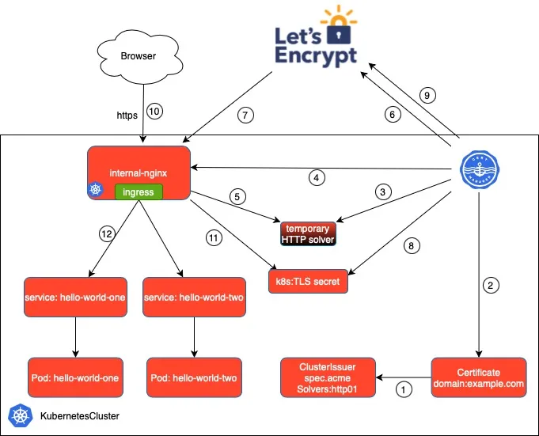

# Implementing Secure HTTPS with Cert-Manager and Let's Encrypt

## Project Overview

This project demonstrates how to implement secure HTTPS for Kubernetes workloads using Cert-Manager and Let's Encrypt. It focuses on automating TLS certificate management for an Artifactory deployment on EKS, using AWS Route53 for DNS management.

## Prerequisites

- Amazon EKS cluster with Nginx Ingress Controller
- Helm 3.x
- kubectl configured for your cluster
- Domain name with DNS configured to point to your Ingress Controller's load balancer
- AWS CLI configured with appropriate permissions
- AWS Route53 hosted zone

## Architecture Components

1. **Cert-Manager Components:**

   - Cert-Manager Controller (certificate lifecycle management)
   - Webhook (resource validation and mutation)
   - CA Injector (CA bundle injection)
   - Custom Resource Definitions (CRDs)

2. **AWS Components:**
   - Route53 for DNS management
   - IAM roles and policies
   - EKS OIDC provider

## Troubleshooting

Common issues and solutions:

1. Certificate stuck in pending state:

   - Check DNS propagation
   - Verify IAM roles and permissions
   - Review cert-manager logs

2. DNS validation failures:
   - Confirm Route53 access
   - Check hosted zone configuration
   - Verify DNS record creation

## Security Considerations

- Use production Let's Encrypt environment for production workloads
- Regularly rotate IAM credentials
- Implement proper RBAC policies
- Monitor certificate expiration dates

## Maintenance

- Certificates auto-renew 30 days before expiration
- Monitor cert-manager logs for issues
- Keep cert-manager updated to latest stable version

## Additional Resources

- [Cert-Manager Documentation](https://cert-manager.io/docs/)
- [Let's Encrypt Documentation](https://letsencrypt.org/docs/)
- [AWS Route53 Documentation](https://docs.aws.amazon.com/Route53/latest/DeveloperGuide/Welcome.html)
- [EKS Documentation](https://docs.aws.amazon.com/eks/latest/userguide/what-is-eks.html)

## Future Enhancements

- Implement automation using Terraform
- Add monitoring and alerting for certificate lifecycle
- Implement automated testing for certificate renewal
- Create backup and disaster recovery procedures
