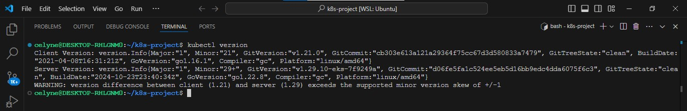

# Streamlining Tooling Application Deployments with Helm, Kustomize, and Vault

This project provides a practical guide to deploying and managing a "tooling application" in Kubernetes using a robust combination of Helm, Kustomize, and Vault.

## _Key Goals_

**Efficient Deployments:** Leverage Helm for packaging and managing the complex Vault application, while using Kustomize to tailor configurations for dev, sit, and prod environments.

**Secure Secrets Management:** Integrate Vault to securely store and inject database credentials into the tooling application, eliminating the need for hardcoded secrets.

## _Deployment Options_

Based on your experience on previous projects, you should already have a grasp of experience using Helm, but you should also know that there are multiple choices available when it comes to deploying applications into Kubernetes, so Helm should not always be your default choice. It is important to be aware of the options available, know the pros and cons, and choose what works for your team or project.

1. Write YAML files and deploy with kubectl
   This is the easiest method where you write YAML for deployments, services, ingress, and all of that, and then deploy with:

```yaml
kubectl apply -f <manifest-file-path>
```

This is usually the default way when getting started with Kubernetes or during development and exploration. However, it is not sufficient or reliable when it comes to managing the infrastructure in production. It is hard work to keep track of multiple manifest files. You can imagine what will be the fate of your project if there are tens or hundreds of micro-services/applications that need to be managed across multiple environments with this type of approach, you will end up in a PEBKAC Situation.

2. Use a templating engine like HELM.  
   You already know about Helm. Its value propositions are to install applications, manage the lifecycle of those applications across multiple environments, and customise applications through templating. Without going deeper into its obvious benefits, it also has its downsides:

- Helm only adds value when you install community components. Tools you can easily find on artifacthub.io otherwise you need to write the manifest files anyway.

- Leads to too much logic in the templates (This is not good for inexperienced Kubernetes users, and a problem for hiring managers)
  Learning another DevOps tool. Always be careful about introducing yet another tool into your team/project.

Everyone's Kubernetes cluster is different. Your needs are different. You might need to make a change to the way the chart is deployed – like changing a small piece of configuration in the templates folder. But, like a remote control, you've only got a limited set of controls which are exposed to you (the values that are exposed in the values.yaml file). If you want to make any deeper changes to the Helm chart, you'll need to fork it and change it yourself.

3. Kustomize Overlays
   To overcome the challenges of Helm identified above, using a tool that is already embedded as part of kubectl which you are already familiar with makes more sense for most use cases.

# How Kustomize Works

**Kustomize** uses a file called `kustomization.yaml` that contains declarative specifications as to what resources need to be imported from what manifest files and what changes need to be made. Once it has processed the resources, it emits them to the standard output, which can be stored in a file or directly used with `kubectl` to apply it to a particular cluster.

One of the excellent use cases of Kustomize is to manage Kubernetes resources for multiple environments. For Kustomize to work in that scenario, you would need a base directory that would contain all manifest files with all the common elements and an overlays directory that contains all the differences for a particular environment.

To understand better, let’s look at a hands-on example.

### Installing Kustomize

Kustomize comes pre-bundled with kubectl version >= 1.14. You can check your version using kubectl version. If the `kubectl version` is 1.14 or greater there's no need to take any steps.



For a stand-alone Kustomize installation (aka Kustomize CLI), go through the official documentation to install Kustomize - [Here](https://kubectl.docs.kubernetes.io/installation/kustomize/)

### Working with Kustomize

Kustomize is a command line tool supporting template-free, structured customization of declarative configuration targeted to k8s-style objects.

Targeted to k8s means that kustomize has some understanding of API resources, k8s concepts like names, labels, namespaces, etc., and the semantics of resource patching.

Kustomize is an implementation of [Declarative Application Management (DAM)](https://kubectl.docs.kubernetes.io/references/kustomize/glossary/#declarative-application-management). A set of best practices around managing k8s clusters.

It is a configuration management solution that leverages layering to preserve the base settings of your applications and components by overlaying declarative YAML artifacts (called **patches**) that selectively override default settings without actually changing the original files (base files).

Kustomize relies on the following system of configuration management layering to achieve reusability:

- **Base Layer** - Specifies the most common resources
- **Patch Layers** - Specifies use of case-specific resources

Let’s step through how Kustomize works using a deployment scenario involving 3 different environments: **dev**, **sit**, and **prod**. In this example, we’ll use Service, Deployment, and Namespace resources. For the dev environment, there won't be any specific changes as it will use the same configuration from the base setting. In sit and prod environments, the replica settings will be different.

Using the tooling app for this example, create a folder structure as below.

```css
└── tooling-app-kustomize
    ├── base
    │   ├── deployment.yaml
    │   ├── kustomization.yaml
    │   └── service.yaml
    └── overlays
        ├── dev
        │   ├── deployment.yaml
        │   ├── kustomization.yaml
        │   └── namespace.yaml
        ├── prod
        │   ├── deployment.yaml
        │   ├── kustomization.yaml
        │   └── namespace.yaml
        └── sit
            ├── deployment.yaml
            ├── kustomization.yaml
            └── namespace.yaml
```


Now, let's walk through the content of each file.

## Base directory

**`tooling-app-kustomize/base/deployment.yaml`** - This is a standard Kubernetes manifest file Deployment.

```yaml
apiVersion: apps/v1
kind: Deployment
metadata:
  name: tooling-deployment
  labels:
    app: tooling
spec:
  replicas: 1
  selector:
    matchLabels:
      app: tooling
  template:
    metadata:
      labels:
        app: tooling
    spec:
      containers:
        - name: tooling
          image: steghub/tooling-app:1.0.2
          ports:
            - containerPort: 80
          resources:
            requests:
              memory: "64Mi"
              cpu: "250m"
            limits:
              memory: "128Mi"
              cpu: "500m"
```


**`tooling-app-kustomize/base/service.yaml`** - This is a standard Kubernetes yaml file for Service.

```yaml
apiVersion: v1
kind: Service
metadata:
  name: tooling-service
  labels:
    app: tooling
spec:
  selector:
    app: tooling
  ports:
    - port: 80
      protocol: TCP
      targetPort: 80
      name: http
  type: ClusterIP
```


**`tooling-app-kustomize/base/kustomization.yaml`** - This is a Kustomization file that is used to let kustomize know what resources to create and monitor in Kubernetes.

```yaml
apiVersion: kustomize.config.k8s.io/v1beta1
kind: Kustomization
resources:
  - deployment.yaml
  - service.yaml
```


The resources being monitored here are **deployment** and **services**. You can simply add more to the list as you wish.

It is assumed that we will need to deploy Kubernetes resources across multiple environments, as a standard practice in most cases. Hence, to deploy resources into the **Dev environment**, let's see what the layout and file contents will look like.

## DEV Environment

In the **overlays** folder - This is where you manage multiple environments. In each environment, there is a Kustomize file that tells Kustomize where to find the **base** setting, and how to **patch** the environment using the base as the starting point.

In the **dev** environment for example, the namespace for dev is created, and the deployment is patched to use a replica count of "**3**" different from the base setting of "**1**". So Kustomize will simply create all the resources in the base, in addition to whatever is specified in the dev directory. We will discuss patching a little further in the following section.

Let's have a look at what each file contains.

**`tooling-app-kustomize/overlays/dev/namespace.yaml`**

```yaml
apiVersion: v1
kind: Namespace
metadata:
  name: dev-tooling
```


**`tooling-app-kustomize/overlays/dev/deployment.yaml`**

```yaml
apiVersion: apps/v1
kind: Deployment
metadata:
  name: tooling-deployment
spec:
  replicas: 3
```


**`tooling-app-kustomize/overlays/dev/kustomization.yaml`**

```yaml
apiVersion: kustomize.config.k8s.io/v1beta1
kind: Kustomization
namespace: dev-tooling
labels:
  - pairs:
      env: dev-tooling
resources:
  - ../../base
  - namespace.yaml
```


The Kustomization file for `dev` here specifies that the base configuration should be applied, and include the YAML file(s) specified in the resources section. It also indicates what namespace the configuration should be applied to.

In summary, it specifies the following:

- The apiVersion
- The Kind of resource (Kustomization)
- The namespace where this Kustomizaton will create or patch resources
- The location of the base folder, where the base configuration can be found.
- The resource(s) to be created - Such as a namespace or deployment
- The labels field ensures that Kubernetes labels and selectors are automatically injected into the resources being created. such as below;

Generally, A Kustomization file contains fields falling into four categories (although not all have been used in the example above):

- **resources** - what existing resources are to be customized. Example fields: k8s resources, crds.
- **generators** - what new resources should be created. Example fields: configMapGenerator (legacy), secretGenerator (legacy), generators (v2.1).
- **transformers** - what to do to the aforementioned resources. Example fields: namePrefix, nameSuffix, images, labels, etc., and the more general transformers (v2.1) field.
- **meta** - fields which may influence all or some of the above. Example fields: vars, namespace, apiVersion, kind, etc.

## Patching configuration with Kustomize

With Kustomize, you can now begin to patch your environments with extra configurations that overwrite the base setting either by

- creating new resources, or
- patching existing resources.

This is all achieved through the overlays configuration. The `overlays/dev/kustomization.yaml` example above only creates a new resource.

### Applying the Configuration

```bash
kubectl apply -k overlays/dev
```

Notice that the apply flag here is **-k** rather than the **-f**. This is because kubectl has been made aware of Kustomize. You can use kustomize CLI directly, but since you are already familiar with kubectl, it just makes sense to use the kustomize flag that comes bundled with kubectl.

Output:

```
namespace/dev-tooling created
service/tooling-service created
deployment.apps/tooling-deployment created
```


## Side Task:

With your understanding of how kustomize can patch resources per environment, now configure both **SIT** and **PROD** environments with their respective overlays and set different configuration values for

- Pod replica
- Resource limit and requests
- Image tag

### For PROD:

**`tooling-app-kustomize/overlays/prod/namespace.yaml`**

```yaml
apiVersion: v1
kind: Namespace
metadata:
  name: prod-tooling
```

**`tooling-app-kustomize/overlays/prod/deployment.yaml`**

```yaml
apiVersion: apps/v1
kind: Deployment
metadata:
  name: tooling-deployment
spec:
  replicas: 4
  template:
    spec:
      containers:
      - name: tooling
        image: image: steghub/tooling-app:1.0.3
        resources:
          requests:
            memory: "65Mi"
            cpu: "275m"
          limits:
            memory: "192Mi"
            cpu: "1"
```

**`tooling-app-kustomize/overlays/prod/kustomization.yaml`**

```yaml
apiVersion: kustomize.config.k8s.io/v1beta1
kind: Kustomization
namespace: prod-tooling
labels:
  - pairs:
      env: prod-tooling
resources:
  - ../../base
  - namespace.yaml
```

### Apply the configurations

```bash
kubectl apply -k overlays/prod
```


### For SIT:

**`tooling-app-kustomize/overlays/sit/namespace.yaml`**

```yaml
apiVersion: v1
kind: Namespace
metadata:
  name: sit-tooling
```

**`tooling-app-kustomize/overlays/sit/deployment.yaml`**

```yaml
apiVersion: apps/v1
kind: Deployment
metadata:
  name: tooling-deployment
spec:
  replicas: 5
  template:
    spec:
      containers:
      - name: tooling
        image: image: steghub/tooling-app:1.0.4
        resources:
          requests:
            memory: "75Mi"
            cpu: "1"
          limits:
            memory: "192Mi"
            cpu: "2"
```

**`tooling-app-kustomize/overlays/sit/kustomization.yaml`**

```yaml
apiVersion: kustomize.config.k8s.io/v1beta1
kind: Kustomization
namespace: sit-tooling
labels:
  - pairs:
      env: sit-tooling
resources:
  - ../../base
  - namespace.yaml
```

### Apply the configurations

```bash
kubectl apply -k overlays/sit
```


## Helm Template Engine vs. Kustomize Overlays

Both technologies have good reasons why they are designed the way they are. But most of the experienced engineers in the industry would rather get the best of both worlds.

With **helm**, you can simply install already packaged applications from [artifacthub.io](https://artifacthub.io/), and then use **Kustomize** to patch its values files.

For business applications, you can choose to package your applications in Helm and simply patch the values files with Kustomize as well. But you might also just use Helm only for applications you wish to download from the public and use Kustomize directly for business applications.

## Integrate the tooling app with Amazon Aurora for `Dev`, `SIT`, and `PROD` environments

1. Configure Terraform to deploy an Amazon Aurora instance.
2. Use the `tooling.sql` file in the tooling repo to load the database schema.
3. Add K8s Secret resource to store database credentials.
4. Configure environment variables for database connectivity in the deployment file and patch each environment for the appropriate values.

## Step 1: Create a new terraform directory - rds_aurora

Directory structure

```
rds_aurora
├── main.tf
├── provider.tf
|-- data.tf
├── variables.tf
├── output.tf
```


**`rds_aurora/main.tf`**

```terraform
# Create a security group for the Aurora database to allow access from EKS
resource "aws_security_group" "aurora_sg" {
  name   = "aurora-sg"
  vpc_id = var.vpc_id

  ingress {
    from_port   = 3306
    to_port     = 3306
    protocol    = "tcp"
    cidr_blocks = ["0.0.0.0/0"]
  }

  egress {
    from_port   = 0
    to_port     = 0
    protocol    = "-1"
    cidr_blocks = ["0.0.0.0/0"]
  }
}

resource "aws_db_subnet_group" "aurora_subnet_group" {
  name        = "aurora-subnet-group"
  subnet_ids  = var.subnet_ids
  description = "Subnet group for Aurora cluster"
}

resource "aws_rds_cluster" "aurora_cluster" {
  cluster_identifier  = "tooling-aurora-cluster"
  engine              = "aurora-mysql"
  engine_version      = "8.0.mysql_aurora.3.05.2"
  master_password     = var.db_password
  master_username     = var.db_username
  database_name       = var.db_name
  skip_final_snapshot = true

  storage_encrypted = true

  db_subnet_group_name   = aws_db_subnet_group.aurora_subnet_group.name
  vpc_security_group_ids = [aws_security_group.aurora_sg.id]
}

resource "aws_rds_cluster_instance" "aurora_instance" {
  count               = 2
  cluster_identifier  = aws_rds_cluster.aurora_cluster.id
  instance_class      = var.db_instance_class
  engine              = "aurora-mysql"
  publicly_accessible = true
}
```

**`rds_aurora/provider.tf`**

```terraform
terraform {
  required_providers {
    aws = {
      source  = "hashicorp/aws"
      version = "5.74.0"
    }
  }
}

provider "aws" {
  region = "us-west-1"
}
```

**`rds_aurora/data.tf`**

```terraform
data "aws_eks_cluster" "existing_cluster" {
  name = "tooling-app-eks"
}
```

**`rds_aurora/output.tf`**

```terraform
output "aurora_endpoint" {
  value = aws_rds_cluster.aurora_cluster.endpoint
}
```

**`rds_aurora/variables.tf`**

```terraform
variable "vpc_id" {
  description = ""
  type        = string
}

variable "db_name" {
  description = "Database name"
  type        = string
}

variable "db_username" {
  description = "Database username"
  type        = string
}

variable "db_password" {
  description = "Database password"
  type        = string
  sensitive   = true
}

variable "subnet_ids" {
  description = ""
  type        = list(string)
}

variable "db_instance_class" {
  description = ""
  type        = string
}
```

Run terraform init and terraform apply.

```bash
terraform init
terraform validate
terraform apply
```


Confirm the database on aws console


## Step 2: Create a bash script to automate loading of the database schema.

```bash
touch load_tooling_db.sh
chmod +x load_tooling_db.sh
```


**`rds_aurora/load_tooling_db.sh`**

```bash
#!/bin/bash

# Set environment variables for DB credentials
export DB_USER="admin"
export DB_PASSWORD="password1234$"
export DB_NAME="tooling_db"

DB_HOST=$(terraform output -raw aurora_endpoint)

# Verify that the DB endpoint was fetched successfully
if [ -z "$DB_HOST" ]; then
  echo "Failed to fetch Aurora DB endpoint. Exiting."
  exit 1
fi
echo "Aurora DB endpoint fetched: $DB_HOST"

# Download tooling-db.sql from GitHub
GITHUB_REPO_URL="https://github.com/mimi-netizen/tooling/raw/master/tooling-db.sql"
echo "Downloading tooling-db.sql from GitHub..."
curl -L -o /tmp/tooling-db.sql "$GITHUB_REPO_URL"
if [ $? -ne 0 ]; then
  echo "Error downloading tooling-db.sql. Exiting."
  exit 1
fi
echo "Downloaded tooling-db.sql successfully."
echo "$(ls /tmp)"

echo "Connecting to DB at $DB_HOST with user $DB_USER on database $DB_NAME"

# Import tooling.sql into Aurora database
echo "Loading tooling-db.sql into the Aurora database..."
mysql -h "$DB_HOST" -P 3306 -u "$DB_USER" -p"$DB_PASSWORD" "$DB_NAME" < /tmp/tooling-db.sql
if [ $? -ne 0 ]; then
  echo "Error loading tooling-db.sql into the database. Exiting."
  exit 1
fi

# Cleanup downloaded file
rm -f /tmp/tooling-db.sql
echo "Database loaded successfully and temporary file cleaned up."
```

**Run The Script**

```bash
./load_tooling_db.sh
```

**_make sure MySQL Client is installed_**


**Check that the database has been imported**

```bash
sudo mysql -h <aurora-db-endpoint> -u <db-username> -p
SHOW DATABASES;
```


## Step 3:

- first, encode your db username and password and copy the encoded output.

```bash
echo -n "your-username" | base64
echo -n "your-password" | base64
```

**`overlays/dev/database-secret.yaml`**

```yaml
apiVersion: v1
kind: Secret
metadata:
  name: aurora-db-credentials
  namespace: dev-tooling
type: Opaque
data:
  DB_USERNAME: <base64-encoded-username>
  DB_PASSWORD: <base64-encoded-password>
```

- Repeat same for SIT and PROD env.

- Deploy the secret to Kubernetes for each environment

```bash
kubectl apply -f overlays/dev/database-secret.yaml
kubectl apply -f overlays/sit/database-secret.yaml
kubectl apply -f overlays/prod/database-secret.yaml
```


## Step 4: Configure Environment Variables for Database Connectivity in the Deployment Files, using the values stored in the Kubernetes Secret.

1. Update the Deployment File:

In the Kubernetes deployment file, add environment variables for database connectivity. Reference the secret for sensitive values.

**`base/deployment.yaml`**

```yaml
apiVersion: apps/v1
kind: Deployment
metadata:
  name: tooling-deployment
  labels:
    app: tooling
spec:
  replicas: 1
  selector:
    matchLabels:
      app: tooling
  template:
    metadata:
      labels:
        app: tooling
    spec:
      containers:
        - name: tooling
          image: steghub/tooling-app:1.0.2
          ports:
            - containerPort: 80
          resources:
            requests:
              memory: "64Mi"
              cpu: "250m"
            limits:
              memory: "128Mi"
              cpu: "500m"
          env:
            - name: DB_HOST
              value: "db-endpoint"
            - name: DB_PORT
              value: "3306"
            - name: DB_NAME
              value: "your-database-name"
            - name: DB_USERNAME
              valueFrom:
                secretKeyRef:
                  name: aurora-db-credentials
                  key: DB_USERNAME
            - name: DB_PASSWORD
              valueFrom:
                secretKeyRef:
                  name: aurora-db-credentials
                  key: DB_PASSWORD
```

**`overlays/dev/deployment.yaml`**

```yaml
apiVersion: apps/v1
kind: Deployment
metadata:
  name: tooling-deployment
spec:
  replicas: 3
  template:
    metadata:
      labels:
        app: tooling
    spec:
      containers:
        - name: tooling
          image: steghub/tooling-app:1.0.3
          resources:
            requests:
              memory: "256Mi"
              cpu: "1"
            limits:
              memory: "512Mi"
              cpu: "2"
          env:
            - name: DB_HOST
              value: "db-endpoint"
            - name: DB_PORT
              value: "3306"
            - name: DB_NAME
              value: "tooling_db"
            - name: DB_USERNAME
              valueFrom:
              secretKeyRef:
                name: aurora-db-credentials
                key: DB_USERNAME
            - name: DB_PASSWORD
              valueFrom:
                secretKeyRef:
                  name: aurora-db-credentials
                  key: DB_PASSWORD
```

**`overlays/prod/deployment.yaml`**

```yaml
apiVersion: apps/v1
kind: Deployment
metadata:
  name: tooling-deployment
spec:
  replicas: 5
  template:
    metadata:
      labels:
        app: tooling
    spec:
      containers:
        - name: tooling
          image: steghub/tooling-app:1.0.3
          resources:
            requests:
              memory: "256Mi"
              cpu: "1"
            limits:
              memory: "512Mi"
              cpu: "2"
          env:
            - name: DB_HOST
              value: "db-endpoint"
            - name: DB_PORT
              value: "3306"
            - name: DB_NAME
              value: "tooling_db"
            - name: DB_USERNAME
              valueFrom:
                secretKeyRef:
                  name: aurora-db-credentials
                  key: DB_USERNAME
            - name: DB_PASSWORD
              valueFrom:
                secretKeyRef:
                  name: aurora-db-credentials
                  key: DB_PASSWORD
```

**`overlays/sit/deployment.yaml`**

```yaml
apiVersion: apps/v1
kind: Deployment
metadata:
  name: tooling-deployment
spec:
  replicas: 3
  template:
    metadata:
      labels:
        app: tooling
    spec:
      containers:
        - name: tooling
          image: steghub/tooling-app:1.0.2
          resources:
            requests:
              memory: "128Mi"
              cpu: "500m"
            limits:
              memory: "256Mi"
              cpu: "1"
          env:
            - name: DB_HOST
              value: "db-endpoint"
            - name: DB_PORT
              value: "3306"
            - name: DB_NAME
              value: "tooling_db"
            - name: DB_USERNAME
              valueFrom:
                secretKeyRef:
                  name: aurora-db-credentials
                  key: DB_USERNAME
            - name: DB_PASSWORD
              valueFrom:
                secretKeyRef:
                  name: aurora-db-credentials
                  key: DB_PASSWORD
```

2. Patch Each Environment Deployment:

Use kubectl to apply the changes for each environment:

```bash
kubectl apply -k base
kubectl apply -k overlays/dev
kubectl apply -k overlays/prod
kubectl apply -k overlays/sit
```


# Integrate Vault with Kubernetes

The [vault helm chart](https://artifacthub.io/packages/helm/hashicorp/vault) is the recommended way to install Vault in a Kubernetes cluster and configure it. In this project, we will configure Vault to use [High Availability Mode](https://developer.hashicorp.com/vault/docs/concepts/ha) with **Integrated storage (Raft)**, This is recommended for production-ready deployment. This installs a StatefulSet of Vault server Pods with either Integrated Storage or a Consul storage backend. The Vault Helm chart can also configure Vault to run in standalone mode or [dev](https://developer.hashicorp.com/vault/docs/concepts/dev-server).

## Folder Structure:

```css
vault
├── base
│   ├── kustomization.yaml
│   └── namespace.yaml
└── overlays
    ├── dev
    │   ├── .env
    │   ├── kustomization.yaml
    │   ├── namespace.yaml
    │   └── values.yaml
    ├── sit
    │   ├── .env
    │   ├── kustomization.yaml
    │   ├── namespace.yaml
    │   └── values.yaml
    └── prod
        ├── .env
        ├── kustomization.yaml
        ├── namespace.yaml
        └── values.yaml
```


### Content of each file.

**`vault/base/namespace.yaml/`** - This is a standard Kubernetes yaml file for a namespace.

```yaml
apiVersion: v1
kind: Namespace
metadata:
  name: vault
```

**`vault/base/kustomization.yaml`**

```yaml
apiVersion: kustomize.config.k8s.io/v1beta1
kind: Kustomization
resources:
  - "namespace.yaml"
```

## Dev Environment

**`vault/overlays/dev/namespace.yaml`**

```yaml
apiVersion: v1
kind: Namespace
metadata:
  name: vault
  labels:
    env: vault-dev
```

**`vault/overlays/dev/kustomization.yaml`**

```yaml
apiVersion: kustomize.config.k8s.io/v1beta1
kind: Kustomization

# This will overwrite the namespace; all resources will be deployed to the specified namespace
namespace: vault

resources:
  - ../../base

patches:
  - path: namespace.yaml

# List the Helm chart we want to deploy
helmCharts:
  - name: vault
    namespace: vault
    repo: https://helm.releases.hashicorp.com
    releaseName: vault
    version: 0.28.1
    valuesFile: values.yaml

secretGenerator:
  - name: vault-kms
    env: .env

generatorOptions:
  disableNameSuffixHash: true
```

Break down of the Kustomization declarative yaml field above:

- **namespace** - Namespace to add to all objects. This will overwrite the `.metadata.namespace` of the resources that will be created.

- **resources** - Each entry in the resources list must be a path to a file, or a path (or URL) referring to another **kustomization** directory.

- **patchesStrategicMerge** - The names in these resource files must match names already loaded via the **resources** field. These entries are used to modify the known resources.

- **helmCharts** - Each entry in the argument list results in the pulling and rendering of a helm chart. This can have the following fields:

  - name: The name of the chart that you want to use.
  - repo: [Optional] The URL of the repository that contains the chart. If this is provided, the generator will try to fetch remote charts. Otherwise, it will try to load the local chart in chartHome.
  - chartHome: [Optional] Provide the path to the parent directory for a local chart.
  - version: [Optional] Version of the chart. Will use the latest version if this is omitted.
  - releaseName: [Optional] The release name that will be set in the chart.
  - namespace: [Optional] The namespace that will be used by the --namespace flag in the helm template command.
  - valuesFile: [Optional] A path to the values file.
  - valuesInline: holds value mappings specified directly, rather than in a separate file.
  - valuesMerge: specifies how to treat valuesInline to the Values file. Legal values: ‘merge’, ‘override’, ‘replace’. Defaults to ‘override’.
  - includeCRDs: specifies if Helm should also generate CustomResourceDefinitions. Defaults to ‘false’.
  - configHome: [Optional] The value that kustomize should pass to helm via the HELM_CONFIG_HOME environment variable. If omitted, {tmpDir}/helm is used, where {tmpDir} is some temporary directory.

**`vault/overlays/sit/.env`**

The dotenv file is used to pass the Vault KMS key into the vault configuration.

```yaml
VAULT_SEAL_TYPE=awskms
VAULT_AWSKMS_SEAL_KEY_ID=arn:aws:kms:us-west-2:111122223333:key/1234abcd-12ab-34cd-56ef-1234567890ab
```

**NB:** Replace the kms key arn with the one created by terraform

**`vault/overlays/dev/values.yaml`** -

Most of the configuration for the Vault installation will be done in this values file. Before we start adding the values file, create a folder ("terraform") in the root directory of your workspace which you will use to create `AWS Key Management Service (KMS) key` and IAM `roles` for service accounts.

### folder structure

```css
├── terraform/
│   ├── main.tf
│   ├── variables.tf
│   └── providers.tf
```


We will be creating the AWS KMS key because when a Vault server is started, it starts in a sealed state and it does not know how to decrypt data. Before any operation can be performed on the Vault, it must be unsealed. Unsealing is the process by which the Vault root key is used to decrypt the data encryption key that the Vault uses to encrypt all data.

IAM roles for service accounts provide the ability to manage AWS credentials for the vault, similar to the way that Amazon EC2 instance profiles provide credentials to Amazon EC2 instances. Instead of creating and distributing your AWS credentials to the vault containers through the Helm values file, we simply associate an IAM role with a Kubernetes service account and configure the pods to use the service account.

### Update the terraform files

**`terraform/providers.tf`**

```terraform
terraform {
  required_providers {
    aws = {
      source  = "hashicorp/aws"
      version = "5.74.0"
    }
  }
}

provider "aws" {
  region = "us-west-1"
}
```

**`terraform/main.tf`**

```terraform
module "vault_iam_role" {
  source      = "terraform-aws-modules/iam/aws//modules/iam-role-for-service-accounts-eks"
  version     = "5.47.1"
  role_name   = "vaultKMS"
  create_role = true
  role_policy_arns = {
    AWSKeyManagementServicePowerUser = "arn:aws:iam::aws:policy/AWSKeyManagementServicePowerUser"
  }

  oidc_providers = {
    main = {
      provider_arn               = "arn:aws:iam::012345678901:oidc-provider/oidc.eks.us-east-1.amazonaws.com/id/5C54DDF35ER19312844C7333374CC09D" # module.eks.dev_eks_oidc_provider_arn #data.aws_eks_cluster.dev-eks.identity[0].oidc[0].issuer
      namespace_service_accounts = ["vault:vault-kms"]
    }
  }

  tags = var.tags

}

module "vault_kms_key" {
  source                  = "terraform-aws-modules/kms/aws"
  version                 = "3.1.1"
  description             = "Vault Cluster KMS Key"
  deletion_window_in_days = 7
  enable_key_rotation     = true
  is_enabled              = true
  key_usage               = "ENCRYPT_DECRYPT"
  multi_region            = false

  # Policy
  enable_default_policy = true
  key_owners            = [module.vault_iam_role.iam_role_arn]
  key_administrators    = [module.vault_iam_role.iam_role_arn]

  # Aliases
  aliases                 = ["dev-vault-kms"]
  aliases_use_name_prefix = true

  # Grants
  grants = {}

  tags = var.tags
}
```

**`terraform/variables.tf`**

```terraform
variable "tags" {
  type = map(any)
  default = {
    Terraform   = "true"
    Environment = "dev"
  }
}
```

Change directory to the terraform and initialize the terraform directory containing Terraform files. terraform apply to execute the actions proposed in the plan.

```bash
cd terraform
terraform init
terraform plan -out tfplan
terraform apply tfplan
```


Before we add the content of the values file, we need to install the Ingress Controller and Cert-Manager. If you don't have those tools installed in your cluster, you can reference the last two projects for this.

- **Ingress Controller:** For this ingress controller you can use the [Nginx ingress controller](https://kubernetes.github.io/ingress-nginx/deploy/) helm chart for the installation. You can deploy the ingress controller with the following command:

```bash
helm upgrade --install ingress-nginx ingress-nginx \
  --repo https://kubernetes.github.io/ingress-nginx \
  --namespace ingress-nginx --create-namespace
```

This will install the controller in the ingress-nginx namespace, creating that namespace if it doesn't already exist.

- **Cert-Manager:** This is a Kubernetes addon to automate the management and issuance of TLS certificates from various issuing sources. It will ensure certificates are valid and up to date periodically, and attempt to renew certificates at an appropriate time before expiry. Visit the last project documentation for the installation.


After the installation of the Cert-manager and Ingress controller, the next step is to configure the Vault cluster from the values file and then deploy it.

**`vault/overlays/dev/values.yaml`**

```yaml
server:
  enabled: "-"
  image:
    repository: "hashicorp/vault"
    tag: "1.17.2"
    # Overrides the default Image Pull Policy
    pullPolicy: IfNotPresent

  # Configure the Update Strategy Type for the StatefulSet
  updateStrategyType: "OnDelete"

  # Ingress allows ingress services to be created to allow external access
  # from Kubernetes to access Vault pods.
  ingress:
    enabled: true
    labels: {}
    annotations:
      nginx.ingress.kubernetes.io/proxy-body-size: 500m
      service.beta.kubernetes.io/aws-load-balancer-scheme: internet-facing
      service.beta.kubernetes.io/aws-load-balancer-type: nlb
      service.beta.kubernetes.io/aws-load-balancer-backend-protocol: ssl
      service.beta.kubernetes.io/aws-load-balancer-ssl-ports: "443"
      cert-manager.io/cluster-issuer: letsencrypt-prod
      cert-manager.io/private-key-rotation-policy: Always

    ingressClassName: "nginx"
    pathType: Prefix

    activeService: true
    hosts:
      - host: "tooling.vault.steghub.com"
        paths: [/]
    tls:
      - secretName: tooling.vault.steghub.com
        hosts:
          - tooling.vault.steghub.com

  terminationGracePeriodSeconds: 10

  # extraSecretEnvironmentVars is a list of extra environment variables to set with the stateful set.
  # These variables take value from existing Secret objects.
  extraSecretEnvironmentVars:
    - envName: VAULT_SEAL_TYPE
      secretName: vault-kms
      secretKey: VAULT_SEAL_TYPE
    - envName: VAULT_AWSKMS_SEAL_KEY_ID
      secretName: vault-kms
      secretKey: VAULT_AWSKMS_SEAL_KEY_ID

  # Enables a headless service to be used by the Vault Statefulset
  service:
    enabled: true

    # Port on which Vault server is listening
    port: 8200
    # Target port to which the service should be mapped to
    targetPort: 8200
    # Extra annotations for the service definition.
    annotations: {}

  # This configures the Vault Statefulset to create a PVC for data
  # storage when using the file or raft backend storage engines.
  dataStorage:
    enabled: true
    # Size of the PVC created
    size: 2Gi
    # Location where the PVC will be mounted.
    mountPath: "/vault/data"
    # Name of the storage class to use.  If null it will use the
    # configured default Storage Class.
    storageClass: null
    # Access Mode of the storage device being used for the PVC
    accessMode: ReadWriteOnce
    annotations: {}

  # Run Vault in "HA" mode. There are no storage requirements unless the audit log
  # persistence is required.  In HA mode Vault will configure itself to use Consul
  # for its storage backend.
  ha:
    enabled: true
    replicas: 3

    # If set to null, this will be set to the Pod IP Address
    apiAddr: null
    clusterAddr: null

    # Enables Vault's integrated Raft storage.
    raft:
      # Enables Raft integrated storage
      enabled: true
      # Set the Node Raft ID to the name of the pod
      setNodeId: true

      config: |
        ui = true

        listener "tcp" {
          tls_disable = 1
          address = "[::]:8200"
          cluster_address = "[::]:8201"
        }

        storage "raft" {
          path = "/vault/data"

          retry_join {
            leader_api_addr = "http://vault-0.vault-internal:8200"
          }

          retry_join {
            leader_api_addr = "http://vault-1.vault-internal:8200"
          }

          retry_join {
            leader_api_addr = "http://vault-2.vault-internal:8200"
          }

          autopilot {
            cleanup_dead_servers = "true"
            last_contact_threshold = "200ms"
            last_contact_failure_threshold = "10m"
            max_trailing_logs = 250000
            min_quorum = 5
            server_stabilization_time = "10s"
          }
        }

        # cluster_addr = "http://vault:8200"

        service_registration "kubernetes" {}

    # config is a raw string of default configuration when using a Stateful
    # deployment. Default is to use a Consul for its HA storage backend.
    # This should be HCL.
    config: |
      ui = true

      listener "tcp" {
        tls_disable = 1
        address = "[::]:8200"
        cluster_address = "[::]:8201"
      }

      seal "awskms" {
      }

      service_registration "kubernetes" {}

      log_requests_level = "trace"

  # Definition of the serviceAccount used to run Vault.
  # These options are also used when using an external Vault server to validate
  # Kubernetes tokens.
  serviceAccount:
    # Specifies whether a service account should be created
    create: true
    # The name of the service account to use.
    name: "vault-kms"
    # Extra annotations for the serviceAccount definition. This can either be
    # YAML or a YAML-formatted multi-line templated string map of the
    # annotations to apply to the serviceAccount.
    annotations:
      eks.amazonaws.com/role-arn: arn:aws:iam::<ACCOUNT_ID>:role/vaultKMS ## Update role for new AWS account

# Vault UI
ui:
  # True if you want to create a Service entry for the Vault UI.
  #
  # serviceType can be used to control the type of service created. For
  # example, setting this to "LoadBalancer" will create an external load
  # balancer to access the UI.
  enabled: true
  publishNotReadyAddresses: true
  # The service should only contain selectors for active Vault pod
  activeVaultPodOnly: false
  serviceType: "ClusterIP"
  serviceNodePort: null
  externalPort: 8200
  targetPort: 8200
```

## Install Vault:

Update the ServiceAccount annotations with **jsonpath="{server.serviceAccount.annotations}"** with your **account ID**. Change your directory to the vault directory and run the comand below to install the vault in your cluster. Replace the URL `tooling.vault.steghub.com` with your domain name and update the record on your hosted zone.

From the values file above, we are using **ingress annotation** under the server field to configure the ingress. The ingress is configured with a TLS certificate, and the certificate is managed by **Cert-manager**, as you can see below.

```yaml
ingress:
  annotations:
    cert-manager.io/cluster-issuer: letsencrypt-prod
    cert-manager.io/private-key-rotation-policy: Always
```

Apply the changes to your cluster

```bash
kubectl kustomize --enable-helm overlays/dev | kubectl apply -f -
```


We use the command above instead of `kubectl apply -k overlays/dev` due to a current limitation in Kustomize when working with Helm charts. The direct `-k` flag doesn't automatically enable Helm chart processing, which is required for our deployment. While this is a known limitation in Kustomize, this alternative command serves our purpose effectively by explicitly enabling Helm support using the `--enable-helm` flag and piping the output to kubectl apply.

Follow the next steps to initialize the Vault cluster.

- Run the command below to view all pods in vault namespace

```bash
kubectl get po -n vault
```


- Run the command below to execute the command on the pods with running status

```bash
kubectl exec -n vault -it <running_vault_pod_name> -- /bin/sh
```

- Check the status of the vault cluster, you should get an output similar to this:

```
---                      -----
Recovery Seal Type       awskms
Initialized              false
Sealed                   true
Total Recovery Shares    0
Threshold                0
Unseal Progress          0/0
Unseal Nonce             n/a
Version                  1.11.3
Storage Type             raft
HA Enabled               true
```

```bash
vault status
```


- To initialize the Vault cluster you will run:

```bash
vault operator init
```

You should get something similar to this after initializing the Vault cluster:

```
Recovery Key 1: 4QY2/CbUeORpS......2Ek4jWk5HJF0sk/rb
  Recovery Key 2: EZrZw6BTsbD7m....../uqmRtPudLAWDWGfT
  Recovery Key 3: 4+wkqRbaJXosL......i4xENfUPlfm3lpr8t
  Recovery Key 4: GpbUXhbyt9TUm......Dy/rXhkOWC+2CcrQT
  Recovery Key 5: RzCAwLhMlWz1v......KV1I5inAU25S+gzhL

  Initial Root Token: hvs.JNGtNK.....Z8H7KqerwUNWL

  Success! Vault is initialized

  Recovery key initialized with 5 key shares and a key threshold of 3. Please
  securely distribute the key shares printed above.
```

Copy the output into a file and save it.

- Check the status after when the vault cluster is unsealed:

```bash
vault status
```


From the `vault status` output, before you initialize the Vault cluster, you will see that the seal type is `awskms`, but after initializing the vault cluster you will get the **recovery keys** because some of the Vault operations still require **Shamir keys**. The Recovery keys generated after running `vault operator init` can be used to unseal the cluster when it is sealed manually or to regenerate a root token.

- Lastly, exit the vault-\* pod.

**NB:** After initializing your vault cluster, some vault pods might not start running. This is because the current configuration uses pod affinity to spread pods across multiple nodes, but your cluster might have fewer nodes than required. You may need to either add more nodes or modify the pod affinity settings in the `values.yaml` file if you want all the pods to be running for **High Availability**.

The **awskms** key type is used for **auto unseal**, using the awskms key type, you don't have to manually unseal the pod if it gets recreated. Move to the next page to see how you can inject secrets from the Vault cluster into an application.

## Dynamically inject secrets into the tooling app container

In this session, we will see how we can securely inject the tooling application database credentials from the vault cluster into the tooling application. This method can be used to pass secret credentials like passwords, tokens, and other secret credentials into an application without the application being aware of the vault cluster.

To store the secrets we need to create a Vault secret of type **KV Version 2**, this is a versioned Key-Value store. You can exit out of the vault pod and install Vault on your local machine from [here](https://developer.hashicorp.com/vault/install) if you don't have Vault installed on your system.

**Install Vault locally**

```bash
sudo snap install vault
```


Export the vault address and login.

```bash
export VAULT_ADDR="https://tooling.vault.cdk-aws.dns-dynamic.net"

vault login
```

- Retrieve the root token from the previous output saved when you initialized the vault pod. Copy and paste the root token after the vault login command.


- Enable the kv-v2 secrets at the path `app`.

```bash
vault secrets enable -path=app kv-v2
```


- Create the tooling application database credentials at the path `app/database/config/dev`.

```bash
vault kv put app/database/config/dev username=db password=password host=http://<aurora-db-endpoint>
```

- Verify that the secret is defined at the path `app/database/config/dev`.

```bash
vault kv get app/database/config/dev
```

## Configure Kubernetes Authentication

- Enable the Kubernetes auth method at the default path.

```bash
vault auth enable kubernetes
```


- Configure Vault to talk to Kubernetes with the `/config` path. This will require the Kubernetes **host address**, use `kubectl cluster-info` to get the Kubernetes host address and **TCP port** and replace it with the kubernetes_host in the command below.

```bash
vault write auth/kubernetes/config \
  kubernetes_host=https://1758918D244B7C9FF1D1.gr7.eu-central-1.eks.amazonaws.com
```

You will get something like this:

```
Success! Data written to: auth/kubernetes/config
```


- For the tooling application to read the database credentials, it needs the read capability to the path `app/data/database/config`. We can do this by creating a policy and attaching it to the Kubernetes authentication role we will create.

```bash
vault policy write tooling-db - <<EOF
path "app/data/database/config/*" {
  capabilities = ["read"]
}
EOF
```


- Create a Kubernetes authentication role named `tooling-role`

```bash
vault write auth/kubernetes/role/tooling-role \
  ttl=6h \
  policies=tooling-db \
  bound_service_account_names=tooling-sa \
  bound_service_account_namespaces=dev-tooling
```

From the command above we are passing the service account name and namespace to `bound_service_account_names` and `bound_service_account_namespaces` respectively. You should get an output like this:

```
Success! Data written to: auth/kubernetes/role/tooling-role
```


## Inject Secrets into the Tooling Application

To inject secrets into the tooling application you will create a service account with the same name configured in the Kubernetes role and attach it to the tooling application pod. This will create a sidecar which is the Vault agent and it will do the authentication and inject the secrets into the application.

- In the **tooling-app-kustomize/overlays** directory where you have your Kubernetes manifest files, create a file `service-account.yaml` and add:

**`tooling-app-kustomize/overlays/dev/service-account.yaml`**

```yaml
apiVersion: v1
kind: ServiceAccount
metadata:
  name: tooling-sa
```


- In the **`tooling-app-kustomize/overlays/dev/deployment.yaml`** file, replace the content with:

```yaml
apiVersion: apps/v1
kind: Deployment
metadata:
  name: tooling-deployment
spec:
  replicas: 3
  template:
    metadata:
      annotations:
        vault.hashicorp.com/agent-inject: "true"
        vault.hashicorp.com/role: "tooling-role"
        vault.hashicorp.com/agent-inject-status: "update"
        vault.hashicorp.com/agent-cache: "false"
        vault.hashicorp.com/agent-inject-secret-database-cred.txt: "app/data/database/config/dev"
        vault.hashicorp.com/agent-inject-template-database-cred.txt: |
          {{- with secret "app/data/database/config/dev" -}}
          export db_host={{ .Data.data.host }}
          export db_password={{ .Data.data.password }}
          export db_username={{ .Data.data.username }}
          {{- end -}}
    spec:
      serviceAccountName: tooling-sa
```


Add the **service-account.yaml** file under the resources field of your Kustomization file in the dev directory. The Kustomization file should look like this:

```yaml
apiVersion: kustomize.config.k8s.io/v1beta1
kind: Kustomization
namespace: dev-tooling
resources:
  - ../../base
  - namespace.yaml
  - service-account.yaml
labels:
  - pairs:
      env: dev-tooling
patches:
  - path: deployment.yaml
```


**Apply the configuration.**

```bash
kubectl apply -k overlays/dev
```


You can inspect the tooling application pod, you will find out that the new pod now launches two containers. The application container, named tooling, and the Vault Agent container, named vault-agent.

Vault Agent manages the token lifecycle and the secret retrieval. The database credentials will be saved at the path `/vault/secrets/database-cred.txt` in the tooling application container.
Run the command below to check the content of the file.

```bash
kubectl exec -it deployment/tooling-deployment -n dev-tooling -c tooling -- cat /vault/secrets/database-cred.txt
```

- To export the Database credentials in the tooling application you can run the command below:

```bash
kubectl exec -it deployment/tooling-deployment -n dev-tooling -c tooling -- cat /vault/secrets/database-cred.txt
```

You can work on passing the credentials file as an environment variable so that your tooling application can automatically ingest the credentials without having to manually run the command above. You can also change the credential path to the dotenv file in the application tooling workspace and change the file format.

## Working with the Vault UI

We have been using the Vault CLI for our vault configurations but you can also use the vault UI to do some of the configurations. To view the vault UI, copy and paste the vault address on your browser, and then you will see the login page.


You can log in using the token you got after initializing the vault cluster. Check the database KV secret created before which is at the path app/database/config/dev.


- Check the tooling-role Kubernetes auth method role.


- Navigate to the vault policy attached to the tooling-role Kubernetes auth method.


Congratulations! You have completed this project. By completing this project, you've gained valuable experience in implementing a robust and secure Kubernetes deployment strategy using a powerful combination of **Helm**, **Kustomize**, and **Vault**.

**Here's a recap of the key skills you've developed:**

1. **Efficient Environment Management:** You learned how to leverage Kustomize to create a base configuration for your application and then tailor it for different environments (dev, sit, prod) using overlays. This promotes code reusability and reduces the risk of configuration drift.

2. **Streamlined Complex Deployments:** You used Helm to simplify the installation and management of Vault, a complex application with its own set of configurations. This demonstrates the power of Helm for handling pre-packaged applications.

3. **Secrets Management Best Practices:** You successfully integrated Vault into your Kubernetes workflow to securely store and dynamically inject database credentials into your application. This eliminates the need for hardcoding secrets and significantly enhances the security posture of your deployments.

4. **Kubernetes Authentication and Authorization:** You configured Vault to authenticate with your Kubernetes cluster and defined fine-grained access control policies to restrict which applications and services can access sensitive secrets.
