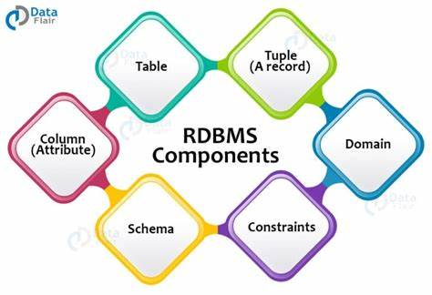
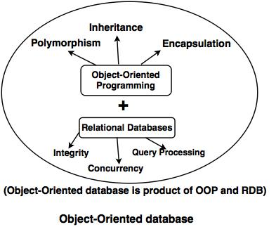

# Database Management Systems

There are several types of Database Management Systems (DBMS) that exist, each with its own strengths and weaknesses, and suitable for different use cases.

Below are some of the most common types of DBMS i have found:

## Relational Database Management System (RDBMS)

RDBMS is the most traditional type of DBMS.  
It stores data in tables with rows and columns, and relationships between tables are defined using foreign keys.

Examples of RDBMS include

- MySQL
- PostgreSQL
- Microsoft SQL Server
- Oracle.

Pros:

~ Well-established and widely used.  
~ Supports complex transactions and queries.  
~ Enforces data consistency and integrity.  
~ Supports SQL (Structured Query Language).

Cons:

~ Limited flexibility in data modeling.  
~ Not suitable for handling large amounts of unstructured data.  
~ Can be slow for certain types of queries.

## NoSQL Database Management System

NoSQL DBMS is a newer type of DBMS that does not use the traditional table-based relational model. Instead, it stores data in various formats such as key-value pairs, documents, graphs, and columns.

Examples of NoSQL DBMS include

- MongoDB
- Cassandra
- Redis
- Riak.

Pros:

~ Flexible data modeling.  
~ Scales horizontally.  
~ Handles large amounts of unstructured data.  
~ Supports high-performance and real-time applications.

Cons:

~ Lacks support for complex transactions and queries.  
~ No standard query language.  
~ Requires more expertise to set up and manage.

## Object-Oriented Database Management System (OODBMS):

OODBMS is a type of DBMS that stores data in the form of objects, which are instances of classes that represent real-world entities.

Examples of OODBMS include

- Gemstone
- Matisse
- ObjectDB

Pros:

Supports complex data modeling
Encapsulates data and behavior
Supports inheritance and polymorphism
Easy to use for object-oriented programming
Cons:

Limited support for transactions and queries
Not widely used
Can be slow for large datasets

## Time-Series Database Management System (TSDBMS)

TSDBMS is a type of DBMS that is optimized for storing and retrieving time-stamped data.  
TSDBMS are designed to handle time-stamped data and provide low-latency data access, high ingestion rates, and support for real-time analytics. They are ideal for applications that require real-time insights into time-stamped data, such as IoT data storage and analysis, financial data storage and analysis, healthcare data storage and analysis, energy and utilities data storage and analysis, and transportation data storage and analysis.

Examples of TSDBMS include

- InfluxDB
- OpenTSDB
- TimescaleDB.

Pros:

~ Optimized for time-series data  
~ Supports high-performance writes and reads  
~ Supports aggregation and filtering  
~ Easy to use for IoT and monitoring applications

Cons:

~ Limited support for complex transactions and queries  
~ Not suitable for non-time-series data

## Graph Database Management System (GDBMS)

GDBMS is a type of DBMS that stores data in the form of nodes and edges, which are used to represent complex relationships between data.

Examples of GDBMS include

- Neo4j
- Amazon Neptune
- OrientDB.

Pros:

~ Supports complex relationships between data  
~ High-performance for traversing relationships  
~ Suitable for social networks, recommendation systems, and fraud detection

Cons:

~ Limited support for transactions and queries  
~ Requires expertise in graph theory

## Document Database Management System (DDBMS)

DDBMS is a type of DBMS that stores data in the form of documents, such as JSON or XML.

.jpg>)

Examples of DDBMS include

- MongoDB
- Couchbase
- RavenDB

Pros:

~ Flexible data modeling  
~ Supports high-performance writes and reads  
~ Easy to use for web and mobile applications  
~ Supports replication and sharding

Cons:

~ Limited support for transactions and queries  
~ No standard query language  
~ Can be slow for certain types of queries
