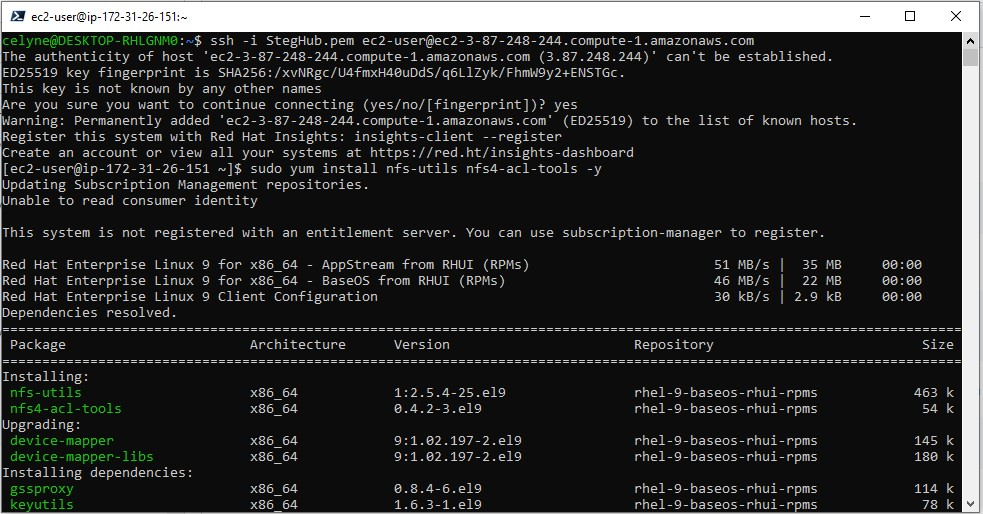

# Step 3 — Prepare the Web Servers

We need to make sure that our Web Servers can serve the same content from shared storage solutions, in our case – NFS Server and MySQL
database.

You already know that one DB can be accessed for reads and writes by multiple clients. For storing shared files that our Web Servers
will use – we will utilize NFS and mount previously created Logical Volume lv-apps to the folder where Apache stores files to be served
to the users (/var/www).

This approach will make our Web Servers stateless, which means we will be able to add new ones or remove them whenever we need, and
the integrity of the data (in the database and on NFS) will be preserved.

## During the next steps we will do following:

- Configure NFS client (this step must be done on all three servers)
- Deploy a Tooling application to our Web Servers into a shared NFS folder
- Configure the Web Servers to work with a single MySQL database

1. Launch a new EC2 instance with RHEL 8 Operating System

2. Install NFS client

```
sudo yum install nfs-utils nfs4-acl-tools -y
```



3. Mount /var/www/ and target the NFS server’s export for apps.  
   Then test if it works.

```
sudo mkdir /var/www
sudo mount -t nfs -o rw,nosuid <NFS-Server-Private-IP-Address>:/mnt/apps /var/www
```


4. Verify that NFS was mounted successfully by running `df -h`. Make sure that the changes will persist on Web Server after reboot:

```
sudo vi /etc/fstab
```

add following line

```
<NFS-Server-Private-IP-Address>:/mnt/apps /var/www nfs defaults 0 0
```


5. Install [Remi’s repository](http://www.servermom.org/how-to-enable-remi-repo-on-centos-7-6-and-5/2790/), Apache and PHP

```
sudo yum install httpd -y

sudo dnf install https://dl.fedoraproject.org/pub/epel/epel-release-latest-8.noarch.rpm

sudo dnf install dnf-utils http://rpms.remirepo.net/enterprise/remi-release-8.rpm

sudo dnf module reset php

sudo dnf module enable php:remi-7.4

sudo dnf install php php-opcache php-gd php-curl php-mysqlnd

sudo systemctl start php-fpm

sudo systemctl enable php-fpm

setsebool -P httpd_execmem 1
```
