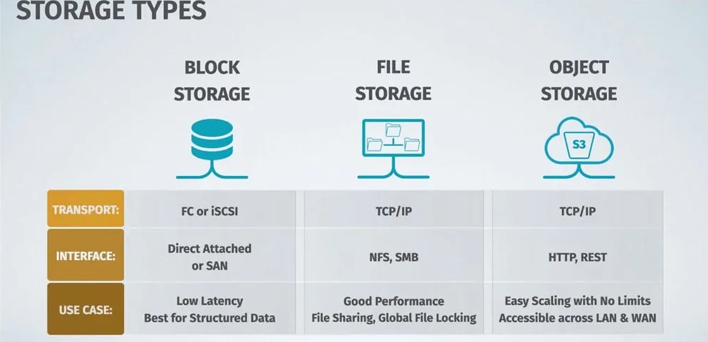

# Block Storage, Object Storage, and Network File System in AWS.

These three storage services offer different capabilities and are designed to cater to various use cases.

In this article, we will explore each of these storage options in AWS, their features, and how they can be utilized effectively.

So, let's dive into the world of AWS storage and uncover the power of block storage, object storage, and network file system!

## Block Storage in AWS

### What is Block Storage?

Block storage in AWS refers to the provision of storage volumes that can be attached to EC2 instances. These volumes are presented as block devices and can be formatted with a file system of your choice. Block storage offers high-performance storage with low latency and is ideal for applications that require direct access to disk-level storage.

### AWS Block Storage Options

AWS provides multiple block storage options, including:

1. **Amazon Elastic Block Store (EBS)**: Amazon EBS offers persistent block-level storage volumes that can be attached to EC2 instances. It provides various volume types, such as General Purpose SSD (gp2), Provisioned IOPS SSD (io1), and Throughput Optimized HDD (st1), catering to different performance and cost requirements.

2. **Amazon EC2 Instance Store**: EC2 instance store provides temporary block-level storage that is physically attached to the host server. It offers high-performance storage but does not provide data persistence beyond the lifetime of the instance. Instance store volumes are ideal for temporary data and caching purposes.

### Object Storage in AWS

### What is Object Storage?

Object storage in AWS is a scalable and durable storage solution designed for storing and retrieving large amounts of unstructured data. It treats data as discrete objects, each with its own unique identifier and metadata. Object storage is highly scalable, cost-effective, and offers high durability and availability.

### AWS Object Storage Option

AWS offers a powerful object storage service called **Amazon Simple Storage Service (S3)**. S3 allows you to store and retrieve any amount of data from anywhere on the web. It provides features like versioning, lifecycle management, access control, and event notifications. S3 is commonly used for backup and restore, data archiving, content distribution, and hosting static websites.

### Network File System (NFS) in AWS

### What is Network File System (NFS)?

Network File System (NFS) is a distributed file system protocol that allows you to share files across a network. It enables multiple servers and clients to access and share the same file system resources. NFS provides a familiar file-based interface and is commonly used for shared storage and file sharing in a networked environment.

### AWS NFS Option

AWS offers a fully managed NFS service called **Amazon Elastic File System (EFS)**. EFS provides scalable and highly available file storage that can be accessed by multiple EC2 instances concurrently. It supports the NFSv4 protocol, offers automatic scaling, and provides strong data consistency. EFS is suitable for a wide range of use cases, including content management, web serving, and data analytics.

## Use Cases and Considerations

Now, let's explore some common use cases and considerations for each storage option:

### Block Storage Use Cases and Considerations

- **Use Cases**: Block storage is well-suited for applications that require low-latency access to storage, such as databases, transactional systems, and high-performance computing.
- **Considerations**: When using block storage, it's important to consider the performance requirements, cost, and data persistence needs. You should also consider backup and disaster recovery strategies for your block storage volumes.

### Object Storage Use Cases and Considerations

- **Use Cases**: Object storage is ideal for storing and managing large amounts of unstructured data, such as media files, backups, logs, and archives. It is also commonly used for content distribution and static website hosting.
- **Considerations**: Consider the access patterns, data retrieval costs, and durability requirements when using object storage. You should also plan for data lifecycle management and implement appropriate access controls for your objects.

### Network File System Use Cases and Considerations

- **Use Cases**: NFS is suitable for scenarios where shared file access is required, such as collaborative work environments, content repositories, and application file sharing.
- **Considerations**: Consider the scalability, performance, and availability requirements when using NFS. You should also ensure proper network connectivity and security for your NFS file systems.

## Conclusion

In conclusion, AWS provides a range of storage options to cater to different needs. Block storage, object storage, and network file system each offer unique capabilities and benefits. By understanding the characteristics and use cases of these storage options, you can effectively leverage them in your AWS environment. So, embrace the power of block storage, object storage, and network file system in AWS, and unlock the full potential of your storage needs!
