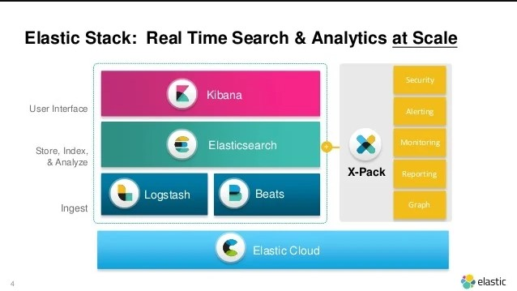

# Elastic Stack: Empowering Data Analytics and Search

The Elastic Stack, formerly known as ELK Stack, is a collection of three core components: Elasticsearch, Logstash, and Kibana. These components work seamlessly together to provide a comprehensive solution for data ingestion, storage, analysis, and visualization.

### 1. Elasticsearch

At the heart of the Elastic Stack is Elasticsearch, a distributed, RESTful search and analytics engine. Elasticsearch is built on top of Apache Lucene and provides a scalable and real-time search capability. It allows organizations to store, search, and analyze large volumes of structured and unstructured data quickly and efficiently.

### 2. Logstash

Logstash is a powerful data processing pipeline that ingests, transforms, and enriches data from various sources. It supports a wide range of input sources, including logs, metrics, and event data. Logstash allows organizations to collect data from diverse sources, parse and transform it, and send it to Elasticsearch for indexing and analysis.

### 3. Kibana

Kibana is a data visualization and exploration tool that works seamlessly with Elasticsearch. It provides a user-friendly interface for searching, analyzing, and visualizing data stored in Elasticsearch. With Kibana, organizations can create interactive dashboards, charts, and graphs to gain insights from their data and make informed decisions.

## Additional Components of the Elastic Stack

In addition to the core components, the Elastic Stack offers several other tools and features that enhance its functionality and provide additional capabilities. Some of these components include:

### 1. Beats

Beats are lightweight data shippers that collect and send data from various sources to Elasticsearch or Logstash. Beats are designed to be easy to deploy and configure, making them ideal for collecting data from servers, containers, and IoT devices. There are different types of Beats available, such as Filebeat for log files, Metricbeat for system metrics, and Packetbeat for network data.

### 2. X-Pack

X-Pack is a commercial extension to the Elastic Stack that provides additional features and capabilities for security, monitoring, alerting, and machine learning. It includes features like role-based access control (RBAC), SSL/TLS encryption, machine learning for anomaly detection, and more. X-Pack enhances the Elastic Stack's functionality and makes it suitable for enterprise-grade deployments.

### 3. Elastic Cloud

Elastic Cloud is a fully managed Elasticsearch service provided by Elastic. It allows organizations to deploy and manage Elasticsearch clusters in the cloud without the need for infrastructure management. Elastic Cloud offers scalability, high availability, and automatic upgrades, making it easy for organizations to leverage the power of Elasticsearch without the operational overhead.

## Benefits of the Elastic Stack

Implementing the Elastic Stack offers several benefits to organizations:

### 1. Scalability and Performance

Elasticsearch, the core component of the Elastic Stack, is designed to scale horizontally, allowing organizations to handle large volumes of data and high query loads. It provides near real-time search and analytics capabilities, enabling organizations to gain insights from their data quickly and efficiently.

### 2. Flexibility and Extensibility

The Elastic Stack is highly flexible and can be used to analyze and visualize data from various sources. It supports a wide range of data types and formats, making it suitable for diverse use cases. Additionally, the Elastic Stack's open-source nature allows organizations to extend its functionality and integrate it with other tools and systems.

### 3. Ease of Use

The Elastic Stack is designed to be user-friendly and easy to deploy and configure. It provides intuitive interfaces and powerful query languages that enable users to interact with their data effectively. The availability of pre-built dashboards and visualizations in Kibana further simplifies the process of data exploration and analysis.

### 4. Rich Ecosystem and Community Support

The Elastic Stack has a vibrant ecosystem and a large community of users and contributors. This means that organizations can leverage a wide range of plugins, integrations, and community-developed solutions to enhance their data analytics and search capabilities. The active community support also ensures that issues are addressed promptly and new features are continuously added.

## Best Practices for Using the Elastic Stack

To make the most out of the Elastic Stack, consider the following best practices:

### 1. Plan for Scalability

When deploying the Elastic Stack, consider the expected data volume and query load to ensure that the cluster is properly sized and can handle the workload. Use features like index sharding and replication to distribute data across multiple nodes and ensure high availability and performance.

### 2. Optimize Data Ingestion

Efficient data ingestion is crucial for a successful implementation of the Elastic Stack. Use Beats orother data shippers to collect and send data to Elasticsearch or Logstash. Consider using Logstash to preprocess and enrich the data before indexing it in Elasticsearch. This can include tasks like parsing log files, transforming data formats, and applying filters to remove unnecessary data.

### 3. Design Effective Indexing Strategies

When designing the indexing strategy, consider the search and analysis requirements of your data. Define appropriate mappings to ensure that the data is indexed correctly and efficiently. Use techniques like index aliases and rollover indices to manage the growth of your data and optimize search performance.

### 4. Leverage Kibana for Data Visualization

Take advantage of Kibana's powerful visualization capabilities to create meaningful dashboards, charts, and graphs. Use the various visualization types available, such as line charts, bar charts, and heat maps, to present your data in a visually appealing and informative way. Explore the different aggregations and metrics available in Kibana to gain deeper insights from your data.

### 5. Monitor and Optimize Performance

Regularly monitor the performance of your Elastic Stack deployment to identify bottlenecks and optimize resource usage. Use tools like Elasticsearch's Monitoring API and Kibana's Monitoring UI to track cluster health, resource utilization, and query performance. Consider implementing features like query caching and document-level security to improve search performance and protect sensitive data.

## Frequently Asked Questions (FAQ)

### Q1: Can the Elastic Stack handle large-scale data analytics?

Yes, the Elastic Stack is designed to handle large-scale data analytics. Elasticsearch's distributed nature allows it to scale horizontally, enabling organizations to process and analyze massive amounts of data. Additionally, features like index sharding and replication ensure high availability and performance even with large data volumes.

### Q2: Can I use the Elastic Stack for real-time data analysis?

Yes, the Elastic Stack is well-suited for real-time data analysis. Elasticsearch provides near real-time search and analytics capabilities, allowing organizations to gain insights from their data as it is ingested. Combined with features like Beats for real-time data collection and Kibana for real-time visualization, the Elastic Stack enables organizations to monitor and analyze data in real-time.

### Q3: Is the Elastic Stack suitable for small organizations?

Yes, the Elastic Stack is suitable for organizations of all sizes. It offers a range of deployment options, from self-hosted installations to fully managed services like Elastic Cloud. Small organizations can start with a single-node deployment and scale as their data and query loads grow. The flexibility and ease of use of the Elastic Stack make it accessible to organizations with varying resources and technical expertise.

### Q4: Can I integrate the Elastic Stack with other tools and systems?

Yes, the Elastic Stack has a rich ecosystem and supports integration with various tools and systems. It provides APIs and connectors that allow you to ingest data from external sources and export data to other systems. Additionally, the Elastic Stack has plugins and integrations available for popular tools like Apache Kafka, Apache Spark, and Tableau, enabling seamless integration into existing data pipelines and workflows.

### Q5: Is the Elastic Stack secure?

Yes, the Elastic Stack provides several security features to protect your data. X-Pack, the commercial extension to the Elastic Stack, offers features like role-based access control (RBAC), SSL/TLS encryption, and audit logging. These features ensure that only authorized users have access to the data and that data transmission is secure. Additionally, Elasticsearch provides features like field-level security and document-level security to further protect sensitive data.

## Conclusion

The Elastic Stack is a powerful and versatile solution for data analytics and search. With its core components, Elasticsearch, Logstash, and Kibana, along with additional tools like Beats and X-Pack, the Elastic Stack empowers organizations to collect, analyze, and visualize their data effectively. By following best practices and leveraging the rich ecosystem of the Elastic Stack, organizations can unlock valuable insights from their data and make data-driven decisions. So, embrace the power of the Elastic Stack and take your data analytics and search capabilities to new heights!
