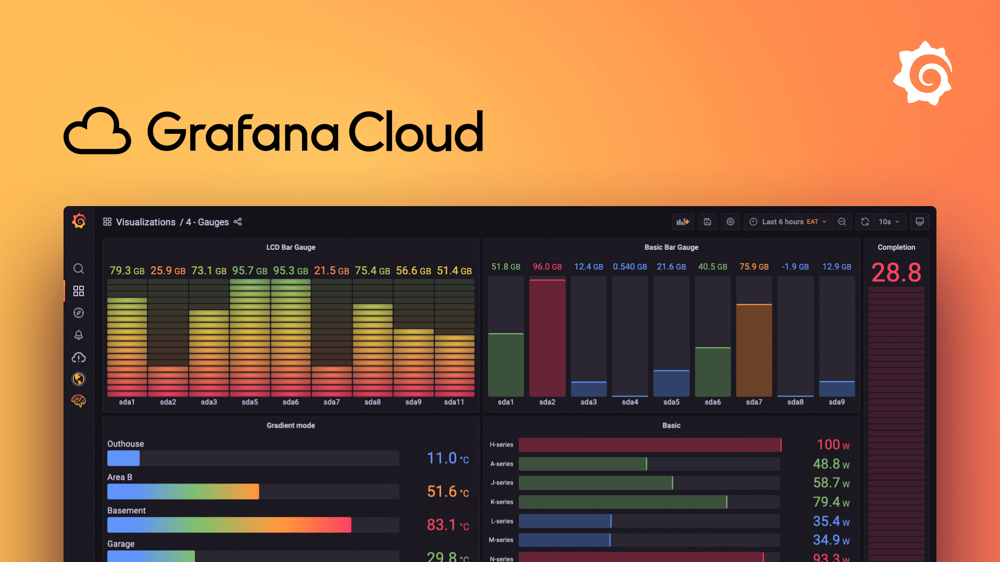

# Grafana: Unleashing the Power of Data Visualization and Monitoring

In today's data-driven world, organizations need robust tools to visualize and monitor their data effectively. Grafana, an open-source platform, has emerged as a powerful solution for creating visually appealing and interactive dashboards for data visualization and monitoring. With its extensive support for various data sources and plugins, Grafana has become the go-to choice for data analysts, DevOps teams, and system administrators.

In this comprehensive article, we will delve into the features and benefits of Grafana, provide a step-by-step guide on setting it up, and explore how you can leverage its capabilities to gain valuable insights from your data.

## Table of Contents

1. [What is Grafana?](#what-is-grafana)
2. [Why Choose Grafana?](#why-choose-grafana)
3. [Setting Up Grafana](#setting-up-grafana)
4. [Data Sources and Plugins](#data-sources-and-plugins)
5. [Creating Dynamic Dashboards](#creating-dynamic-dashboards)
6. [Alerting and Notifications](#alerting-and-notifications)

## What is Grafana?

Grafana is an open-source data visualization and monitoring platform that empowers users to create interactive dashboards for analyzing and monitoring data from various sources. It supports a wide range of data sources, including popular databases, cloud platforms, and monitoring systems. Grafana provides a user-friendly interface with drag-and-drop capabilities, making it accessible to users with varying technical expertise. With Grafana, you can transform complex data into meaningful visualizations, enabling you to identify trends, patterns, and anomalies with ease.

## Why Choose Grafana?

Grafana has gained immense popularity among data analysts, DevOps teams, and system administrators for several reasons:

1. **Flexible Data Visualization**: Grafana offers a plethora of visualization options, including graphs, charts, tables, and heatmaps. These options allow users to customize their dashboards' appearance and create visually stunning representations of their data. With Grafana's flexible visualization capabilities, you can effortlessly communicate complex information in a visually appealing manner.

2. **Real-time Monitoring**: Grafana supports real-time monitoring, enabling users to track metrics and events as they occur. This is particularly useful for monitoring system performance, network traffic, application logs, and other time-sensitive data. By setting up alerts and notifications, you can promptly respond to critical events or anomalies, ensuring the smooth operation of your systems.

3. **Extensive Data Source Support**: Grafana seamlessly integrates with a wide range of data sources, including popular databases like MySQL, PostgreSQL, and InfluxDB, as well as cloud platforms like AWS and Google Cloud. Additionally, Grafana supports various monitoring systems such as Prometheus and Elasticsearch. This extensive data source support allows you to consolidate data from multiple sources into a single dashboard, facilitating comprehensive analysis and monitoring.

4. **Robust Plugin Ecosystem**: Grafana boasts a vibrant plugin ecosystem that extends its capabilities. Users can leverage plugins to add additional data sources, visualization options, and alerting mechanisms. This flexibility enables you to tailor Grafana to your specific needs and integrate it seamlessly with your existing tools and systems.

5. **User-friendly Interface**: Grafana's user-friendly interface empowers users with varying technical expertise to create and customize dashboards without the need for complex coding or scripting. The intuitive drag-and-drop interface, coupled with a rich set of pre-built panels and templates, allows for quick and easy dashboard creation.

6. **Effortless Sharing and Collaboration**: Grafana enables users to share their dashboards effortlessly, facilitating collaboration and knowledge sharing. Dashboards can be shared as static images or interactive links, enabling stakeholders to view and interact with the data. Additionally, Grafana supports role-based access control, ensuring that only authorized users can access sensitive data.

## Setting Up Grafana

Setting up Grafana involves the following steps:

1. **Choose an Installation Method**: Grafana can be installed on-premises or in the cloud. You can opt to install Grafana on a dedicated server or utilize Grafana Cloud, a managed service that offers a hassle-free experience.

2. **Configure System Requirements**: Ensure that your system meets the minimum requirements for running Grafana. This includes checking hardware specifications, operating system compatibility, and network requirements.

3. **Install and Configure Grafana**: Follow the installation guide provided by Grafana to install and configure the platform on your chosen platform. This typically involves setting up a Grafana server, configuring data sources, and customizing dashboard settings.

4. **Access Grafana UI**: Once Grafana is installed and configured, you canaccess the Grafana user interface (UI) by navigating to the designated URL in your web browser. You will be prompted to create an initial admin account and set a password.

5. **Explore the UI**: Familiarize yourself with the Grafana UI, which consists of various components such as the side menu, dashboard editor, and panel editor. Take some time to navigate through the different sections and understand the available options for creating and customizing dashboards.

## Data Sources and Plugins

Grafana supports a wide range of data sources, allowing you to connect to various databases, cloud platforms, and monitoring systems. Some popular data sources supported by Grafana include:

- [MySQL](https://www.mysql.com/)
- [PostgreSQL](https://www.postgresql.org/)
- [InfluxDB](https://www.influxdata.com/)
- [Prometheus](https://prometheus.io/)
- [Elasticsearch](https://www.elastic.co/elasticsearch/)

To connect Grafana to a data source, you need to configure the appropriate data source plugin. Grafana provides a rich collection of plugins that extend its functionality. Some notable plugins include:

- [Worldmap Panel](https://grafana.com/grafana/plugins/grafana-worldmap-panel): Allows you to visualize data on a world map.
- [Pie Chart Panel](https://grafana.com/grafana/plugins/grafana-piechart-panel): Enables the creation of pie charts for data analysis.
- [Clock Panel](https://grafana.com/grafana/plugins/grafana-clock-panel): Displays a clock or timer on your dashboard.
- [Table Panel](https://grafana.com/grafana/plugins/grafana-table-panel): Presents tabular data in a customizable table format.

By leveraging these plugins, you can enhance your dashboards with additional visualization options and features.

## Creating Dynamic Dashboards

Grafana empowers users to create dynamic and interactive dashboards that provide real-time insights into their data. Here are some key steps to consider when creating dashboards in Grafana:

1. **Choose a Visualization Type**: Select the appropriate visualization type based on the nature of your data and the insights you want to convey. Grafana offers a wide range of visualization options, including graphs, charts, tables, and heatmaps.

2. **Configure Data Source**: Connect your chosen data source to Grafana by configuring the relevant data source plugin. This allows Grafana to retrieve data from your selected source and populate the dashboard with the necessary information.

3. **Design the Dashboard Layout**: Organize your dashboard by arranging panels in a logical and visually appealing manner. Grafana's drag-and-drop interface makes it easy to position and resize panels according to your preferences.

4. **Customize Panel Settings**: Fine-tune each panel's settings to display the desired information. This includes specifying the data source, selecting the appropriate visualization type, and defining any additional parameters or filters.

5. **Apply Styling and Theming**: Customize the appearance of your dashboard by applying themes, colors, and fonts that align with your brand or visual preferences. Grafana provides various styling options to help you create visually stunning dashboards.

6. **Add Interactivity and Drill-Downs**: Enhance user experience by adding interactive elements to your dashboard. Grafana allows you to configure drill-downs, which enable users to explore specific data points in more detail by clicking on them.

7. **Configure Time Range and Refresh Interval**: Set the time range for your dashboard to control the data displayed. You can specify a fixed time range or enable auto-refresh to ensure that the dashboard always reflects the latest data.

8. **Save and Share the Dashboard**: Once your dashboard is complete, save it and share it with relevant stakeholders. Grafana provides options to export dashboards as images or generate shareable links for interactive access.

By following these steps, you can create dynamic and visually appealing dashboards that effectively communicate insights from your data.

## Alerting and Notifications

Grafana's alerting and notification capabilities enable you to proactively monitor your systems and respond to critical events. Here's how you can set up alerts in Grafana:

1. **Define Alert Rules**: Specify the conditions that trigger an alert. This can include thresholds, anomalies, or specific patterns in your data. Grafana allows you to define complex alert rules using query expressions and functions.

2. **Configure Notification Channels**: Set up notification channels to receive alerts. Grafana supports various notification channels, including email, Slack, PagerDuty, and Webhooks. Configure the appropriate channel based on your preferred method of receiving alerts.

3. **Create Alert Notifications**: Create alert notifications that specify the recipients and the message content. You can customize the notification message to include relevant information such as the alert severity, affected system, and recommended actions.

4. **Test and Validate Alerts**: Before deploying your alerts in a production environment, test and validate them to ensure they trigger correctly. Simulate different scenarios and verify that the alerts are triggered and notifications are sent as expected.
