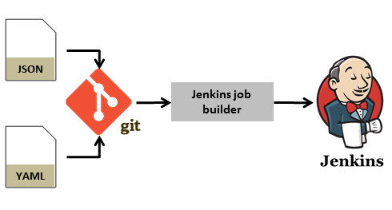

# Jenkins: A Comprehensive Guide to Continuous Integration and Delivery

In today's fast-paced software development landscape, delivering high-quality software quickly and efficiently is crucial. This is where Jenkins, an open-source automation tool, comes into play. Jenkins enables continuous integration and delivery, allowing development teams to automate their build, test, and deployment processes. In this article, we will explore the features and benefits of Jenkins, as well as provide a step-by-step guide on how to set it up and use it effectively.

## Table of Contents

1. [What is Jenkins?](#what-is-jenkins)
2. [Why Use Jenkins?](#why-use-jenkins)
3. [Setting Up Jenkins](#setting-up-jenkins)
4. [Creating a Jenkins Job](#creating-a-jenkins-job)
5. [Configuring Jenkins](#configuring-jenkins)
6. [Integrating Jenkins with Version Control Systems](#integrating-jenkins-with-version-control-systems)
7. [Running Tests with Jenkins](#running-tests-with-jenkins)
8. [Deploying Applications with Jenkins](#deploying-applications-with-jenkins)
9. [Monitoring and Reporting with Jenkins](#monitoring-and-reporting-with-jenkins)
10. [Conclusion](#conclusion)
11. [FAQ](#faq)

## What is Jenkins?

Jenkins is an open-source automation server that facilitates continuous integration and delivery. It provides a platform for automating the build, test, and deployment processes of software development projects. Jenkins allows developers to integrate their code changes into a shared repository, run automated tests, and deploy applications to various environments.

## Why Use Jenkins?

There are several reasons why Jenkins has become the go-to choice for continuous integration and delivery:

1. **Automation**: Jenkins automates repetitive tasks, such as building and testing code, saving developers time and effort.

2. **Integration**: Jenkins integrates seamlessly with various tools and technologies commonly used in software development, including version control systems, testing frameworks, and deployment tools.

3. **Scalability**: Jenkins can handle projects of any size, from small personal projects to large enterprise applications.

4. **Extensibility**: Jenkins offers a vast array of plugins that extend its functionality, allowing developers to customize and tailor their automation workflows.

5. **Community Support**: Jenkins has a large and active community of users and contributors who provide support, share best practices, and develop new plugins.

## Setting Up Jenkins

To set up Jenkins, follow these steps:

1. **Install Jenkins**: Download and install Jenkins on your server or local machine. Detailed installation instructions can be found on the [official Jenkins website](https://www.jenkins.io/doc/book/installing/).

2. **Access Jenkins**: Once installed, access Jenkins by opening a web browser and navigating to `http://localhost:8080` (replace `localhost` with the appropriate server address if running on a remote machine).

3. **Unlock Jenkins**: During the first access, Jenkins will provide an initial setup wizard. You will need to retrieve the initial administrator password from the Jenkins installation directory and enter it to unlock Jenkins.

4. **Install Plugins**: Select the recommended plugins or choose specific plugins based on your requirements. These plugins extend Jenkins' functionality and provide additional features.

5. **Create an Admin User**: Set up an administrator account by providing the necessary details.

6. **Start Using Jenkins**: Once the setup is complete, you can start using Jenkins to automate your software development processes.

## Creating a Jenkins Job

A Jenkins job represents a specific task or process that you want to automate. To create a Jenkins job, follow these steps:

1. **Access Jenkins Dashboard**: Log in to Jenkins and access the Jenkins dashboard.

2. **Create a New Job**: Click on "New Item" to create a new Jenkins job.

3. **Choose Job Type**: Select the appropriate job type based on your requirements. For example, you can choose a freestyle project, a pipeline project, or a multi-configuration project.

4. **Configure Job Settings**: Provide a name for your job and configure the necessary settings, such as source code management, build triggers, and build steps.

5. **Save Job Configuration**: Save the job configuration.

6. **Build Job**: Run the job manually or configure it to run automatically based on triggers.

## Configuring Jenkins

Jenkins provides various configuration options to customize its behavior and integrate with other tools. Some essential configuration options include:

- **Global Tool Configuration**: Configure tools such as JDK, Git, and Maven that Jenkins jobs may require.

- **System Configuration**: Configure system-wide settings, such as security, email notifications, and environment variables.

- **Plugin Management**: Manage installed plugins, update existing plugins, and install new plugins.

- **User Management**: Manage user accounts, permissions, and access control.

- **Folder Configuration**: Organize jobs into folders for bettermanagement and organization.

## Integrating Jenkins with Version Control Systems

Jenkins seamlessly integrates with popular version control systems like Git, SVN, and Mercurial. To integrate Jenkins with a version control system:

1. **Install the Required Plugins**: Install the necessary plugins for your version control system. For example, the Git Plugin for Git integration.

2. **Configure Source Code Management**: In your Jenkins job configuration, select the appropriate source code management system and provide the repository URL and credentials.

3. **Specify Branches to Build**: Specify the branches or tags you want Jenkins to build. You can use regular expressions to define branch patterns.

4. **Set Up Webhooks or Polling**: Configure webhooks or polling to trigger Jenkins builds whenever changes are pushed to the repository.

## Running Tests with Jenkins

Jenkins allows you to automate the execution of tests as part of your continuous integration process. To run tests with Jenkins:

1. **Choose a Testing Framework**: Select a testing framework that suits your project, such as JUnit for Java projects or pytest for Python projects.

2. **Configure Test Execution**: Set up your Jenkins job to execute the tests. This may involve specifying the test command, test file patterns, and any additional test parameters.

3. **Generate Test Reports**: Configure Jenkins to generate test reports after each test run. This will provide valuable insights into test results and help identify any failures or regressions.

4. **Integrate with Test Coverage Tools**: If you use test coverage tools like JaCoCo or Cobertura, configure Jenkins to generate coverage reports and track code coverage metrics.

## Deploying Applications with Jenkins

Jenkins can automate the deployment of applications to various environments, such as development, staging, and production. To deploy applications with Jenkins:

1. **Choose a Deployment Strategy**: Determine the deployment strategy that best suits your project, such as manual deployment, rolling deployment, or blue-green deployment.

2. **Configure Deployment Steps**: Set up deployment steps in your Jenkins job configuration. This may involve copying files to the target environment, running database migrations, or restarting services.

3. **Integrate with Deployment Tools**: If you use deployment tools like Ansible or Docker, integrate them with Jenkins to streamline the deployment process.

4. **Monitor Deployment Status**: Configure Jenkins to monitor the deployment process and provide feedback on the success or failure of each deployment.

## Monitoring and Reporting with Jenkins

Jenkins offers various monitoring and reporting features to track the status and progress of your automation workflows. Some key monitoring and reporting capabilities include:

- **Build History**: Jenkins maintains a build history, allowing you to view the details of past builds, including build logs, test results, and artifacts.

- **Build Notifications**: Configure Jenkins to send email notifications or integrate with messaging platforms like Slack to notify stakeholders about build status and failures.

- **Build Pipelines**: Visualize your entire software delivery process using Jenkins Pipeline, a powerful and flexible way to define and execute continuous delivery pipelines.

- **Metrics and Dashboards**: Use plugins like Jenkins Metrics Plugin or Jenkins Dashboard View to generate metrics and dashboards that provide insights into build times, success rates, and other key performance indicators.

## Conclusion

Jenkins is a versatile and powerful automation tool that enables continuous integration and delivery. By automating build, test, and deployment processes, Jenkins helps development teams deliver high-quality software faster and more efficiently. With its extensive plugin ecosystem and active community support, Jenkins remains a top choice for organizations seeking to streamline their software development workflows.

## FAQ

### 1. Can Jenkins be used for non-Java projects?

Yes, Jenkins can be used for projects written in various programming languages. It supports a wide range of build tools, testing frameworks, and deployment technologies, making it suitable for projects of any language or stack.

### 2. Can Jenkins be used for manual deployments?

Yes, Jenkins can be configured to perform manual deployments. While it excels in automating the deployment process, it can also be used to trigger manual deployments and track their status.

### 3. Is Jenkins suitable for small projects?

Yes, Jenkins is suitable for projects of any size. It can be scaled up or down based on your project's requirements. Even small projects can benefit from Jenkins' automation capabilities and streamlined workflows.

### 4. Can Jenkins integrate with cloud-based services?

Yes, Jenkins can integrate with various cloud-based services, such as Amazon Web Services (AWS), Microsoft Azure, and Google Cloud Platform (GCP). This allows you to leverage cloud resources for your build, test, and deployment processes.

### 5. Is Jenkins secure?

Jenkins provides security features, such as user authentication, authorization, and access control, to ensure the safety of your automation workflows. However, it is essential to configure Jenkins securely and follow best practices to maintain a secure environment.
