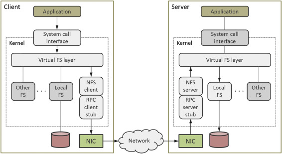

# The Ultimate Guide to Network File System (NFS)

Network File System (NFS) is a distributed file system protocol that enables remote file access and sharing between computers over a network. It allows a client system to access files and directories located on a remote server as if they were local. NFS provides a transparent and seamless way to share files across different operating systems and platforms.

### Key Features of NFS

- **Remote File Access**: NFS allows clients to access files and directories located on remote servers as if they were local, providing a unified view of the file system.
- **File Locking**: NFS supports file locking mechanisms to ensure data integrity and prevent conflicts when multiple clients attempt to access or modify the same file simultaneously.
- **Caching**: NFS incorporates caching mechanisms to improve performance by storing frequently accessed data locally on the client system, reducing network overhead.
- **Security**: NFS provides security features such as authentication and access control to protect data from unauthorized access. It supports various security mechanisms, including Kerberos and Secure RPC.
- **Scalability**: NFS is designed to scale efficiently, allowing multiple clients to access shared files simultaneously without significant performance degradation.

## Benefits of Using NFS

Implementing Network File System (NFS) offers numerous benefits for organizations:

- **Centralized File Storage**: NFS allows organizations to centralize file storage on dedicated servers, providing a single point of access for files and simplifying data management.
- **Collaboration and File Sharing**: NFS enables seamless file sharing and collaboration among users and systems, regardless of their location or operating system.
- **Data Consistency**: NFS ensures data consistency by supporting file locking mechanisms, preventing conflicts and data corruption when multiple clients access the same file simultaneously.
- **Performance Optimization**: NFS incorporates caching mechanisms that improve performance by reducing network overhead and storing frequently accessed data locally on the client system.
- **Platform Independence**: NFS is platform-independent, allowing file sharing between different operating systems, including Unix-like systems, Linux, and Windows.

## Setting Up NFS

Setting up Network File System (NFS) involves several key steps:

### 1. Server Configuration

Configure the NFS server by installing the necessary software and enabling NFS services. Set up the file system that will be shared and specify the access permissions for clients. Configure the NFS exports file to define the shared directories and their access rights.

### 2. Client Configuration

Configure the NFS client by installing the NFS client software and configuring the necessary settings. Mount the shared directories from the NFS server to the client system using the appropriate mount command. Ensure that the client has the necessary permissions to access the shared files.

### 3. Network Configuration

Ensure that the NFS server and client systems are connected to the same network and can communicate with each other. Configure the network settings, including IP addresses and network masks, to enable proper communication between the server and client.

### 4. Firewall Configuration

If you have a firewall enabled on either the server or client system, configure it to allow NFS traffic. Open the necessary ports to ensure that NFS communication is not blocked by the firewall. Consult the documentation of your firewall software for specific instructions.

### 5. Testing and Validation

Thoroughly test the NFS setup to ensure proper functionality and performance. Verify that the client can access and modify files on the NFS server. Test file locking mechanisms to ensure data integrity when multiple clients access the same file simultaneously.

### 6. Monitoring and Maintenance

Implement a monitoring system to continuously monitor the NFS server and client for performance, availability, and potential issues. Regularly perform maintenance tasks such as software updates, security patches, and performance optimizations to keep the NFS setup running smoothly.

## Optimizing NFS Performance

To optimize the performance of your Network File System (NFS), consider the following factors:

### 1. Network Bandwidth

Ensure that your network infrastructure has sufficient bandwidth to handle the expected workload. High-speed networks, such as Gigabit Ethernet, are recommended for optimal NFS performance. Consider implementing technologies like jumbo frames to further improve network throughput.

### 2. NFS Version

Choose the appropriate NFS version based on your specific requirements. NFSv4 offers improved security and performance compared to earlier versions. However, compatibility with older NFS clients and servers should be considered when selecting the NFS version.

### 3. Mount Options

Optimize the mount options used when mountingthe NFS shares on the client system. Experiment with different mount options to find the best combination for your specific use case. Some common mount options include:

- **noac**: Disables attribute caching, ensuring that the client always retrieves the latest file attributes from the server. This can be useful for applications that require real-time data consistency.
- **rsize** and **wsize**: Specifies the read and write buffer sizes used by the client when communicating with the server. Adjusting these values can improve performance, especially for large file transfers.
- **hard** or **soft**: Specifies the error handling behavior when the server becomes unavailable. "hard" retries indefinitely, while "soft" returns an error after a certain number of retries. Consider the trade-offs between reliability and responsiveness when choosing between these options.

### 4. File System Tuning

Optimize the file system settings on the NFS server to improve performance. Consider adjusting parameters such as the file system block size, inode size, and file system journaling options based on your workload characteristics.

### 5. Network Latency

Minimize network latency by ensuring that the NFS server and client systems are physically close to each other and connected through a high-speed network. Consider using technologies like network bonding or link aggregation to increase network throughput and redundancy.

## Frequently Asked Questions (FAQ)

### Q1: What is the difference between NFSv3 and NFSv4?

NFSv3 and NFSv4 are different versions of the Network File System protocol. NFSv4 offers improved security, file locking mechanisms, and performance compared to NFSv3. It also introduces features such as support for ACLs (Access Control Lists) and better integration with Kerberos for authentication.

### Q2: Can NFS be used for cross-platform file sharing?

Yes, NFS is platform-independent and can be used for cross-platform file sharing. It allows files to be shared between different operating systems, including Unix-like systems, Linux, and Windows.

### Q3: How does NFS handle file locking?

NFS handles file locking through the use of lock managers. When a client requests a lock on a file, it communicates with the lock manager on the server to coordinate access. This ensures that multiple clients cannot simultaneously modify the same file, preventing conflicts and data corruption.

### Q4: Is NFS secure for remote file sharing?

NFS provides security features such as authentication and access control to protect data from unauthorized access. It supports various security mechanisms, including Kerberos and Secure RPC. However, additional measures, such as using VPNs or encrypting NFS traffic, may be necessary to enhance security further.

### Q5: Can NFS performance be improved for large file transfers?

Yes, NFS performance for large file transfers can be improved by adjusting the read and write buffer sizes (rsize and wsize) used by the client when communicating with the server. Increasing these values can enhance performance, especially for large file transfers.

## Conclusion

Network File System (NFS) is a powerful protocol that enables seamless file sharing and access across different systems. By understanding the features, benefits, setup, and optimization techniques of NFS, you can create a robust and efficient file sharing infrastructure. Remember to consider factors such as network bandwidth, NFS version, mount options, file system tuning, and network latency to maximize the performance of your NFS setup. With proper configuration and maintenance, NFS can greatly enhance collaboration and data management in your organization.
