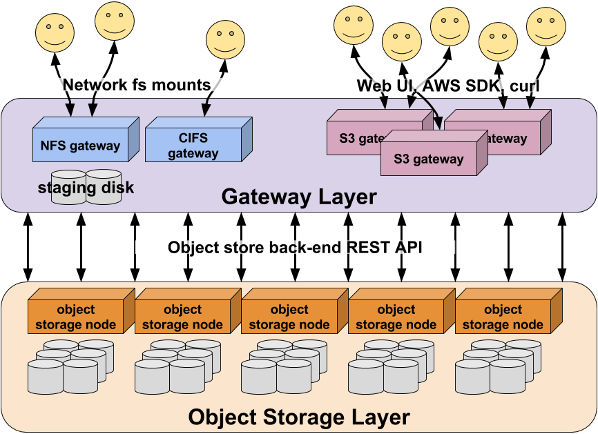
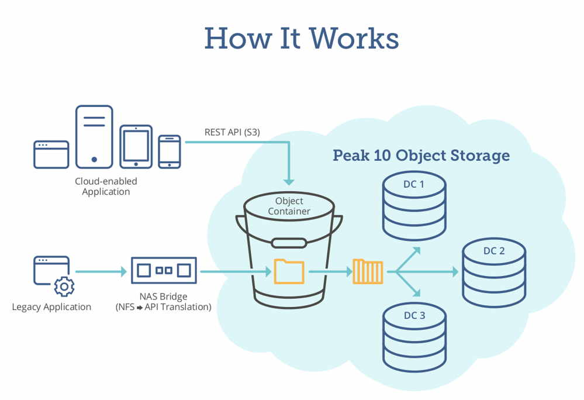

# Object Storage

Object storage is a method of storing and managing data as discrete objects rather than as files or blocks. In this article, we will delve into the world of object storage, its characteristics, benefits, and its applications in various industries. So, let's embark on a journey to uncover the secrets of object storage!

## Understanding Object Storage

### What is Object Storage?

Object storage is a storage architecture that organizes and manages data as individual objects. Each object consists of data, metadata, and a unique identifier. Unlike traditional file systems, which organize data in a hierarchical structure, object storage uses a flat address space, allowing for virtually unlimited scalability.

### How Does Object Storage Work?

In object storage, data is stored as objects in a distributed system. Each object is assigned a unique identifier, often referred to as a Universal Unique Identifier (UUID), which serves as its address. These objects are then stored across multiple storage nodes or servers, forming a distributed storage cluster.

When a request is made to access or modify an object, the object storage system retrieves the object based on its identifier. This distributed architecture allows for high availability, fault tolerance, and scalability, as objects can be replicated and distributed across multiple nodes.

### Benefits of Object Storage

Object storage offers several benefits that make it a popular choice for storing and managing data:

1. **Scalability**: Object storage is highly scalable, allowing for the storage of massive amounts of data. As the storage needs grow, additional storage nodes can be added to the cluster, seamlessly expanding the storage capacity.

2. **Durability and Reliability**: Object storage systems are designed to provide high durability and reliability. Data is often replicated across multiple nodes, ensuring that even if one node fails, the data remains accessible.

3. **Metadata and Custom Attributes**: Object storage allows for the inclusion of metadata and custom attributes with each object. This metadata can provide valuable information about the object, such as creation date, author, or content type, enabling efficient search and retrieval.

4. **Cost-Effectiveness**: Object storage is often more cost-effective than traditional storage methods. It eliminates the need for complex file systems and allows for efficient utilization of storage resources, reducing overall costs.

5. **Data Accessibility**: Object storage provides easy and fast access to data. Objects can be accessed directly using their unique identifiers, eliminating the need to navigate through complex directory structures.

## FAQ

Now, let's address some frequently asked questions about object storage:

1. **Can object storage be used for unstructured data?**
   Yes, object storage is particularly well-suited for unstructured data, such as multimedia files, documents, and backups. Its flat address space and scalability make it ideal for managing large volumes of unstructured data.

2. **Is object storage suitable for transactional data?**
   Object storage is not typically designed for transactional data that requires frequent updates. It is better suited for data that is read-intensive or write-once, read-many (WORM) in nature.

3. **Can object storage be used in cloud environments?**
   Yes, object storage is widely used in cloud environments. Cloud providers often offer object storage services that provide scalable and durable storage for various applications and services.

4. **What is the difference between object storage and block-level storage?**
   Object storage operates at a higher level of abstraction, dealing with individual objects and their metadata, while block-level storage operates at a lower level, dealing with fixed-sized blocks of data. Object storage is more suitable for unstructured data, while block-level storage is often used for structured data and databases.

5. **Does object storage support versioning and data retention?**
   Yes, object storage systems often support versioning, allowing for the preservation of multiple versions of an object. Additionally, data retention policies can be applied to objects, ensuring compliance with regulatory requirements.

## Conclusion

In conclusion, object storage provides a scalable, reliable, and cost-effective method of storing and managing data. With its flat address space, metadata capabilities, scalability, and durability, object storage has become a popular choice for various applications, especially in cloud environments. So, embrace the power of object storage and unlock new possibilities for your data storage and management needs!
