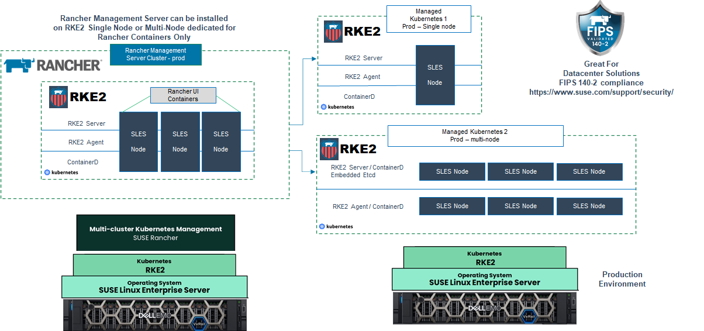

# Rancher: Simplifying Kubernetes Management and Orchestration

In the world of containerization and cloud-native applications, Kubernetes has emerged as the de facto standard for container orchestration. However, managing and scaling Kubernetes clusters can be complex and time-consuming. That's where Rancher comes in.

Rancher is an open-source container management platform that simplifies the deployment, management, and scaling of Kubernetes clusters. In this comprehensive guide, we will explore the features and benefits of Rancher, as well as provide a step-by-step tutorial on how to set it up and leverage its capabilities to streamline your containerization workflows.

## Table of Contents

1. [What is Rancher?](#what-is-rancher)
2. [Why Use Rancher?](#why-use-rancher)
3. [Setting Up Rancher](#setting-up-rancher)
4. [Managing Kubernetes Clusters with Rancher](#managing-kubernetes-clusters-with-rancher)
5. [Deploying Applications with Rancher](#deploying-applications-with-rancher)
6. [Monitoring and Logging with Rancher](#monitoring-and-logging-with-rancher)
7. [Scaling and Load Balancing with Rancher](#scaling-and-load-balancing-with-rancher)
8. [Securing Kubernetes with Rancher](#securing-kubernetes-with-rancher)
9. [Conclusion](#conclusion)
10. [FAQ](#faq)

## What is Rancher?

Rancher is an open-source container management platform that provides a centralized interface for deploying, managing, and scaling Kubernetes clusters. It abstracts away the complexities of Kubernetes and provides a user-friendly interface that simplifies cluster management tasks. Rancher supports multiple Kubernetes distributions, including Rancher's own Kubernetes distribution, as well as popular distributions like RKE, EKS, AKS, and GKE. With Rancher, you can easily provision and manage clusters across different cloud providers or on-premises infrastructure.

## Why Use Rancher?

There are several reasons why Rancher has gained popularity among DevOps teams and organizations:

1. **Simplified Kubernetes Management**: Rancher abstracts away the complexities of Kubernetes and provides a user-friendly interface for managing clusters. It simplifies tasks such as cluster provisioning, scaling, and upgrades, making it easier for teams to adopt and manage Kubernetes.

2. **Multi-Cluster Management**: Rancher allows you to manage multiple Kubernetes clusters from a single centralized interface. This is particularly useful for organizations that have multiple clusters across different environments or cloud providers. Rancher provides a unified view and control over all your clusters, simplifying management and monitoring.

3. **Application Catalog**: Rancher provides an application catalog that allows you to deploy pre-configured applications with a single click. The catalog includes a wide range of popular applications, such as databases, monitoring tools, and CI/CD pipelines. This simplifies the deployment of complex applications and accelerates the development process.

4. **Infrastructure Flexibility**: Rancher supports multiple infrastructure providers, including public clouds like AWS, Azure, and Google Cloud, as well as on-premises infrastructure. This flexibility allows you to choose the infrastructure that best suits your needs and easily migrate between providers if required.

5. **Monitoring and Logging**: Rancher provides built-in monitoring and logging capabilities, allowing you to gain insights into the health and performance of your clusters. It integrates with popular monitoring tools like Prometheus and Grafana, providing real-time visibility into your applications and infrastructure.

6. **Scalability and Load Balancing**: Rancher simplifies the scaling of Kubernetes clusters by providing intuitive scaling options. It also integrates with load balancers, allowing you to distribute traffic across your application instances and ensure high availability.

## Setting Up Rancher

Setting up Rancher involves the following steps:

1. **Choose an Installation Method**: Rancher can be installed on-premises or in the cloud. You can choose to install Rancher on a dedicated server or use Rancher's managed service, Rancher Kubernetes Engine (RKE), for a hassle-free experience.

2. **Configure System Requirements**: Ensure that your system meets the minimum requirements for running Rancher, including hardware specifications, operating system compatibility, and network requirements.

3. **Install and Configure Rancher**: Follow the installation guide provided by Rancher to install and configure Rancher on your chosen platform. This typically involves setting up a Rancher server and connecting it to your Kubernetes clusters.

4. **Access Rancher UI**: Once Rancher is installed and configured, you can access the Rancher UI through a web browser. Use the provided credentials to log in and start managing your Kubernetes clusters.

## Managing Kubernetes Clusters with Rancher

Rancher provides a user-friendly interface for managing Kubernetes clusters. Some of the key management features include:

- **Cluster Provisioning**: Rancher allows you to easily provision new Kubernetes clusters across different infrastructure providers. You can choose from various Kubernetes distributions and configure cluster settings according to your requirements.

## FAQ

1. **What is Rancher?**
   Rancher is an open-source container management platform that simplifies the deployment, management, and scaling of Kubernetes clusters. It provides a user-friendly interface for managing multiple clusters across different environments or cloud providers.

2. **How does Rancher simplify Kubernetes management?**
   Rancher abstracts away the complexities of Kubernetes and provides a centralized interface for managing clusters. It simplifies tasks such as cluster provisioning, scaling, and upgrades, making it easier for teams to adopt and manage Kubernetes.

3. **Can Rancher be used with different Kubernetes distributions?**
   Yes, Rancher supports multiple Kubernetes distributions, including its own distribution, RKE, as well as popular distributions like EKS, AKS, and GKE. This allows you to choose the distribution that best suits your needs.

4. **Does Rancher support on-premises infrastructure?**
   Yes, Rancher supports both public cloud providers like AWS, Azure, and Google Cloud, as well as on-premises infrastructure. This flexibility allows you to choose the infrastructure that best suits your requirements.

5. **Does Rancher provide monitoring and logging capabilities?**
   Yes, Rancher provides built-in monitoring and logging capabilities. It integrates with popular monitoring tools like Prometheus and Grafana, allowing you to gain insights into the health and performance of your clusters.

6. **Can Rancher scale Kubernetes clusters?**
   Yes, Rancher simplifies the scaling of Kubernetes clusters by providing intuitive scaling options. It also integrates with load balancers, allowing you to distribute traffic across your application instances and ensure high availability.

7. **Is Rancher suitable for deploying complex applications?**
   Yes, Rancher provides an application catalog that allows you to deploy pre-configured applications with a single click. The catalog includes a wide range of popular applications, simplifying the deployment of complex applications and accelerating the development process.

8. **Is Rancher suitable for managing multiple clusters?**
   Yes, Rancher allows you to manage multiple Kubernetes clusters from a single centralized interface. This is particularly useful for organizations that have multiple clusters across different environments or cloud providers.

9. **Is Rancher suitable for securing Kubernetes clusters?**
   Yes, Rancher provides features for securing Kubernetes clusters, such as RBAC (Role-Based Access Control) and integration with external authentication providers. It allows you to define fine-grained access control policies and ensure the security of your clusters.

10. **Is Rancher suitable for organizations of all sizes?**
    Yes, Rancher is suitable for organizations of all sizes, from small startups to large enterprises. Its flexibility, scalability, and ease of use make it a popular choice for managing Kubernetes clusters in various environments.
