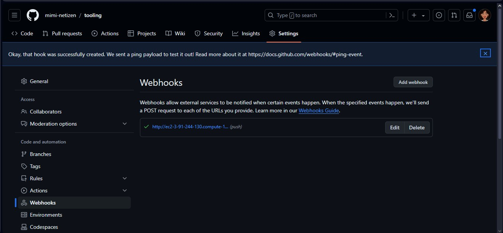
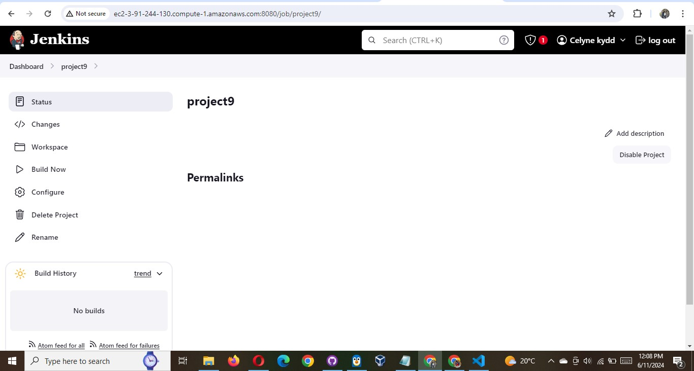
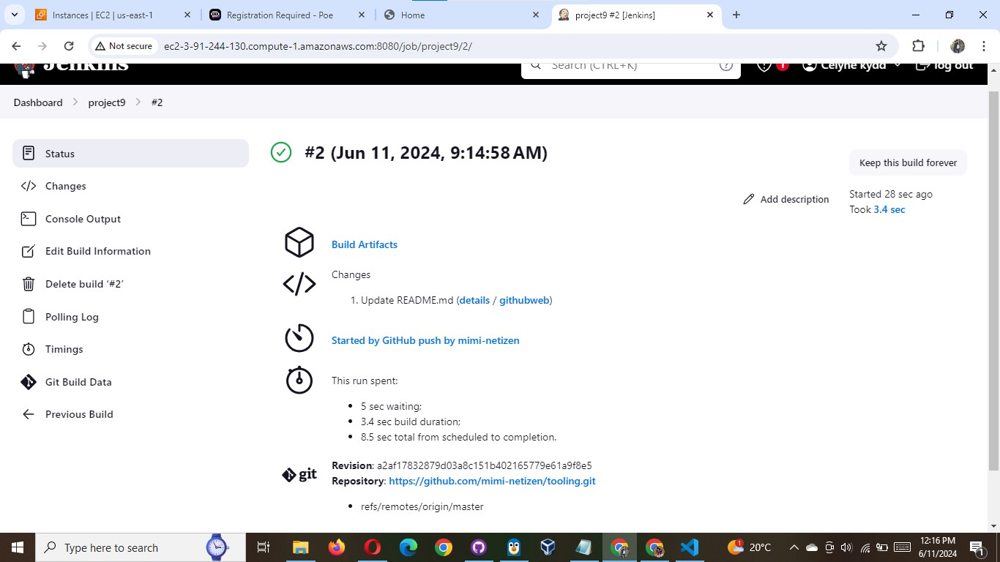
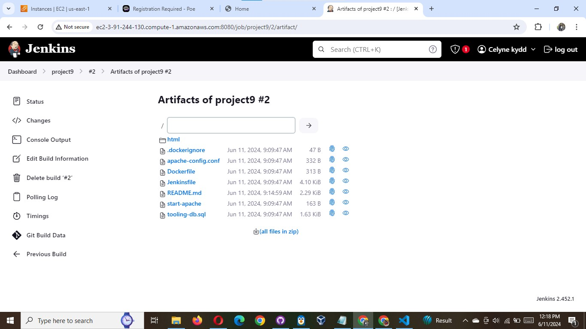
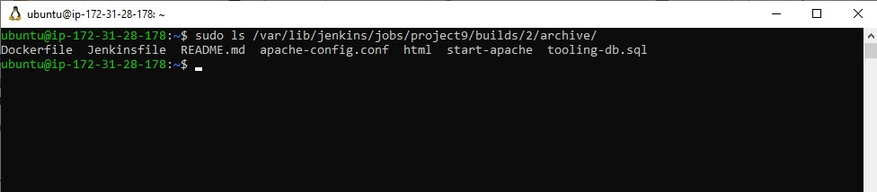

# Configure Jenkins to retrieve source codes from GitHub using Webhooks

In this part, you will learn how to configure a simple Jenkins job/project (these two terms can be used interchangeably). This job
will will be triggered by GitHub webhooks and will execute a ‘build’ task to retrieve codes from GitHub and store it locally on
Jenkins server.

1. Enable webhooks in your GitHub repository settings



2. Go to Jenkins web console, click "New Item" and create a "Freestyle project"



To connect your GitHub repository, you will need to provide its URL, you can copy from the repository itself

In configuration of your Jenkins freestyle project choose Git repository, provide there the link to your Tooling GitHub repository
and credentials (user/password) so Jenkins could access files in the repository.

Save the configuration and let us try to run the build. For now we can only do it manually.
Click "Build Now" button, if you have configured everything correctly, the build will be successfull and you will see it under #1


You can open the build and check in "Console Output" if it has run successfully.

If so – congratulations! You have just made your very first Jenkins build!

But this build does not produce anything and it runs only when we trigger it manually. Let us fix it.

3. Click "Configure" your job/project and add these two configurations
   Configure triggering the job from GitHub webhook:

Configure "Post-build Actions" to archive all the files – files resulted from a build are called "artifacts".

Now, go ahead and make some change in any file in your GitHub repository (e.g. README.MD file) and push the changes to the master branch.

You will see that a new build has been launched automatically (by webhook) and you can see its results – artifacts, saved on Jenkins
server.




You have now configured an automated Jenkins job that receives files from GitHub by webhook trigger (this method is considered as
‘push’ because the changes are being ‘pushed’ and files transfer is initiated by GitHub). There are also other methods: trigger one
job (downstreadm) from another (upstream), poll GitHub periodically and others.

By default, the artifacts are stored on Jenkins server locally

```
ls /var/lib/jenkins/jobs/tooling_github/builds/<build_number>/archive/
```


