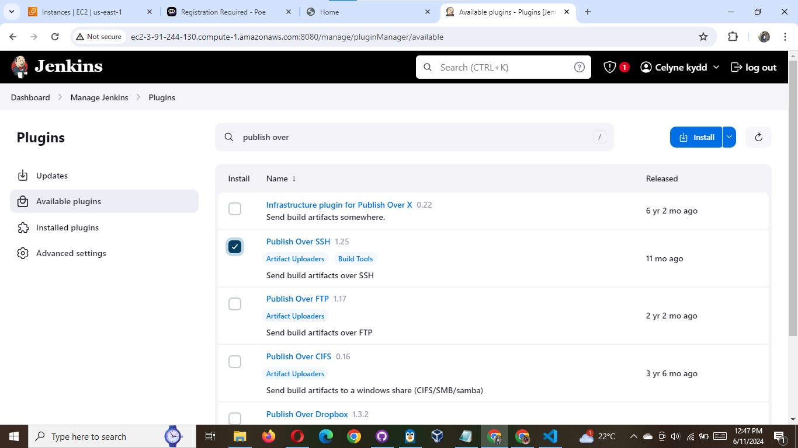
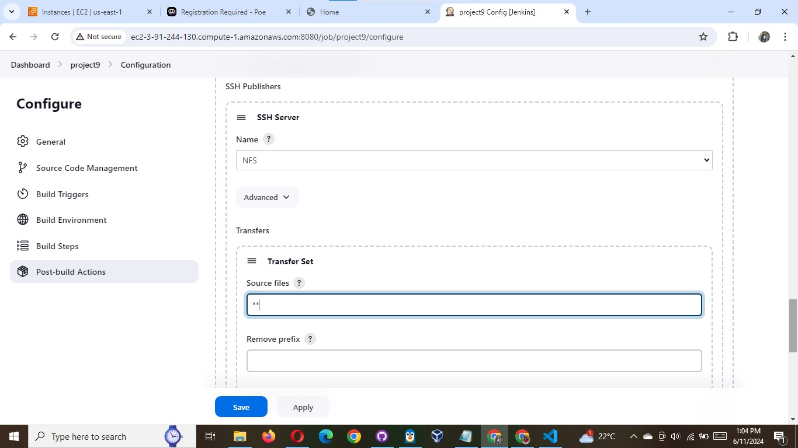
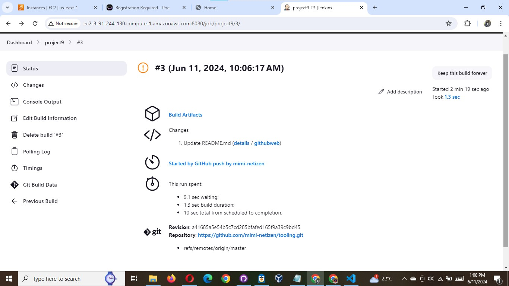
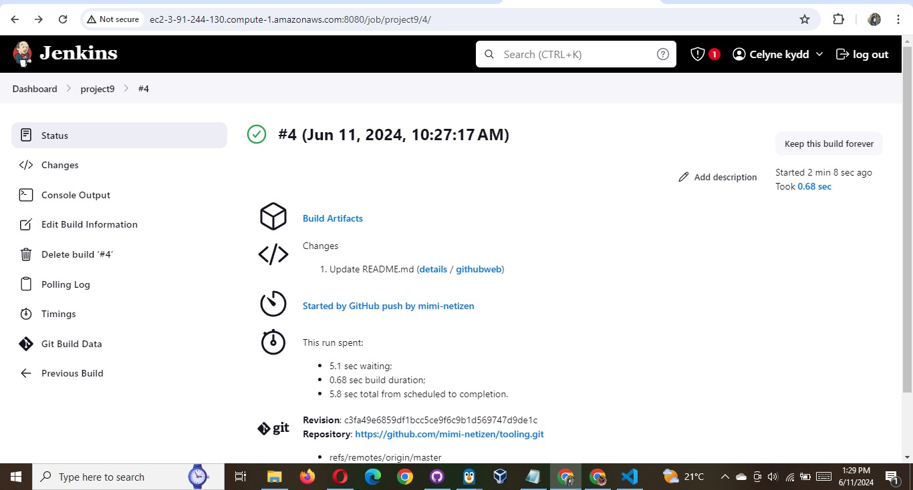
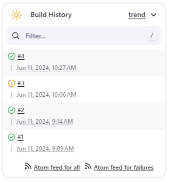
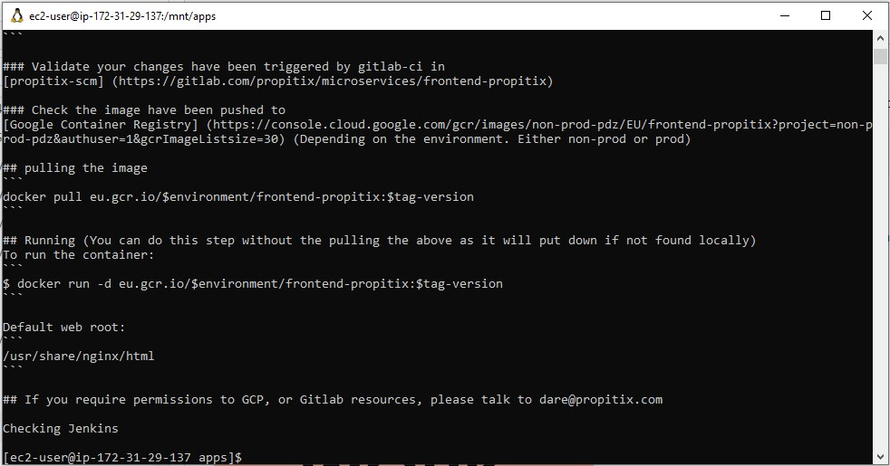

# Configure Jenkins to copy files to NFS server via SSH

Now we have our artifacts saved locally on Jenkins server, the next step is to copy them to our NFS server to /mnt/apps directory.

Jenkins is a highly extendable application and there are 1400+ plugins available. We will need a plugin that is called "Publish Over
SSH".

1. Install "Publish Over SSH" plugin.
   On main dashboard select "Manage Jenkins" and choose "Manage Plugins" menu item.

On "Available" tab search for "Publish Over SSH" plugin and install it



2. Configure the job/project to copy artifacts over to NFS server.
   On main dashboard select "Manage Jenkins" and choose "Configure System" menu item.

Scroll down to Publish over SSH plugin configuration section and configure it to be able to connect to your NFS server:

1. Provide a private key (content of .pem file that you use to connect to NFS server via SSH/Putty)
2. Arbitrary name
3. Hostname – can be private IP address of your NFS server
4. Username – ec2-user (since NFS server is based on EC2 with RHEL 8)
5. Remote directory – /mnt/apps since our Web Servers use it as a mointing point to retrieve files from the NFS server

Test the configuration and make sure the connection returns Success. Remember, that TCP port 22 on NFS server must be open to receive
SSH connections.


Save the configuration, open your Jenkins job/project configuration page and add another one "Post-build Action"

Configure it to send all files probuced by the build into our previouslys define remote directory. In our case we want to copy all
files and directories – so we use \*\*.

If you want to apply some particular pattern to define which files to send – use this syntax.



Save this configuration and go ahead, change something in README.MD file in your GitHub Tooling repository.

Webhook will trigger a new job and in the "Console Output" of the job you will find something like this:

```
SSH: Transferred 25 file(s)
Finished: SUCCESS
```



If you find an error, change security settings of your NFS Server

```powershell
sudo chown -R nobody:nobody /mnt
sudo chmod -R 777 /mnt
```




To make sure that the files in /mnt/apps have been udated – connect via SSH/Putty to your NFS server and check README.MD file

```
cat /mnt/apps/README.md
```




If you see the changes you had previously made in your GitHub – the job works as expected.

Congratulations!
You have just implemented your first Continous Integration solution using Jenkins CI. Watch out for advanced CI configurations in
upcoming projects.
