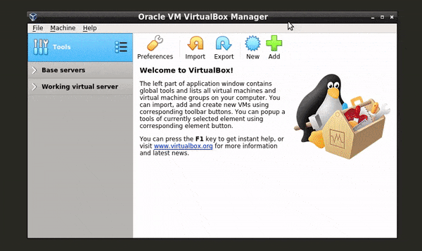

# CentOS Stream 8/9 installation

## Table of Contents

1. [Introduction](#introduction)
2. [Step 1: Download CentOS 8/9 ISO Image](#step-1-download-centos-8/9-iso-image)
3. [Step 2: Create a Bootable USB Drive](#step-2-create-a-bootable-usb-drive)
4. [Step 3: Begin the CentOS 8/9 Installation](#step-3-begin-the-centos-8/9-installation)
5. [Step 4: Choose Installation Language](#step-4-choose-installation-language)
6. [Step 5: Select the Keyboard Language](#step-5-select-the-keyboard-language)
7. [Step 6: Configure Language](#step-6-configure-language)
8. [Step 7: Select the Location and the Timezone](#step-7-select-the-location-and-the-timezone)
9. [Step 8: Select Software and Features to Install](#step-8-select-software-and-features-to-install)
10. [Step 9: Choose the Partitioning Scheme](#step-9-choose-the-partitioning-scheme)
    - [Step 9.1: Automatic Partition Configuration](#step-91-automatic-partition-configuration)
    - [Step 9.2: Custom Partition Configuration](#step-92-custom-partition-configuration)
11. [Step 10: Configure Network and Hostname](#step-10-configure-network-and-hostname)
12. [Step 11: Begin the Installation](#step-11-begin-the-installation)
13. [Step 12: Set the Root Password and Create a User Account](#step-12-set-the-root-password-and-create-a-user-account)
14. [Step 13: Reboot and Accept the License Agreement](#step-13-reboot-and-accept-the-license-agreement)
15. [Step 14: Login to Your New CentOS 8 Machine](#step-14-login-to-your-new-centos-8-machine)

## Introduction

CentOS 9 is a powerful, enterprise-class Linux distribution derived from the sources of Red Hat Enterprise Linux (RHEL). This guide aims to provide a comprehensive walkthrough for installing CentOS 9, ensuring you have a solid foundation for your server or desktop environment.

## Step 1: Download CentOS 8/9 ISO Image

You can easily get an ISO image of all released versions of CentOS. On the website of [CentOS](https://www.centos.org/centos-stream/), you can get the list of all available mirrors in the world.

For better download speed choose the mirror in your region.

- Get the list here: https://admin.fedoraproject.org/mirrormanager/mirrors/CentOS
- Or direct download ISO from here: http://isoredirect.centos.org/centos/8/isos/x86_64/

After Download the ISO image, you can verify the image with the size and SHA256 hash value.


## Step 2: Create a bootable USB drive

After download the ISO image the next thing we required is a bootable USB drive.

On a Windows PC, you can create a bootable USB of CentOS by using [YUMI](https://pendrivelinux.com/yumi-multiboot-usb-creator/) or [RUFUS](https://rufus.ie/en/) or [balena etcher](https://etcher.balena.io). All are very simple and reliable ways to make a bootable USB.


If you on Linux then you can create bootable USB using the dd command like the below example.

```bash
sudo dd if=/path_to_iso_file/CentOS-8-x86_64-1905-dvd1.iso of=/dev/sdb status=progress && sync
```

Note: replace path_to_iso_file with your iso file path and also replace /dev/sdb by your USB device path. If you don’t know your USB device path you can run the below command to see it.

```bash
sudo lsblk
```

#### Virtual Box

For installation in Virtual Box, we do not need a bootable USB media. You can just click on Create New Virtual Machine and Select Redhat 64 Bit.

Also, allot RAM and Storage according to your choice.

**Remember a minimum of 1.5 GB RAM and 10 GB HDD is required.**



Now go under the Storage option and choose CentOS 8 or 9(depends on what you decided to download) ISO image file in Virtual Optical Drive.


## Step 3: Begin the CentOS 8/9 installation

Finally, boot from your bootable USB media and start the CentOS 8/9 Setup.


## Step 4: Choose installation language

Here you can choose the language for the installation process.


When you click on continue, You will see the below page.


## Step 5: Select the keyboard language

Here you can choose the keyboard language for the installation process. The default is English (United States).


In this section, you can choose between different languages and also can test it by typing some text in the given textbox.


## Step 6: Configure Language

In localization, section click on Language Support to choose the language for OS.

![image]

![image]

## Step 7: Select the location and the timezone

After that, click on Time & Date for selecting Timezone and the location.

![image]

![image]

## Step 8: Select Software and features to install

In the software section, the installation source is automatically selected. Below that, the Software selection option is available. Here you can select which features and software you want to install during installation.

![image]

By default, the server with the GUI option is selected. You can choose between various Base Environment and select Add-Ons for selected Environment.

![image]

For Example, You want a Basic WEB server without GUI then just select the following options.

![image]

## Step 9: Choose the partitioning scheme

Note: Be careful when making choices in this process. You may lose your data if the wrong option selected.

In the SYSTEM section, the first option is for configuring Disk partition and choose the installation destination for our server.

![image]

Disk partitioning is one of the most important parts of the OS installation.

### Step 9.1: Automatic Partition Configuration

If you do not want to create manual partitions, just select the disk, select Storage Configuration as automatic and click on Done. In this method, all the disk space is used and partitions are created automatically.

Note: This process deletes all your partitions and data on the disk.

![image]

### Step 9.2: Custom Partition Configuration

If you want to install CentOS 8/9 on a disk, where you already have some partition then you should select the custom partition option.

![image]

After that, you will see the below menu where you have to select the partition scheme and create new partitions. For example, in the below image I select the Standard partition scheme.

![image]

Now, We have to create mount points like the image below.

![image]

After creating all the necessary mount points, your partition table looks like the below image.

![image]

After that, verify all the changes will be done in the partition table and click on Accept Changes when done.

![image]

## Step 10: Configure Network and Hostname

You should have a configured network connection during the installation process because the network connection is required to update all the components during installation.

![image]

Also, you can define the hostname of the server.

![image]

## Step 11: Begin the installation

Now, we are ready to start the installation process of our CentOS 8/9 Server.

![image]

## Step 12: Set the root password and create a user account

After that, the User Settings section needs to be configured.

![image]

Now set a strong password for the root user.

![image]

After that, create a user and set a strong password for that user.

![image]

## Step 13: Reboot and accept the license agreement

When the installation process is completed you have to reboot the server.

![image]

After reboot, you have to accept the license and finally Finish Configuration.

![image]

![image]

## Step 14: Login in your New Centos 8 Machine

After that, you can log in with the user you created in the previous step.

![image]
