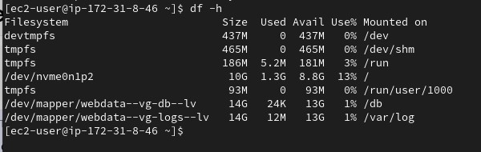

# STEPS TWO: Preparing Database

We can now proceed to installing and configuring MYSQL server that will serve as the database for our website on the server instance, to do this, we can follow same process as we did in the server instance to create ec2 instance, create and attach the 3 ebs volumes, ssh into your nstance and create partitions.

Create logical volumes, use same process as we did in the server instance, the logical volume should be `db-lv` instead of `apps-lv` and mount it to /db directory instead of `/var/www/html/.`

