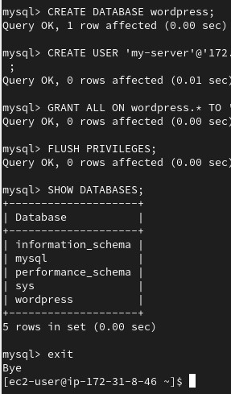

# Install MySQL on your DB Server EC2

Install and configure mysql server on your DB ec2 instance

```powershell
sudo yum -y update
sudo yum install mysql-server
```


Verify that the service is up and running

```powershell
sudo systemctl status mysqld
```

If it is not running, restart the service and enable it so it will be running even after reboot

```powershell
sudo systemctl restart mysqld

sudo systemctl enable mysqld
```


Configure the DB to work with wordpress , you can do this by creating a DB user that is from the web server IP address.

First , log in as root user

```powershell
sudo mysql
```

Then create a new db

```powershell
CREATE DATABASE wordpress;

CREATE USER 'myuser'@'my server ipaddress' IDENTIFIED BY 'choose your password' ;

GRANT ALL ON wordpress2.* TO 'citatech'@'yourwebserver ip address' ;

FLUSH PRIVILEGES;

SHOW DATABASES;
```



Test your db connection by logging in to your db from your webserver, before that, ensure you allowed port 3306 (which is the default port for mysql) in your mysql instance inbound rules, configure the connection to your-webserver-IP-address/32

Then access your webserver instance and also install mysql client

```powershell
sudo yum install -y mysql-client
```

Log in to the mysql server remotely from your webserver

```powershell
sudo mysql -u myuser -p -h (your mysql server ip address)
```


