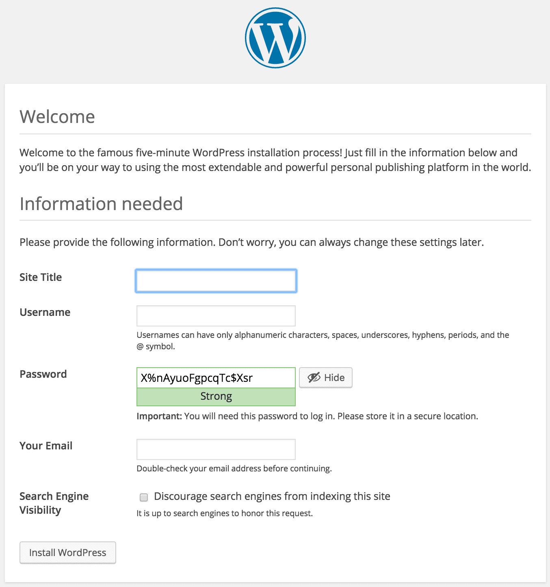

# Configure MySQL and Connect to Server

visit your-ip-address/wordpress in your web browser and you should get the same result as below;

Go ahead and click the “Let’s go!” button to begin our setup.

Fill in the required fields:

Instance name: wordpress*instance_name  
Username: root  
Password: root_password  
Database Host: ip address  
Table Prefix: wp*

From the welcome page, we will need to setup a master administrator account. This account is for maintaining and administering our account.

Site title for the site.  
Username: admin  
Password: admin_password  
Your Email: admin_email  
Discourage search engines from indexing this site:

